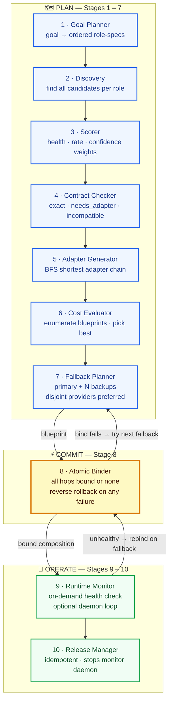
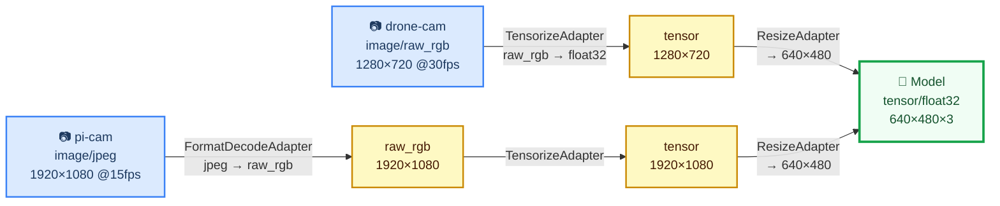
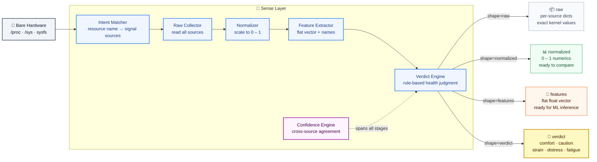

# D2A — Device-to-Agent Protocol

> A protocol that lets bodiless AI agents safely and temporarily bind to real device hardware — perceive its live state, use a capability under scope and quota, then release it — so many agents can share a limited pool of physical machines.

---

## The Idea

An agent is a mind with no body. A device is a body with no mind. D2A is how a mind borrows a body — and lets go cleanly when it's done.

Perception and action are physical: a language model that can only read text is fundamentally limited compared to one that can ask *"is this machine thermally stressed right now?"* or *"compose a vision pipeline from the camera on the drone and the GPU across the room."* Real hardware is the missing half of an AI agent.

D2A sits in a gap between two existing protocols:
- **A2A** (Agent-to-Agent): orchestration between AI agents.
- **MCP** (Model Context Protocol): agents talking to software tools.
- **D2A** fills the third corner: agent-to-physical-hardware. Bind, perceive, act, release.

The design principle is that binding is *temporary and scoped* — no agent owns a device, it borrows a capability for a TTL, under a consent policy that the device owner controls.

---

## System Architecture

```mermaid
flowchart TB
    subgraph Agents["🤖  AI Agents"]
        A1["Agent A\nRemoteAgent / Agent"]
        A2["Agent B\nagent.achieve('vision')"]
    end

    subgraph Core["🔒  D2A Core — frozen contract"]
        SC["Capability Schema\nschema.py"]
        VB["Bind Verbs\nverbs.py"]
        ID["Identity + Token\nidentity.py"]
    end

    subgraph Pipeline["⚙️  Resolution Pipeline"]
        AD["Advertise"]
        TG["Trust Gate\nEd25519-signed token"]
        BR["Contention Broker\npriority · quota · preemption"]
        BI["Binding\nscoped · expiring"]
        AD --> TG --> BR --> BI
    end

    subgraph DevStack["💻  Device Stack"]
        DR["Device Runtime\ndevice_runtime.py"]
        PB["OS Probes\n/proc · /sys · sysfs"]
        HW["Bare Hardware\ncamera · GPU · mic · sensors"]
        DR --> PB --> HW
    end

    subgraph Transport["🌐  Swarm Transport"]
        LS["LANSwarm\nUDP broadcast + TCP"]
        DS["DHTSwarm\nKademlia UDP discovery + reused TCP core"]
    end

    A1 & A2 --> Core
    Core --> Pipeline
    Pipeline --> DevStack
    Transport <--> Pipeline
    Transport <--> DevStack

    classDef agentNode  fill:#dbeafe,stroke:#3b82f6,stroke-width:2px,color:#1e3a5f
    classDef coreNode   fill:#fef9c3,stroke:#ca8a04,stroke-width:2px,color:#451a03
    classDef pipeNode   fill:#dcfce7,stroke:#16a34a,stroke-width:2px,color:#14532d
    classDef devNode    fill:#f3e8ff,stroke:#9333ea,stroke-width:2px,color:#3b0764
    classDef transNode  fill:#ffe4e6,stroke:#e11d48,stroke-width:2px,color:#4c0519

    class A1,A2 agentNode
    class SC,VB,ID coreNode
    class AD,TG,BR,BI pipeNode
    class DR,PB,HW devNode
    class LS,DS transNode
```



Runtimes plug in on the device side; agents plug in on the top. The frozen core in the middle never changes — only the transport and the hardware underneath vary.

---

## The Universal 7-Phase Lifecycle

The same seven phases apply to every device regardless of what hardware it has. Only what it advertises in phase 1 differs.

```mermaid
flowchart LR
    P0["⚡ 0 · Exist\nprobe self"]
    P1["📡 1 · Advertise\npublish capabilities"]
    P2["🔍 2 · Discover\nagent finds providers"]
    P3["🔑 3 · Trust\nEd25519 token issued"]
    P4["🔗 4 · Bind\nbroker grants slot"]
    P5["👁️ 5 · Sense\nread via sense layer"]
    P6["🎯 6 · Act\nuse the capability"]
    P7["🔓 7 · Release\nslot returned"]

    P0 --> P1 --> P2 --> P3 --> P4 --> P5 --> P6 --> P7
    P7 -->|"back to available"| P1

    classDef exist     fill:#f0fdf4,stroke:#15803d,stroke-width:2px,color:#14532d
    classDef advertise fill:#eff6ff,stroke:#2563eb,stroke-width:2px,color:#1e3a8a
    classDef discover  fill:#f0f9ff,stroke:#0284c7,stroke-width:2px,color:#0c4a6e
    classDef trust     fill:#fef9c3,stroke:#ca8a04,stroke-width:2px,color:#451a03
    classDef bind      fill:#fdf4ff,stroke:#a21caf,stroke-width:2px,color:#4a044e
    classDef sense     fill:#fff7ed,stroke:#ea580c,stroke-width:2px,color:#431407
    classDef act       fill:#fff1f2,stroke:#e11d48,stroke-width:2px,color:#4c0519
    classDef release   fill:#f1f5f9,stroke:#475569,stroke-width:2px,color:#0f172a

    class P0 exist
    class P1 advertise
    class P2 discover
    class P3 trust
    class P4 bind
    class P5 sense
    class P6 act
    class P7 release
```



A Raspberry Pi, a laptop, a phone under Termux, a drone companion computer — all run the same runtime code. The only difference is the set of capabilities each probes and advertises.

---

## Capability Composition

The headline feature. Instead of binding to one device at a time, an agent declares a **goal**:

```python
with agent.achieve("vision") as comp:
    result = comp.run()   # consumer_confirmed=True
```

D2A assembles a working pipeline from **partial capabilities on different devices** — a camera on one node, a GPU on another — inserting adapter chains so mismatched outputs fit. A drone camera (raw RGB 1280×720) and a Pi camera (JPEG 1920×1080) both feed the same model (float32 tensor 640×480×3) via different chains. Nothing binds until every hop's contract is verified.

### The 10-Stage Engine



### Adapter Chains in Practice



Both paths produce the same verified contract at the consumer. `contracts_compatible()` runs at plan time **and** again at runtime — the consumer confirms the guarantee held end-to-end.

**Contract rules:** media-type mismatches (audio into a vision model) are rejected immediately as incompatible. Unknown format on either side always fails — never silently assumed to match.

---

## The Sense Layer

Raw hardware signals are noisy, device-specific, and meaningless to most agents. The Sense Layer translates them into four clean output **shapes** so every agent — from a one-liner to a trained ML model — gets exactly the view it needs.



**Verdict levels** (best → worst): `comfort` → `caution` → `strain` → `distress` → `fatigue`

Each verdict carries an **advice** string: `proceed`, `throttle`, `reduce_load`, `release_now`, `prefer_plugged_device`.

A simple agent needs zero ML: receive `verdict=distress`, read `advice=release_now`, release the binding. Every `SenseFrame` includes verdict + confidence regardless of which shape was requested.

> **Note:** Sense Layer Part 1 (the full forward pipeline) is complete and tested. Part 2 — SafetyFilter, ReflexPath (urgent fast-path), EventEmitter, and HealthAggregator — is **in progress**.

---

## Contention-Aware Broker

Multiple agents compete for a finite number of hardware slots. The broker handles this fairly and auditably:

| Feature | Detail |
|---|---|
| **Priority** | Integer 1 (highest) – 9 (lowest) per bind request |
| **Quotas** | Per-capability slot limit (default 1, configurable) |
| **Preemption** | Higher-priority agent takes a slot from a lower-priority holder |
| **Wait-queue** | Lower-priority requests park; auto-granted on release |
| **Auto-grant** | When a slot frees, the highest-priority queued agent is granted immediately |
| **Audit log** | Full event history: granted · queued · preempted · released · auto\_granted |
| **Cancel-queue** | Atomic Binder cancels queue entries on rollback — prevents ghost bindings |

Since v1.12 the raw numeric preemption above applies to **local (in-process) callers
only** — a *remote* bind's priority is governed by the owner's arbitration policy
and a stated contention claim; see
*[Multi-Agent Arbitration](#multi-agent-arbitration-phase-12-v112-additive)*.

---

## Security model (Ed25519, v1.1)

As of **v1.1** the trust gate is real asymmetric cryptography. **Identity is a keypair.**

> **What the old model actually was (honesty first).** Before v1.1, "signing" was HMAC where the device signed a token with its *own* secret and later verified it with the *same* secret. The published `public_key` was `sha256(private_key)` and was **never used in any verification path**. Net effect: **there was no cross-node authentication at all** — a device only ever "trusted" a token it had minted itself, and no agent or device ever cryptographically verified the other. v1.1 replaces this wholesale.

**Identity = keypair.** Each node (device *and* agent) has a persisted Ed25519 keypair, and its `node_id` is **derived from its public key** (`node_id = sha256(pubkey)[:16]`, `crypto.derive_node_id`). You cannot claim a `node_id` you don't hold the key for. Keys live in `~/.d2a/keys/<name>.json` (mode `0600`; override the base dir with `D2A_HOME` / `XDG_DATA_HOME`), keyed by node name so identity is stable across restarts.

**Dual crypto backend, one wire format.** `d2a/crypto.py` auto-detects a backend at import: **PyNaCl → `cryptography` → a pure-Python RFC 8032 fallback** (`d2a/_ed25519_fallback.py`). Signatures are byte-identical across all three (verified against the RFC 8032 §7.1 test vectors and cross-backend), so nodes on different backends interoperate.

> ⚠️ **The pure-Python fallback is DEMO-GRADE ONLY: not constant-time, slow, and vulnerable to timing side channels that can leak the signing key.** It exists so the core has zero third-party dependencies and still produces real signatures on a bare install. **Production deployments MUST install a real backend** (`pip install pynacl` or `cryptography`); detection is automatic. Check `d2a.crypto.ACTIVE_BACKEND` / `crypto.using_fallback()`.

**What is signed.** The five security-critical trust messages —
`bind_request`, `bind_response`, `renew_binding`, `lease_renewed`, `release_binding` — plus published **capability records**. The `BindToken` itself is device-signed over *all* its fields (`capability_name, agent_id, node_id, scope, expires_at, ts`), closing an earlier gap where `expires_at`/`scope` rode along unsigned. Canonical signing is sorted-key, compact-separator, UTF-8 JSON; `sig_key` (the signer's pubkey) is inside the signed bytes, `sig` is outside. The protocol version `v` and a timestamp `ts` are inside the signed payload too — so `agent_address` and `v` are now **tamper-evident** (both previously-flagged unauthenticated fields are closed).

**TOFU (trust on first use).** A peer's key is pinned on first contact (`~/.d2a/known_peers.json` via `crypto.PinStore`); both roles pin (agents pin devices, devices pin agents). Two independent checks guard every signed message, each with a distinct reason: **derivation** — `node_id` must derive from the presented key (`node_id_derivation_mismatch`); and **pin** — a known `node_id` presenting a different key is rejected loudly (`tofu_key_mismatch`). A bare signature check is never trusted on its own — a self-consistent forgery that claims another node's identity fails the derivation check.

**Replay window.** A signed message with `|receiver_now − ts| > 60 s` is rejected (`stale_signature`). The receiver clock is authoritative, consistent with the lease design. Records reuse the transport's TTL for freshness instead of a signed replay window (the transport rewrites a record's `ts` on ingest, so `ts` is excluded from a record's signature).

**Data-path messages stay bearer-authenticated (deliberately).** `get_reading` / `subscribe` / `stream_frame` are **not** signed per-request; the device authorizes them by looking up the `binding_id` in its own in-memory store. The signed `bind_response` is what proves the binding is real; the `binding_id` then acts as a bearer capability handle.

**What is explicitly NOT provided:**

- **No transport encryption.** Messages are signed, not encrypted — signing prevents *forgery*, not *eavesdropping*. A `binding_id` is a bearer token and is **sniffable on-path**; anyone who observes it can use it until the lease expires. **Leases are what bound the damage window** (default 300 s). Put D2A on a trusted network or add TLS/WireGuard underneath if confidentiality matters.
- **No revocation** and **no key rotation.** A pinned key is pinned until the pin store is edited; there is no CRL/OCSP and a re-keyed node presents as a new identity.
- **No PKI / no CA.** Trust is TOFU only — no certificate chains, no web of trust.
- **No forward secrecy.** There is no session key exchange; compromise of a signing key compromises all past and future signatures by it.

**Binding leases (DHCP-style).** Every binding is a *lease* with a TTL (default 300 s), carried in the bind response as `lease_ttl` / `lease_expires_at`. **The device clock is the single source of truth for expiry — agent and device clocks are never compared.** The agent auto-renews at ~½ TTL (with jitter); a single dropped renew is retried (~every TTL/10) and does *not* kill a healthy binding — only an explicit denial or the device-clock deadline actually passing does. On expiry the device runs one unified teardown (the same broker path as explicit release and preemption): it frees the broker slot, hands it to any queued agent, tears down subscriptions, and invalidates the token. This means a crashed agent that never releases no longer holds a slot forever — the lease lapses within a fraction of a TTL and the resource is reclaimed. What expiry does **not** guarantee: the `lease_expired` notice pushed to the agent is **best-effort, fire-and-forget** (it needs the agent's UNVERIFIED, agent-claimed `agent_address`, and can be lost); an agent that misses it simply finds its next request rejected. Renewal is transport-agnostic — identical over `LANSwarm` and `DHTSwarm`.

**Consent policy** (`policy.py`):

```
OPEN resources      → bindable by any trusted remote agent by default
                      (compute, gpu, sensing, battery_aware, storage, network)

Sensitive resources → DENIED to all remote agents by default
                      (camera, microphone, location, display)
                      Require explicit owner opt-in:
                      DeviceRuntime(open_resources=["camera"])
```

**Resource probes are availability-only.** `probe_camera()` detects that `/dev/video0` exists — it does not open the device, capture a frame, or record anything. The same applies to microphone, location, and display probes.

---

## Capability Manifests (v1.2)

Every capability record can carry a **manifest** — a signed, machine-readable self-description so an agent learns what a capability *is* (its reading schema, actions, consent tier, whether it streams) from discovery alone, without reading any device code. This is D2A's equivalent of an **MCP tool schema / A2A agent card**, and the prerequisite for a mechanical `d2a→MCP` bridge.

The manifest lives inside the capability record, which is **already Ed25519-signed at publish** (`signing.sign_record`), so **manifests are authenticated for free** — a tampered manifest fails `verify_record`. The manifest is injected at the single record builder (`DeviceRuntime._capability_record`, shared by the UDP/DHT publish path and the TCP `capabilities_request` path) *before* signing. Manifests are **optional** (a record without one is valid — additive contract) and validated at publish time (`d2a/manifest.py`, a stdlib leaf).

**Deliberately a small fixed vocabulary, not full JSON Schema** (no `$ref`, `oneOf`, or deep nesting) — so manifests are writable by hand, diffable, verifiable, and translatable to MCP schemas mechanically. The whole grammar:

```
manifest = {
  "description": <str>,                      # one line, human-readable        (required)
  "reading":  { <field>: <fieldspec> },      # what a data frame contains      (optional)
  "actions":  { <name>: { "description": <str>,
                          "params": { <param>: <paramspec> } } },              (optional)
  "consent_tier": "open" | "sensitive",      # MUST equal the policy SSOT      (required)
  "streaming": <bool>                         # does subscribe() apply?      (default false)
}

fieldspec / paramspec = {
  "type": "number" | "string" | "boolean" | "object" | "array",               (required)
  "items": "number" | "string" | "boolean" | "object",   # required iff type=="array";
                                                          # forbidden otherwise; NO nested arrays
  "unit":  <str>,          # optional, e.g. "%", "MB", "C"
  "description": <str>,    # optional
  "format": "hex",         # optional; ONLY on type=="string" — declares hex-encoded bytes
  "required": <bool>       # paramspec only
}
```

**Bytes** are represented as hex-encoded `"string"` fields, optionally annotated `"format": "hex"` so the encoding is machine-readable.

**consent_tier is not free text.** It must equal the resource's *intrinsic* sensitivity — the single source of truth is `RESOURCE_SENSITIVITY` (resource capabilities) / `KIND_SENSITIVITY` (peripheral kinds), unknown → `"sensitive"`. The validator rejects any manifest whose `consent_tier` contradicts it. Rationale: **the manifest describes the resource's *nature*; whether *this* device grants it is a bind-time policy decision** (see the consent policy), never encoded in the manifest — so it can't drift from, or lie about, the policy layer.

**Size cap.** A manifest larger than **4 KB** is rejected at publish. This matters because Kademlia `FIND_VALUE` returns **all** live provider records for a capability in **one** UDP datagram (`{"records": [...]}`, `MAX_PACKET = 65535`) — so the datagram size is `N_providers × record_size`, not a single record. A realistic manifest is ~0.6 KB (record ~1.2 KB); the 4 KB cap keeps a single verbose manifest from breaking discovery, but heavy provider fan-in on one capability still trends toward the 64 KB ceiling. A finer mitigation (cap records-per-`VALUE`, or TCP fallback for large result sets) is **explicitly deferred** — out of scope for v1.2.

**Worked example** — the `sensing` capability manifest (note the array-typed fields, the SSOT-derived `consent_tier`, and units):

```json
{
  "description": "Thermal zones and hardware sensor inputs of the host.",
  "reading": {
    "thermal_zones":  { "type": "number", "description": "count of thermal zones" },
    "sample_temps_c": { "type": "array", "items": "number", "unit": "C",
                        "description": "sample of current zone temperatures" },
    "sensor_inputs":  { "type": "number", "description": "count of hwmon sensor inputs" },
    "hwmons":         { "type": "array", "items": "string",
                        "description": "hardware monitor chip names" }
  },
  "consent_tier": "open",
  "streaming": true
}
```

**Agent side:** `discover()` results expose `record["manifest"]`; `RemoteAgent.describe(capability_name)` returns the parsed manifest from the discovery cache. See `examples/manifest_demo.py`.

Built-in manifests ship for `compute`, `sensing`, `camera`, and `raw_<kind>` peripheral relays. Guardian (Case 2) and Synthesis (Case 3) virtual capabilities carry their own composed manifests when they go on-wire — see below.

---

## Composition on the Wire

Guardian VirtualSmartObjects (Case 2) and Synthesis emergent devices (Case 3) are no longer in-process only — a host node **publishes them as first-class capabilities** that other agents discover, bind, and drive over the network, through the **same** broker quota, lease lifecycle, and consent policy as any real capability.

**Guardian — `DeviceRuntime.publish_virtual(vso)`.** Publishes the VSO's *smart* surface (e.g. `smart_sensor` with `verdict`/`monitor` actions) as a distinctly-named capability, signed with the host key, alongside the `raw_<kind>` relay capability (which keeps its own raw-primitive manifest). Both surfaces are independently discoverable. The manifest is composed from the kind's action map — the smart actions, not the raw primitives.

**Synthesis — `DeviceRuntime.publish_emergent(handle)`.** The **coordinator** node that holds the `EmergentDeviceHandle` publishes the emergent device (e.g. `pooled_storage_2x` with `write`/`read`). The manifest is composed **only** from the synthesis kind + `combined_contract` — **member records are never embedded**, so no per-part manifest or member `node_id` leaks into the emergent record (there's a test asserting exactly this).

**Binding & actions.** A virtual capability is registered in the host's capability set + broker quota + consent policy (its consent tier comes from `KIND_SENSITIVITY`), so bind/renew/release, lease expiry, and consent gating all apply identically — **there is no consent bypass through the virtual path** (a sensitive-kind VSO denies an unapproved remote agent, proven by test). Reads route through the virtual dispatcher; a new additive **`action`** message (binding-scope-gated, like `get_reading`) invokes a manifest-declared action via `RemoteAgent.call_action(binding, action, params)`. Bytes cross the wire hex-encoded.

> **Honest coordinator caveat.** The coordinator/host is a **single point of failure and a trust chokepoint**: agents trust *its* Ed25519 signature over the virtual/emergent record and its routing, and the **member devices are invisible behind it** — an agent cannot see or independently verify the parts a coordinator fused, nor reach them directly. The emergent *record* carries no member identity, but a runtime *action response* (e.g. a pooled `read`) may still reference the member that served it. Distributed multi-coordinator trust and per-member attestation are out of scope.

---

## Event Layer — Conditional Events (v1.3)

Before v1.3 an agent could **pull** (`get_reading`), **raw-stream** (`subscribe`), and **request/response** (`action`) — but it could not be *notified when something it cares about happens*. The event layer adds the missing interaction primitive: **"notify me when field X crosses Y."**

**Condition vocabulary — small and fixed**, exactly like the manifest vocabulary. A condition is one manifest reading field + one operator:

```json
{"field": "value", "op": "gt", "value": 50}      // op ∈ gt|lt|ge|le|eq|ne|changed
{"field": "level", "op": "changed"}               // "changed" takes no value
```

**One condition per subscription.** An agent wanting AND/OR composes it agent-side with multiple subscriptions — there is deliberately **no expression language**, which is what keeps this spec-able. Conditions are validated **at subscribe time against the capability's manifest**: an unknown field, or an op/type mismatch (`gt` on a string field, `eq` on an array), is rejected with `{"error": "invalid_condition", "detail": …}`. Ordered ops (`gt`/`lt`/`ge`/`le`) require a numeric field; `eq`/`ne` require the value to match the field's declared scalar type; arrays/objects are not conditionable.

**Edge semantics — fires on the crossing, not the level.** A `gt` condition fires on the sample where the field *crosses* the threshold (False→True), **not** on every sample it stays above it, and **re-arms** automatically when the field drops back below. `changed` fires on any value change. The **first sample only establishes a baseline and never fires** — even if the condition is already true at subscribe time (there is no prior edge to cross). Each subscription keeps its own edge state, so N conditions on one capability each track their own crossings off the single shared sample.

```python
# agent-side convenience
sub = agent.on_event(binding,
                     {"field": "value", "op": "gt", "value": 50},
                     lambda ev: print("crossed!", ev["seq"], ev["reading"]),
                     eval_hz=5)
# ... later
agent.off_event(binding, sub["event_sub_id"])
```

**Delivery — best-effort, no guarantee (documented honestly).** An `event` is a **data-path** message: `binding_id`-bearer, **not signed** (same class as `stream_frame`), fire-and-forget to the agent's address, carrying the **triggering reading snapshot** and a **per-subscription monotonic `seq`** so the agent can detect gaps (a jump surfaces as `event["_gap"]`). There is **no re-delivery** — an agent that needs certainty re-reads on event receipt.

**Principle guard — bounded background work, purchased by a live lease.** Condition evaluation is opt-in work that only runs while a lease is live. It rides the **same per-capability sampling loop** as streaming (no parallel evaluator; virtual VSO/emergent capabilities are driven through the same loop via a registered pseudo-source). Two guards, with **distinct** rejection reasons:

| Guard | Default | Rejection reason |
|---|---|---|
| Per-binding cap (what one lease may buy) | `8` | `event_cap_exceeded` |
| Per-capability device ceiling (shared-loop defense-in-depth) | `32` | `device_event_capacity` |

The device **owns the cadence**: an agent-requested `eval_hz` is clamped to `MAX_SAMPLE_HZ` (10) and the effective rate is echoed in the subscribe response. *(The same clamp now also guards `subscribe` streaming, which was previously unclamped.)* **Every event subscription dies with the binding** — lease expiry, release, and preemption all tear down events through the *same* unified cleanup path as streams (proven by a multi-sweep test: zero events after expiry).

**Sense-layer verdict events.** The Sense Layer's long-standing `event_emitter` hook is closed: a device-local health **verdict transition** (`comfort → caution → distress`) fires as a `verdict_change` event with the same changed-op edge semantics (never on the baseline).

### Async task lifecycle (Phase 2)

Some actions are slow — a `monitor` that samples a sensor N times over minutes cannot return synchronously (it would block the handler past the agent's 5 s request timeout). A dispatcher **declares an action long-running** in its manifest (`actions.<name>.long_running: true`); the device then runs it on a worker thread and returns **immediately**:

```json
{"type":"action_result", "result": {"task_id": "…", "status": "running"}}
```

Completion (or failure) arrives later as a **`kind:"task"` event on the same channel** — `{"kind":"task","task_id":…,"status":"done"|"failed","result":…}` — so no new delivery machinery is needed; the subscription is implicit with the task. Poll meanwhile with the **`task_status`** verb (`running` → `done`/`failed`/`cancelled`/`unknown`). `RemoteAgent.call_action(binding, action, params, on_complete=cb)` registers the completion callback; the call itself returns the moment the `task_id` is issued.

**Which actions are long-running (measured, not assumed).** The Guardian `monitor` (an `intervals × delay` loop, unbounded by agent params) is declared long-running. The emergent `read_all` / `verdict_all` were measured to be **single-pass** aggregate reads (one `read_value` per member, no sleep loop; `verdict_all` delegates to one `read_all`) — they stay synchronous, **no exemption invented**.

**Tasks are binding-scoped: lease death cancels them** through the *same* unified teardown path as streams and events. Here the honest limit is explicit:

- A **cooperatively cancellable** action (its function accepts a cancel token) sees the token set and returns early — **truly cancelled**.
- A **non-cancellable** action (e.g. the VSO `monitor` for-loop, which has no stop check) keeps running in the background — **orphaned**. The device drops its task record so the completion event is **suppressed** and `task_status` returns `unknown`, but the loop itself is *not* interrupted. The demo long-running action is written with a cancel token to exercise real cancellation; the VSO monitor is honestly orphaned.

### Device-local reflex path (Phase 2)

A **reflex** is a device-local `condition → action` binding that runs with **no agent involved** — the fast path for "if the health verdict crosses into `distress`, flag it locally *now*." It is wired through the Sense Layer's **`safety_check` hook** (the other closed Part-2 stub) and reuses `conditions.EdgeEvaluator`, so it fires on the edge and re-arms exactly like a wire condition — but evaluated and actioned entirely on-device (`DeviceRuntime.wire_reflex_demo()`). This is deliberately **one hook + one demo reflex**; full reflex *policy* (multiple reflexes, agent-authored local bindings) is out of scope.

> **Name-collision note.** The original Sense-Layer `reflex_path` TODO meant a *latency optimization* (skip optional pipeline stages when `mode=="urgent"`). The v1.3 reflex is a *different* feature — a local condition→action hook. They share a name only; a pointer comment marks this at the old TODO site, and the urgent skip-stages optimization stays deferred.

---

## Error model (v1.4)

Before v1.4 the wire had **five** different error shapes accreted across arcs —
`{"type":"error","reason":…}`, `{"type":"error","error":…,"detail":…}`,
`{"type":"lease_renewed","status":"denied","reason":…}`,
`{"status":"error","message":…}`, and policy denials that carried only a human
`message` with **no machine code at all**. An agent could not branch on a stable
value; it had to string-match prose. v1.4 collapses all of them onto **one shape
with one carrier key** and a single source-of-truth registry: `d2a/errors.py`.

**The two shapes.** A *fault* and a *coded denial* differ only in whether the
message is itself the answer to a request:

```jsonc
// error — a fault, no useful body
{"type": "error", "code": "binding_invalid_or_out_of_scope", "detail": "...",
 "binding_id": "…"}          // + contextual fields (task_id, peer_version) where they apply

// coded denial — a semantic "no" that keeps its own type + status,
// but carries the SAME code from the SAME registry
{"type": "lease_renewed", "status": "denied", "code": "lease_expired",
 "binding_id": "…", "detail": "..."}
```

Denials that are responses (`bind_response`, `lease_renewed`, `released`) keep
their `type` and `status:"denied"` and **gain** `code`; everything else that was
an error becomes `type:"error"` + `code`. A dying-lease **notice** push
(`lease_expired`) carries `code` too, so the agent's `LeaseLostError.code` is
uniform — `errors.LEASE_EXPIRED` on a silent TTL death, `errors.DEVICE_SHUTDOWN`
on an announced departure. Agent-side exceptions expose `.code`
(`LeaseLostError.code`, `WireError.code`); `.reason` remains a value-identical
alias.

**The registry** (`d2a/errors.py`, one leaf module, every code a named constant;
trust/identity codes are re-exported from `d2a.signing` / `d2a.crypto` so each has
exactly one name):

| Group | Codes |
|---|---|
| Transport / version | `version_mismatch` |
| Trust / identity | `unsigned_trust_op`, `stale_signature`, `bad_signature`, `node_id_derivation_mismatch`, `tofu_key_mismatch` |
| Lease / binding lifecycle | `unknown_binding`, `not_owner`, `capability_mismatch`, `lease_expired`, `device_shutdown`, `derived_input_failed` |
| Policy | `policy_blocked`, `approval_required` |
| Broker | `capability_not_found`, `no_active_bind`, `binding_not_found` |
| Scope / action / event guards | `binding_invalid_or_out_of_scope`, `not_an_action_capability`, `no_manifest_for_conditions`, `invalid_condition`, `event_cap_exceeded`, `device_event_capacity` |
| Intervention (Phase 8, mutating) | `not_an_intervention_capability`, `invalid_plan`, `intervention_preflight_refused`, `intervention_verify_failed`, `intervention_error`, `audit_sealed` |
| Remote keyed owner approval (Phase 10A) | `owner_approval_required` (non-terminal — sign the returned `plan_hash`), `owner_unregistered`, `owner_key_mismatch`, `owner_sig_invalid`, `owner_approval_stale` |
| Lease delegation (Phase 10B) | `not_delegator`, `delegation_scope_exceeded`, `delegation_not_found`, `delegation_revoked` (child-right-ended notice) |
| Capability boundaries (Phase 11) | `out_of_boundary` (plan outside the manifest's declared lane — refused before consent, audited) |
| Multi-agent arbitration (Phase 12) | `preempted_by_arbitration` (graceful eviction notice), `invalid_claim`, `claim_rate_limited` (refused + audited) |
| Agent-side | `no_response`, `binding_id_mismatch`, `no_provider` |

**Boundary — what is NOT in the registry.** Codes that appear **inside**
`action_result.result` — the Guardian/emergent *brain* results (e.g.
`consent_required`, `device_unavailable`, `path_sandbox_violation`,
`skill_not_enabled`) — are **application-level, not protocol-registry members**.
They ride nested in an otherwise-*successful* `action_result` and are not protocol
control-flow, so an agent never branches on them to keep a binding alive. Folding
those onto the same `{code, detail}` shape is **deferred** as a follow-up; the
registry and its drift guard cover the protocol error surface only.

**Free-text is not a code.** A caught exception string from a failed async task is
delivered under `error_detail` (on the `kind:"task"` event and `task_status`),
deliberately *not* `code`/`error`, so a stack-trace string can never be mistaken
for a registry member.

**Drift guard.** `tests/test_errors.py` fails if a sixth shape ever appears: it
asserts `errors.py` has no duplicate code values and that `ALL_CODES` equals its
constants, then AST-scans the wire-facing modules to assert every protocol
error/denial dict carries its code under `code` (never the abolished `reason` /
`error` carriers) and that any literal code is a registry member.

## Graceful departure (v1.4)

A device can leave the mesh two ways. **Ungraceful** — the process crashes or is
killed — is handled by the lease machinery exactly as before: renews start failing,
the agent's `LeaseLostError.code` becomes `lease_expired`, and every peer TTL-ages
the stale record out of discovery (up to one record-TTL of "ghost"). **Graceful** —
`device.stop()` / `device.stop_swarm()` / context-manager exit — now does better,
best-effort, *before* the transport closes:

1. **Unified teardown.** Every active binding is torn down through the *one*
   codepath (`broker.teardown_all` → `_remove_active_bind`, reason `"shutdown"`,
   recorded on the `Binding`), killing each binding's streams, event subs, and
   tasks via the same `_cleanup_binding_stream` used by lease expiry.
2. **Announced notice.** Each bound agent gets a `device_shutdown` push (a
   data-path message, same class as `lease_expired`) carrying
   `code: "device_shutdown"`. The agent surfaces this **distinctly** —
   `LeaseLostError.code == errors.DEVICE_SHUTDOWN`, not `lease_expired` — so a
   harness can branch: *announced shutdown → don't retry this device soon; silent
   vanish → back-off rediscovery.*
3. **Immediate unpublish.** The device retracts its records so discovery drops it
   **now**, not after a TTL:
   - **LAN** broadcasts a `withdraw`; peers delete the record from their cache on
     receipt.
   - **DHT** has no native DELETE, so we publish a **tombstone** — a record with a
     fresh `ts` (so it *supersedes* the live copy in every merge) and a `tombstone`
     flag, replicated to the K closest exactly like a store. Consumers drop the
     provider on sight; the tombstone itself is TTL-pruned, so storage doesn't grow.

The graceful path is **strictly additive**: it introduces no new required field or
verb, and an ungraceful death still behaves identically to before. *Known bound:*
all three steps are best-effort — an agent whose address the device never learned
gets no notice (same limitation as `lease_expired`), and a DHT replica that is not
among the key's current K-closest ages its copy out by TTL rather than by tombstone.

## Diagnostic Surface (core; v1.6 additive)

### Phase 7 — diagnostics

Before an agent can *fix* a subsystem it has to *see* what's wrong with it. The
diagnostic surface is the **read-only half of the fix loop**: a family of
capabilities that expose a subsystem's health as normal manifested, readable,
condition-subscribable readings — so an agent can observe a failure state
*before* any intervention is attempted. **Intervention — acting on what a
diagnostic reveals — is the [Intervention Surface (Phase 8)](#intervention-surface-phase-8-v17-additive) below; nothing in
*this* section mutates state.** Every diagnostic reads `/proc`, `/sys`, or a
read-only query to a standard tool and never changes anything: it is the same
risk class as the existing resource probes.

A diagnostic is attached at a concrete target and published like any other
capability:

```python
device.attach_diagnostic("device_node_health", "/dev/video0")
device.attach_diagnostic("kernel_module_health", "uvcvideo")
device.attach_diagnostic("service_health", "ollama.service")     # user=True for --user
device.attach_diagnostic("usb_power_health", "3-2")              # a sysfs USB bus id
```

| Family | What it **sees** (reading) | What it **cannot observe** |
|---|---|---|
| `device_node_health` | `present`, `readable`, `path`, `holder_pids` (PIDs holding an open fd, via a read-only `/proc/*/fd` scan) | whether the sensor hardware physically works; BIOS-level enablement; fds held by other users' processes without privilege |
| `kernel_module_health` | `loaded` (from `/proc/modules`), `dmesg_lines` (tail lines mentioning the module), `dmesg_available` | kernel log when `dmesg` needs privilege (`kernel.dmesg_restrict`); whether the module's hardware works; parameters / version drift |
| `service_health` | `active`, `active_state`, `sub_state` (systemd `is-active` / `show`, system or `--user`) | whether the service does useful work; its logs / exit code; non-systemd init systems |
| `usb_power_health` | `autosuspend`, `control`, `runtime_status`, `autosuspend_delay_ms` (sysfs `power/*`) | actual watts drawn; whether the downstream device functions; hub / upstream power budget |

**Manifest honesty.** Each diagnostic's manifest carries a `cannot_observe` list —
a new **optional, non-derived** honesty key (v1.6, valid on any manifest, distinct
from the derived-only `cannot_detect`): a real reading still has a limited vantage
point and says so on-wire, so a discovering agent learns the blind spots from the
record alone. Every family reading also carries the shared `observable: bool` +
`reason: str` contract.

**Consent.** System introspection reveals running processes (fd holders) and the
device / module / service inventory of the host, so **all diagnostics are
`sensitive` in the consent SSOT** (`DIAGNOSTIC_SENSITIVITY`) and **deny-by-default
to remote agents** — a remote bind needs explicit owner approval, exactly like
camera/microphone.

**Conditions.** Diagnostics are condition-subscribable through the existing event
layer. The boolean state field (`present` / `loaded` / `active` / `autosuspend`)
is an `eq`-on-`bool` target, so *"notify me when `/dev/video0.present` becomes
false"* fires on the true→false edge (verified against a controllable fixture node,
not the real camera).

**Platform honesty.** Everything here is **Linux-specific**. Each diagnostic
degrades gracefully where its source is absent — it returns `observable: false`
plus a `reason` (and the boolean state defaults to its safe value) **rather than
raising an unhandled `FileNotFoundError`**. "Unknown" is modelled as
`observable: false` alongside the boolean, so the state field stays a real boolean
and an `eq`-on-`bool` condition still validates and evaluates cleanly — a
`present: false` with `observable: true` means *confirmed absent*, with
`observable: false` means *couldn't tell*.

Demo: `examples/diagnostics_demo.py`. Tests: `tests/test_diagnostics.py`.

## Intervention Surface (Phase 8; v1.7 additive)

Diagnosis is the read-only half of the fix loop; **intervention is the half that
mutates.** An intervention capability lets an agent *act* on what a diagnostic
revealed — stop a wedged service, release a device node, unload a bad module — and
then the device *proves the fix worked*. Where ordinary code has git as its undo
net, a live device fix has none, so this layer trades that for two things: **owner
approval of a concrete plan** and a **tamper-evident signed audit trail**. The
whole loop is `diagnose → plan → approve → execute → verify → audit`.

```python
device.attach_intervention("service_intervene", "ollama.service", user=True)
device.set_intervention_approval_callback(lambda plan, agent_id: owner_says_yes(plan))
# agent side:
agent.propose_intervention(binding, plan)   # plan = {action, params, evidence,
                                            #         expected, verify, reversible, ...}
```

**Double gate (deny-by-default, both layers).** Binding an intervention capability
needs owner approval — the right merely to *propose* — because the tier is
`intervention` (a third consent tier above `open` / `sensitive`), so an unapproved
bind is denied `approval_required` exactly like camera/mic. Then **every concrete
plan needs its own per-plan approval** via `set_intervention_approval_callback(fn(plan,
agent_id) -> bool)`, which **defaults to DENY** — nothing mutates without an explicit
owner *yes* to *that specific plan*. Loosening this later is one line; tightening it
would be a breaking change, so it ships tight. The callback receives the **full
normalized plan** (including `reversible` / `reversible_how` / `reversible_ack`), so
the owner approves a plan, not a resource name.

**The plan is mandatory and self-justifying.** A proposal is rejected `invalid_plan`
unless it carries: a manifest-declared **`action`** (marked `mutating`), **`params`**,
**`evidence`** (the diagnostic reading that justifies the fix), **`expected`** (the
intended outcome in words), a **`verify`** `{diagnostic, condition}`, and an explicit
**`reversible`** bool. `reversible:true` requires a non-empty `reversible_how` (the
inverse action); `reversible:false` requires `reversible_ack:true` — a deliberate
no-undo acknowledgement that is surfaced to the owner in the approval callback.

**TOCTOU-free single round.** Propose → owner gate → execute → verify → audit all
happen in one device-side handler on the **exact normalized plan the device hashed**;
the agent never re-submits plan fields between approval and execution.

**The device verifies its own fix — the agent is never trusted for it.** The
`verify.condition` is validated **at propose time against the paired diagnostic's
manifest** (an agent cannot declare an unverifiable or meaningless check; `changed`
is rejected as not a definite predicate). After executing, the **device reads that
paired diagnostic fresh, in the same scope it mutated**, and evaluates the condition
itself. A fix that ran but whose verify did not hold comes back **`failed_verify`,
never a silent success**.

**Reference set (this machine).**

| Family | Action(s) | Reversible? | Paired diagnostic | Status here |
|---|---|---|---|---|
| `service_intervene` | start / stop / restart | **yes** (stop↔start) | `service_health` | primary — real user-scope unit, real state change, diagnostic-confirmed |
| `process_release` | release (signal the holder PID) | **no** (a kill has no undo) | `device_node_health` | the `reversible:false` demonstrator; tested against a test-spawned child, never a real device |
| `kernel_module_intervene` | load / unload | yes (load↔unload) | `kernel_module_health` | ships **privilege-gated** — `preflight` refuses (`intervention_preflight_refused`) without `CAP_SYS_MODULE`/root, so on this unprivileged dev machine the real mutation is **skipped-with-reason**, never half-run |

**Signed, hash-chained, fail-closed audit.** Every *terminal* outcome — approved+
executed, `failed_verify`, `refused_preflight`, and **owner-DENIED** — is written as
**one device-signed line** to `d2a_home()/audit/<device>.jsonl` (same base dir /
`0600` perms as keys). Each entry stores the sha256 of the previous entry's signed
bytes inside its own signed payload, so the log is an Ed25519-signed hash chain:
rewriting or truncating any past line breaks a signature or the chain, caught by
`verify_chain()`. The device is **fail-closed** — before it extends the log it
re-verifies the whole chain, and **refuses to extend a tampered log** (`audit_sealed`); a compromised
log is never silently continued. It survives restart by reading and verifying the
existing chain and continuing from its head.

**The approver is a local at-device attestation.** Audit entries record
`approver: "device_owner@local"` — this asserts *the owner said yes at the device*,
**not** a cryptographic owner signature. That is the honest seam where remote or
keyed owner approval lands later; today it is a local trust assertion.

**Known limits (stated, not hidden).**
- **No auto-revert.** A `failed_verify` (or any bad outcome) is *reported and
  audited*; the device does **not** automatically run the inverse action. Undo is
  the owner's to propose as a new plan.
- **`cannot_fix` is on-wire honesty, not a guarantee.** Each intervention manifest
  carries a `cannot_fix` list (v1.7, the mutating sibling of `cannot_observe`) — a
  fixer's real blind spots (dead hardware, BIOS/firmware, privilege it lacks, the
  bootstrapping limit that a restart only bounces a buggy service). A discovering
  agent learns them from the record alone.
- **Reversibility is a per-plan claim**, evaluated structurally, not proven by the
  device — it lives in the plan (and the audit), not the static manifest.
- Everything here is **Linux-specific** (systemd, `/proc`, `modprobe`).

Demo: `examples/intervention_demo.py`. Tests: `tests/test_intervention.py`.

### Remote keyed owner approval (Phase 10A; v1.9 additive)

Phase 8 approved a plan with a **local console callback** and recorded
`approver: "device_owner@local"` — a local attestation, **not** a cryptographic
proof of *who* approved. Phase 8 named this its seam. 10A closes it: an **owner
keypair** — a principal **distinct from the device host key** — can approve a plan
by **signing its `plan_hash` over the wire**, and the audit then records the owner
pubkey + signature.

**Register the owner (TOFU).** The owner pre-registers their *public* key on the
device; the device stores only the public key (the owner private key lives with
the owner — a phone/console app — never on the device):

```python
device.set_owner_pubkey(owner_pubkey)            # TOFU-pinned, persisted 0600
# a different key later is rejected unless set_owner_pubkey(k, rotate=True)
```

Once set, it **populates the Phase-9 node-descriptor `owner_pubkey` slot** — any
agent that `describe_node`s the device learns "this device answers to owner
`<fingerprint>`."

**Approve by signature (two rounds, one verb).** Keyed approval is an optional
`owner_approval` field on the existing `propose_intervention` — no new verb, so the
whole gate/execute/verify/audit path is reused. Because the owner must sign the
device's *normalized* `plan_hash`, a first round hands it back:

1. Agent proposes the plan. If keyed approval is the active path (owner key
   registered, no local callback), the device replies a **non-terminal**
   `status:"pending_owner_approval"` carrying `{plan_hash, device_node_id, nonce,
   ts}` — nothing mutates, nothing is audited.
2. The owner signs it — `signing.sign_owner_approval(plan_hash, device_node_id,
   owner_priv, owner_pub)` — the **one** canonical subject builder shared by device
   and owner tooling.
3. The agent resubmits the **same** plan with `owner_approval=<signed>`. The device
   verifies and proceeds exactly as Phase 8, and the audit entry's `approver`
   becomes the owner key fingerprint with the owner pubkey + signature attached.

**What the signature is bound to.** The signed subject is
`{kind:"intervention_approval", plan_hash, device_node_id, nonce, ts}`. So an
approval is bound to:

- **the exact normalized plan** — the device rebuilds the subject with the
  `plan_hash` it *recomputes* from the resubmitted plan, so a signature for plan X
  fails for plan Y (different subject, verification fails — no separate compare);
- **this device** — `device_node_id` in the subject defeats cross-device replay;
- **freshness** — `ts` must be within the 60 s replay window (the same discipline
  as signed trust messages), and a small **bounded nonce seen-cache** (pruned past
  the window) stops a captured approval being reused.

**Coexistence — one gate, no second policy surface.** The per-plan gate stays at
the same point; only its *acceptance proof* widens, in a strict priority: an
attached owner signature → keyed verify (a bad sig is a **hard deny**, never a
silent fall-through); else a local callback → Phase 8 unchanged; else an owner key
is registered → `pending_owner_approval`; else → deny. A device with **no owner key
registered behaves exactly as v1.8** (local callback / default deny). A describe of
the plan gate never prompts twice — keyed verification is a pure signature check,
no owner prompt.

**Honest limit — this proves *which key*, not *who held it*.** A valid owner
signature proves the pinned owner *key* approved this plan on this device. It does
**not** prove a specific human was at the keyboard: **key custody is out of
scope** — a stolen or auto-signing owner key is the same trust assumption as every
other Ed25519 key in D2A (host keys, agent keys). 10A upgrades "a string on the
device" to "a signature from the pinned owner key," and no further. (The seam a
future *per-agent* remote-keyed authority would revisit — delegating the *right to
propose* to a specific agent — is Phase 10B, lease delegation.)

Tests: `tests/test_keyed_approval.py`.

### Lease delegation (Phase 10B; v1.10 additive)

The A2A-shaped gap: **agent A hands a binding to agent B.** It was deferred until
real consumers existed — derivation coordinators and intervention proposers now
are those consumers. Before 10B a crude delegation already "worked" the wrong way:
the data path is `binding_id`-bearer (it checks the binding, never *who* is
asking), so A could just leak its `binding_id` to B — **unscoped, un-re-gated,
unrevocable bearer sharing**. 10B turns that hole into a first-class primitive.

**`delegate_binding` / `revoke_delegation`.** A (signed) asks the device to issue B
a **child binding**. The device re-gates B, caps the child lease, optionally
narrows scope, and links it for cascade teardown. B receives its *own*
`binding_id` and uses it like any binding (`accept_delegation` builds the dict):

```python
res = A.delegate_binding(binding, delegate_agent_id=B, scope={"actions":["stop"]})
bnd = B.accept_delegation(res)      # B's own capped, scoped child binding
B.request_data(bnd)                 # works until A's lease ends / A revokes
A.revoke_delegation(node_id, bnd["binding_id"])   # cut B off now
```

**Consent is not laundered (the core safety rule).** B inherits A's *tier*, never a
fresh grant — the device **re-gates B at delegation time**, using the *same*
machinery a direct bind by B would face:

- **open** → passes (open caps are bindable by anyone);
- **sensitive** → the *same* policy gate B would hit binding directly (owner-opened
  → allowed; `needs_approval` without consent for B → **denied**);
- **intervention** → delegating the **right to propose** requires a **keyed owner
  approval naming B** (Phase 10A) — `signing.sign_delegation_approval(capability, B,
  parent_binding_id, device_node_id, …)`, bound to the capability + **B** + the
  parent + this device. **A cannot hand B a mutation right the owner didn't sanction
  for B**, and an approval naming X does not authorize delegating to Y. These
  delegations are **audited** (`kind:"delegation"`, who delegated what to whom, the
  owner pubkey + signature). Note the layered safety: even after B holds a delegated
  intervention binding, *each* `propose_intervention` B makes still hits the per-plan
  owner gate — **delegation transfers use, never the authority to approve.**

**Scope — narrower, never wider.** `scope={"actions":[…]}` restricts B to a subset
of the capability's actions; the device rejects any list not offered by the
capability, and enforces it on B's every `action` / `propose_intervention`
(`delegation_scope_exceeded`). Omitted → B inherits A's full scope. (Action-level
in v1; reading-field-level narrowing is deliberately deferred.)

**The lease-cascade guarantee — a delegation cannot defeat leases.** B's child is
**capped to A's remaining lease** (a longer `sub_ttl` is clamped) and is
**non-renewable** — B's derived right can never outlive A's. When A's binding ends
by *any* path — release, lease expiry, preemption, device shutdown, capability
teardown — the child is torn down in the **same unified teardown** (its streams /
events / tasks die with it) and B gets a best-effort `delegation_revoked` notice.
A child that lapses before its parent is swept on its own cap. And **re-delegation
is forbidden** (a child cannot itself be a delegation parent) — bounding the
laundering surface and cascade depth.

Tests: `tests/test_delegation.py`.

### Capability boundaries (Phase 11; v1.11 additive)

The MCP **"roots"** concept, adapted. A capability declared its *actions* but not
the **scope of targets** it may legitimately operate on — `service_intervene`
declares `restart`, but nothing bounded *which* units it may ever touch, so the
entire safety burden fell on per-plan owner vigilance (Phase 8). v1.11 adds a
declared, **device-enforced operational lane**, checked *before* a plan reaches
the owner — defense-in-depth, not a consent replacement.

**The `boundary` manifest key** (optional, intervention tier). Per-key constraints
from a small fixed vocabulary (`d2a/boundary.py` — a leaf like `conditions.py`,
deliberately no expression language): the reserved key `"target"` (the
capability's fixed attach-time target) or any action param, each constrained by
exactly one of `{"in": [...]}` (exact set), `{"match": "glob"}` (strings), or
`{"range": [min, max]}` (numbers). Validated at publish time against the
manifest's own actions — a boundary on a param no action takes is rejected, as is
a `boundary` key on any non-intervention tier (a declared boundary nobody
enforces would look like protection; diagnostics/derivation adopt it in
follow-ups via the same generic `boundary.check(boundary, values)`).

```python
device.attach_intervention("process_release", "/dev/video0",
    boundary={"target": {"match": "/dev/video*"},
              "pid":    {"range": [300, 4194304]},
              "signal": {"in": ["TERM", "HUP"]}})     # KILL is out of the lane
```

**Enforcement order is the point.** The device checks the boundary in
`propose_intervention` **before preflight and before *both* consent gates** — an
out-of-boundary plan is refused structurally with the distinct `out_of_boundary`
code, the **owner is never prompted** (neither the local callback, nor the keyed
path, nor a `pending` round), nothing mutates, and the **attempt is audited** (a
well-formed plan aimed outside the lane is exactly the probe an audit log exists
to capture). Two smaller teeth: a **constrained param is effectively required** —
an agent cannot dodge a `signal` allow-list by omitting `signal` and riding the
executor's default — and the **attach-time lane check** refuses to publish a
capability whose own fixed target is outside its declared boundary.

**Honesty box.** Boundary is a structural *pre-filter*, not consent: in-boundary
plans still face the full double gate — **both must hold**. An **absent** boundary
means *unchanged v1.10 behavior* (compat), chosen over must-declare-for-the-tier
because the target is already fixed per instance at attach time (absent is not
unbounded on the dangerous axis), a forced boilerplate boundary written
thoughtlessly is theater, and the absence is *visible*: the boundary rides the
Ed25519-signed manifest into the published record and the `describe_node`
catalog, so an authorized agent sees the lane — or sees that none was declared.
A stricter must-declare mode can arrive later as a device-local policy knob with
no wire change.

**Deliberately declined: MCP "sampling."** MCP sampling lets a server ask the
*client's* LLM to reason on its behalf. In D2A the device is the *less*-trusted
party — a device asking the agent's model to think for it **inverts the trust
direction** and hands a potentially-malicious device a **prompt-injection surface
into the agent**. Devices report signed *state*; agents do all reasoning.
Recorded here so the gap is a decision, not an omission.

Tests: `tests/test_boundary.py`.

## Multi-Agent Arbitration (Phase 12; v1.12 additive)

A **D2A-original concept** — neither MCP nor A2A has it, because they never need
it: a software tool is copyable (two clients can call the same MCP tool
concurrently), while a **physical device is singular** — one camera, one GPU
slot, one actuator. Before v1.12, `quota=1` + leases serialized access
first-come-first-served, a contending agent had no way to express intent or
urgency, and (worse) the wire had an open hole: `bind_request.priority` was a
raw int fed straight to the broker's numeric preemption rule, so **any remote
agent could send `priority: 1` and silently evict any holder** — no owner gate,
no notice. v1.12 closes that hole and replaces it with governed arbitration.

**The contention claim** (optional field on `bind_request`, rides *inside* the
Ed25519-signed payload so every stated priority is attributable to a key):

```python
binding = agent.bind_remote_to(node_id, "compute",
    claim={"priority": "safety",                  # routine|elevated|urgent|safety — FIXED set
           "intent":   "thermal shutdown imminent",   # advisory text, never parsed
           "max_wait": 30})                       # how long I'll queue (device prunes after)
```

**Claiming grants nothing — the owner's policy is the gate.** Agents can only
*declare* a claim; the device weighs it against an owner-set `ArbitrationPolicy`
that agents have no verb to touch:

```python
device.arbitration.allow_preemption("safety")               # global opt-in
device.arbitration.allow_preemption("urgent", "camera")     # or per capability
device.arbitration.set_claim_rate(max_claims=5, window=60)  # anti-gaming knob
```

**Default: NO level may preempt** — claims order the waitqueue by level, holders
are never evicted. A safety-preempts-by-default rule was considered and
rejected: "safety" is agent-asserted and unverifiable, so defaulting it to an
eviction right would hand every remote agent the same free eviction button this
phase exists to close.

**Graceful preemption, never a silent cut.** When the owner's policy sanctions
an eviction, it runs through the broker's ONE existing preemption/teardown path
(a `may_preempt` flag on `request_bind` — local in-process callers keep the old
behavior unchanged, trusted by definition), and *before the winner's
bind_response leaves the handler* the victim gets a `preempted` push: the
distinct `preempted_by_arbitration` code, the **winning claim level**, and its
**re-queue position**. The victim's re-queued turn (and any queued bind's turn)
now actually arrives: when the slot frees, the device pushes a **signed**
`waitqueue_granted` message carrying the minted binding — the agent verifies it
exactly like a `bind_response`, adopts the lease, and fires `on_regrant`. (This
also fixes a pre-v1.12 gap where a remote agent's waitqueue grant was minted
silently and expired unused.) If the push is undeliverable, the minted lease
TTL-expires and the slot re-frees — self-healing.

**Anti-gaming, layered:** a fixed 4-level enum (no int arms race); claiming
grants nothing by default; a per-agent sliding-window rate limit on
above-routine claims that **refuses** (`claim_rate_limited`) rather than
silently downgrades — and the refusal is **audited**, because a claim-spammer is
a probe worth recording.

**Audit.** Every owner-sanctioned preemption appends one signed, hash-chained
entry (`kind: "arbitration"`): who was preempted for whom, under which policy
(`policy_allowed`), on whose *stated* claim (level + advisory intent), re-queue
outcome. Fail-closed, consistent with the intervention layer: a broken audit
chain downgrades preemption to queueing (an eviction the device cannot record
must not happen) — the bind still serves, degraded not dead.

**The honest limit (read this).** The device **cannot verify that a claim is
true** — a "safety" claim is an assertion, and the device has no way to check
that the claimant's need is real or greater than the holder's. Arbitration is
therefore only as honest as the claiming agents, *unless* the owner's policy
gates which levels have teeth — which is exactly why the policy is
owner-governed and defaults to no-preemption. What the system does guarantee:
a claim is **attributable** (signed), **bounded** (rate-limited), and
**recorded** (audited) — a lying claimant is identifiable and evictable by the
owner after the fact, never undetectable.

Tests: `tests/test_arbitration.py`.

## Node Catalog (v1.8; additive)

Every arc before this made a *named* capability easier to find, trust, or bind.
This one adds the primitive both MCP (`list_tools`) and A2A (the agent card) treat
as foundational and D2A lacked: **ask a node WHAT IT CAN DO without knowing any
capability name in advance.** Until now discovery was lookup-by-name — ask the DHT
*"who provides `sensing`?"* — with no *"what does node X offer?"* and no
full-manifest enumeration (`discover(None)` on a DHT can only return the local
cache; a DHT can't enumerate its keys).

**`describe_node` — the node-level `list_tools` / agent-card.** An agent that can
**reach** a node asks it directly (point-to-point TCP) for its **full capability
catalog**: for every capability the node hosts — real, VSO, emergent, diagnostic,
intervention — its `name`, `tier`, and full `manifest`, plus a **node
self-descriptor** header (`node_id`, `protocol_version`, `device_class`,
`host_pubkey`, `owner_pubkey` if one is ever registered — a forward hook, absent
today — `catalog_ts`, `catalog_count`, `catalog_truncated`). The whole response is
**host-key-signed once** (one Ed25519 signature over header + catalog) and the
agent **verifies + TOFU-pins** it exactly like a `bind_response`; tamper any entry
and the signature fails.

```python
resp = agent.describe_node(node_id)          # signed request, verified response
resp["node"]["catalog_count"]                # what the node offers *to me*
[c["name"] for c in resp["catalog"]]         # names — zero prior knowledge
agent.describe("compute", node_id=node_id)   # still there: one cap's manifest
```

`describe_node` **composes with** `describe(name)` (a single cached capability's
manifest) rather than replacing it — the catalog is the node-level roll-up; the
per-capability lookup is unchanged.

**The `node:<id>` names-record — DHT enumeration.** The DHT key that already
resolves a node's address is **extended** (not forked) to carry a signed **node
descriptor**: the node's disclosed capability **names** (names only — never
manifests) alongside its address. So an agent enumerates *"what does node X
offer"* straight from the DHT (`agent.node_capabilities(node_id)`), then fetches
the full manifests point-to-point with `describe_node`. It is signed with
`sign_record` and verified + TOFU-pinned like every other DHT record; a broadcast
transport (LANSwarm) already carries every open cap record on the wire, so it
keeps the names-record as a default no-op and answers from its record cache.

*Size discipline.* The names-record rides a **single** UDP datagram with exactly
**one** provider (the node itself), so the `N × record` ceiling that bounds
`cap:<name>` FIND_VALUE replies (see *Capability Manifests*) **does not apply** —
it is one record, not `N`. It is still capped (`≤256` names / `≤8 KB` serialized,
measured on the *signed* record); past the cap it truncates and sets
`truncated:true`, and `describe_node` (TCP — no datagram ceiling) is the
complete-catalog fallback.

**Consent filtering — a catalog is an information-disclosure surface.** A catalog
that enumerated sensitive/intervention capabilities to anyone would be a
reconnaissance gift (*"this node runs nginx and exposes a restart fixer"*). The
rule is **deny-by-default, one predicate**:

> A capability is disclosed **iff it would pass the bind gate's static half right
> now** — `policy.check(name, requester, is_remote=True) == "allow"`. Nothing else.

- `needs_approval` / `deny` entries are **omitted entirely** — not name-only. An
  unauthorized agent cannot even tell they exist, and they are absent from
  `catalog_count`. (A *stub* — name + tier with the manifest withheld — was
  considered and **rejected**: the stub *is* the reconnaissance leak.)
- **Visibility never exceeds bind-ability, and flips exactly when `policy.check`
  flips.** The *same* predicate builds the `describe_node` catalog and the
  `node:<id>` names-record — no second, parallel visibility rule anywhere, so the
  two surfaces can never disagree. Every sensitive / intervention capability
  defaults to `needs_approval`, so it is invisible **and** un-bindable-without-
  consent until the owner acts.
- A capability the owner **opens** with `policy.allow()` (say `camera`) becomes
  bindable by any remote agent **and therefore enumerable in both surfaces** —
  consistent, and the owner's explicit choice. Leaving it at `needs_approval`
  keeps it both un-bindable-without-consent and invisible. One knob, one meaning.
- **A describe is a READ.** It consults the static rule table (`policy.check`) and
  **never** `policy.approve` — so a catalog request can never prompt the owner (a
  describe that prompted the owner on every call would be a DoS). The requester id
  is threaded to `policy.check` so a future **per-agent** policy would narrow the
  catalog and binding through the *same* call.

**What this closes, and the honest residual.** A **reachable** node's full offering
is now enumerable — `discover(None)`'s gap is closed *for a node you can reach*.
Two limits stay, by design:

- **The interactive-approvable set is not enumerable.** A capability the owner
  would approve *case-by-case* (`needs_approval` with a live callback) is still
  invisible — the catalog reveals only the *statically* authorized set, never the
  *potentially-approvable* one. You learn such a name out-of-band and bind it
  directly. This is the seam a future **remote keyed approval** (owner authorizes a
  specific agent id) would revisit — the requester id already flows to
  `policy.check` for exactly that.
- **There is no global census.** `describe_node` upgrades *per-node* introspection
  from lookup-by-name to full enumeration; it does **not** enumerate ALL nodes on
  the network. A Kademlia DHT has no global key enumeration and D2A keeps **no
  global registry, by design** — you still need a node's id (from a `cap:<name>`
  discovery, a `node:<id>` resolution, a manual seed, or `probe_peer`) before you
  can describe it.

**Deliberately declined: the MCP/A2A session lifecycle + `initialize` handshake.**
D2A stays **connectionless** — per-message version negotiation + leases, not
sessions. `describe_node` is a single signed round-trip, not a stateful
capability-negotiation handshake. A session/`initialize` layer would duplicate the
lease + per-message-version machinery and add reconnection state D2A intentionally
avoids; the connectionless model is the point, so the handshake is out of scope.

Tests: `tests/test_node_catalog.py`.

## Capability Derivation (application layer; v1.5 additive publish path)

Every arc before this one made a *real* capability easier to find, trust, compose,
or subscribe to. Derivation answers a different question: **what if the capability
an agent needs does not exist on any device at all?** Instead of failing, the agent
**synthesizes a functional substitute** from capabilities that *do* exist — e.g. an
ambient-temperature *trend* proxied from a host's thermal-zone maxima, or a
*free-space map* inferred from a device's motion trajectory — using a community-grade
**recipe package**.

The **engine** (Phases 1–2) is a **pure application layer** in the top-level
`d2a_derive/` package: it drives an ordinary `RemoteAgent`, reuses `d2a.manifest`'s
validator and `d2a.crypto`'s Ed25519 signing verbatim, and adds no wire verbs.
**Phase 3 (v1.5)** is the one **sanctioned, additive** protocol touch: the manifest
vocabulary gains optional derived-provenance keys + per-field cadence so a derived
capability can be *published* on-wire (closing the two protocol gaps this arc had
reported). No verbs, no renames — same-major peers ignore the new keys.

**A recipe package** is a directory — `recipe.json` + `transform.py` +
`test_frames.json` — designed to be signed and self-contained so recipes can one day
be *contributed* (v1's registry is just a local folder, `~/.d2a/recipes/`, and the
only author is KB). `recipe.json` declares what fields it `requires`, what capability
it `provides` (a full manifest **plus** `derived`/`recipe`/`fidelity`/`cannot_detect`
metadata), any allowed `unit_adaptations`, and a `cost_rank_hint`. `transform.py` is
deterministic, stdlib-only Python exposing `init(ctx)`, `on_frame(input, frame, ctx)`,
`reading(ctx)`.

**Consent is structural and non-overridable.** The derived capability's effective
tier is `max(all input tiers, the recipe's declared output tier)`. Mapping a space is
**sensitive regardless of how open the positional inputs are**, so
`trajectory_free_space_map` (open `demo_odometry` input → **sensitive** free-space
map) is the consent-escalation demonstration — the planner's `max()` provably yields
`sensitive`.

### Trust v1 — authorship, not safety (read this)

A recipe loads **only** if **(a)** its signature verifies against its embedded
`author_pubkey` **and (b)** that pubkey is in the user's `~/.d2a/trusted_authors.json`
(the explicit *review-then-trust* install step). No signature, or an untrusted author,
is refused with a distinct code (`recipe_unsigned` / `recipe_bad_signature` /
`recipe_untrusted_author`). **Loading `transform.py` IS executing it** — `importlib`
runs the module's code, and every `on_frame` call runs recipe-author code in-process
and **unsandboxed**. The signature therefore proves **AUTHORSHIP, not SAFETY**. The
only structural safeguard is ordering: the **trust gate runs strictly before
`importlib`**, so untrusted code is never imported — but a *trusted* author's bug or
malice is out of scope for v1 and is documented, not silently mitigated. (The two
shipped reference recipes are signed by a clearly-labelled **demonstration** key whose
private seed is public in the repo — which is itself the point: a signature grants no
safety, and you must still choose to trust the author.)

### The ten components — v1 form vs. deferred

| # | Component | v1 (Phase 1 unless noted) | Deferred / out of scope |
|---|---|---|---|
| 1 | **Recipe format** | Signed, self-contained dir (`recipe.json` + `transform.py` + `test_frames.json`); canonical-JSON Ed25519 signature | Versioning of the recipe *format* itself; richer type system than the manifest vocabulary |
| 2 | **Trust** | Sig-verifies-vs-embedded-pubkey **and** pubkey ∈ `trusted_authors.json`; authorship only | PKI / revocation / rotation; **any** safety analysis of transform code; sandboxing |
| 3 | **Registry** | Local folder scan; per-recipe admission; rejects recorded, never raised | Networked recipe distribution / discovery; recipe search |
| 4 | **Validator** | Recipe schema + `provides` manifest (reuses `validate_manifest`) + `requires` contract-check (fields, types, units incl. declared adaptations, `min_hz`) | Cross-recipe type inference; conversions beyond the tiny declared-pair scale table |
| 5 | **Planner** | `need()`: direct-first → recipe match → contract → cost-rank → dry-run gate → **plan**; **multi-hop chaining** (Phase 4) with strict preference, depth rail, cycle guard, nested provenance | NL goal interpretation; chains deeper than `MAX_DERIVATION_DEPTH` |
| 6 | **Dry-run** | Transform run against its own `test_frames.json`; output must validate; **run twice, must be identical** (determinism) | Property-based / fuzz fixtures; coverage requirements |
| 7 | **Provenance** | Every plan carries `{recipe, version, author_pubkey, inputs[node/cap], effective_tier}` | Signed provenance chains; audit log persistence |
| 8 | **Live executor** (Phase 2) | `DerivedCapability`: binds each input under a real auto-renewed lease, feeds the transform (subscribe for streaming providers, else a bounded pull loop), resolves the recipe's dotted fields out of the device frame's `raw` and applies the declared unit scale; `reading()` / `health()` / `close()` | Multi-hop derived-feeds-derived; back-pressure / rate shaping |
| 9 | **Self-healing** (Phase 2) | Lease-loss branches on `LeaseLostError.code`: `lease_expired` → bounded rebind + re-subscribe (backoff, capped attempts); `device_shutdown` → mark gone, slow rediscovery (no immediate retry). Required input gone → `failed`, optional → `degraded`; `on_state_change` fires; `_gap`/seq-jump → one resync re-read. No busy-spin | Predictive pre-emptive rebind; provider quality ranking on rebind |
| 10 | **Runtime monitor** (Phase 2) | Per-input staleness (no frame within `N × expected interval`) → `degraded` (reason staleness), recovery → `active`; `health()` snapshot `{state, per_input:{staleness_s, gap_count, rebind_count}, last_output_ts}` | Cross-input correlation; predictive health |

Signing helper (part of the format, not sugar): `python -m d2a_derive.sign <recipe_dir> <keyname>` produces a self-contained signed `recipe.json` in one command.

### Phase 2 — the plan comes alive

Phase 1 stopped at a *plan*. **`DerivedCapability(plan, agent).start()`** turns it into a running capability, driving an ordinary `RemoteAgent` over **whatever transport it holds — LAN or DHT** (the executor never looks; both are tested):

- **Binds every input under a real lease** (auto-renewed), subscribes to streaming providers or runs a bounded pull loop otherwise, and per frame **resolves the recipe's declared dotted fields** (`pose.x_m`, `thermal.max_temp_c`) out of the device frame's `raw` using the same flatten convention `DataProvider` writes, then **applies the declared unit scale** (a `cm` provider feeds a `m`-expecting transform correctly) before calling `transform.on_frame`.
- **`reading()`** returns `None` until the transform first emits, then always the latest output; `health()["last_output_ts"]` tracks when.
- **Self-heals** on lease loss (see component 9): the free-space map keeps growing straight through a killed lease once the input rebinds. A *required* input that becomes permanently unrecoverable takes the capability to `failed`; an *optional* one only to `degraded`.
- **`close()`** releases every input binding and tears down every stream — the device is left with **zero active binds or subscriptions** (asserted).

Run it: **`python3 examples/derive_demo.py`** — an agent needs `free_space_map`, no device provides it, the planner synthesises it from a synthetic trajectory (open inputs → **sensitive** derived), the map grows live, a mid-run lease kill is self-healed and the map resumes, then a clean close; finally `thermal_ambient_proxy` is derived from this machine's **real** `sensing` capability.

### Phase 3 — derived capabilities on the wire (v1.5)

A capability synthesised on one node is only useful to that node until it can be *published*. Phase 3 makes any locally derived capability **discoverable, bindable, and subscribable by other agents, for any device class** — through the **exact same `_register_virtual` machinery** a Guardian VSO or emergent device already uses. **`DerivedCapability.publish(runtime)`** registers the running derivation on a `DeviceRuntime`: broker quota, a policy rule from the **effective** consent tier (sensitive → `require_approval`, **no bypass** — a sensitive derived capability on-wire gates exactly like real sensitive hardware), leases, condition-events, and the one unified teardown path. `reading()` routes to the live derivation via the pseudo-source registration, so a **remote** subscriber's condition on a derived reading field fires normally.

**Trust honesty (say it plainly): the publisher signs with its host key; consumers trust the publisher over data derived from sources they cannot see** — the same chokepoint honesty as emergent devices. A consumer verifies the publisher's signature and reads the derived manifest's provenance (`derived` / `recipe` / `fidelity` / `cannot_detect`), but the *input lineage* — which upstream providers fed the transform — stays publisher-local (publishing it would leak the members, exactly as an emergent device omits its parts). You are trusting the publisher's honesty about what it synthesised, not auditing its inputs.

**Lifecycle coupling.** When the underlying derivation enters `failed` (a required input became permanently unrecoverable), the published capability is **unpublished and its consumer bindings are torn down with a distinct `derived_input_failed` code**, so a remote consumer gets a lease-loss it can branch on (not stale data). A `degraded` derivation **keeps serving**, with the live state exposed in the reading envelope's `derived_state` field. Publisher graceful shutdown follows the existing departure path (consumers get `device_shutdown`).

This is the **manifest half** of the protocol change: two additive vocabulary additions (below) close derivation gaps 1 and 3. `PROTOCOL_VERSION → 1.5`, additive — same-major peers ignore the new keys.

#### The universal recipe pack — one pattern, four device classes

Derivation is not a mapping trick. The shipped pack proves the same engine substitutes a missing sensor across unrelated device classes; every recipe is stdlib-only, signed, dry-run-gated, and honest about its limits:

| Recipe | Substitutes | Requires | Tier | Fidelity limit (what it CANNOT do) |
|---|---|---|---|---|
| `trajectory_free_space_map` | occupancy-map / camera | `demo_odometry` (`pose.x_m/y_m`) | **sensitive** (escalated) | marks only *visited* cells; blind to obstacles, walls, unvisited space, dynamic objects |
| `thermal_ambient_proxy` | thermometer | `sensing` (`thermal.max_temp_c`) | open | uncalibrated trend only; cannot recover absolute ambient (device heat is an unknown offset) |
| `presence_from_activity` | presence sensor | `compute` (`cpu.util_pct`, `memory.used_percent`) | **sensitive** (escalated) | infers *machine* in use, not a *person*; a background job reads identical to a human; no identity |
| `load_trend_from_thermal` | power / load meter | `sensing` + `compute` (`thermal.max_temp_c`, `cpu.util_pct`) | open | crude band, not watts; confounded by ambient changes, fan curves, and other components' heat |

The last two bind **real shipped capabilities** on any Linux host — no scaffolding. `presence_from_activity` is the **second consent-escalation demo**: open compute inputs, but presence inference is surveillance-adjacent, so it declares `sensitive` and the planner's structural `max()` keeps the derived capability sensitive.

### Phase 4 — chaining derivations (multi-hop)

A recipe's `requires` may be satisfied by a **derived** capability, so derivations **stack**: `compute → presence → activity_summary`. This is **pure application layer — no protocol change** (the v1.5 provenance vocabulary already carries the lineage through the hops). A published derived capability is an ordinary provider to discovery, so **chaining across the wire already works with zero planner changes** — agent B binding another agent's published `presence` and feeding its own `activity_summary` recipe is, from B's side, just a single-hop derivation onto a provider whose manifest happens to say `derived: true`. Phase 4 adds **local chaining** (the planner instantiates an inner recipe to satisfy an outer one), **provenance nesting**, and the **guards**.

**Depth bound = 2 hops (`MAX_DERIVATION_DEPTH`), and why.** This counts derivations, not bindings: a recipe may be fed by *one* derived input, which is itself fed by real providers, but no deeper. It is a **deliberate safety rail, not a technical limit**. Each hop is a coarse proxy of a coarse proxy, so **confidence compounds downward**; each hop adds an author you must trust; and each hop multiplies the cost of debugging a top-level number that looks wrong. Raise it only with eyes open.

**Strict preference order** (enforced and tested per tier): **real provider > single-hop derived > two-hop chain**. The planner never chains when a shorter path satisfies — a real provider of the goal wins outright; a recipe whose inputs are all satisfiable by *real* providers beats one that would need an inner derivation.

**Provenance through hops.** The outer plan **nests** the inner's provenance (full lineage readable from the top); the **effective tier is the `max` across the whole chain**; `cannot_detect` is the **union** of all hops; and `fidelity` is concatenated hop-by-hop. If the chain is published, that chain-max tier and unioned `cannot_detect` ride in the published manifest. From `examples/chain_demo.py`:

```
LINEAGE:
    activity_summary (author c4f304457f75…, tier sensitive)
      ← presence [DERIVED]:
        presence_from_activity (author c4f304457f75…, tier sensitive)
          ← compute [real provider 0e4da1a5]
```

Here `activity_summary` *declares* `open`, but the chain-max rule keeps it **sensitive** (its `presence` input is sensitive), and its `cannot_detect` is the union of both recipes' blind spots — a chained consent-escalation.

**Guards.** A recipe may not transitively require its own `provides` (a **cycle** → distinct `derivation_cycle` refusal); a chain deeper than the rail is refused (`derivation_depth_exceeded`). **Healing propagates across hops through the existing state machine:** an inner derivation that fails takes the outer input to *gone* (→ outer `failed` if required, `degraded` if optional); across the wire this is delivered for free by Phase 2's healer + Phase 3's lifecycle coupling (the inner publisher's `derived_input_failed` / `device_shutdown` push surfaces as an outer lease-loss).

**Trust across a chain (say it plainly): you trust *every* publisher in the lineage** — the host serving the leaf capability, and the author of every recipe on the way up. The nested provenance is what makes that trust *auditable* rather than blind; the depth rail is what keeps the surface legible.

Run it: **`python3 examples/chain_demo.py`** — builds `compute → presence → activity_summary` live (fully local), prints the lineage above, then shows the same chain across the wire (one agent publishes `presence`, a stranger consumes it).

### Phase 5 — the registry as community infrastructure

Phases 1–4 made a recipe *runnable*; Phase 5 makes it *distributable*. The recipe
registry stops being "a local folder only KB writes to" and becomes **community
infrastructure**: recipes travel from an author to a stranger through an explicit,
mechanical **review-then-trust** flow, and a conformance runner produces the artifact
a future community PR review would attach. This is **still pure application layer — no
protocol change, stdlib only.** Distribution is a matter of *reading files and
verifying signatures*, not new wire verbs.

**The lifecycle — author → sign → publish → review → install → conformance:**

1. **author** — `python -m d2a_derive.new <name>` scaffolds a package
   (`recipe.json` + `transform.py` + `test_frames.json`) with **every mandatory
   honesty field present but empty** (`fidelity: ""`, `cannot_detect: []`). The
   format's constitution is enforced *at authoring time*: the file physically cannot
   omit the fields, only leave them unfilled.
2. **sign** — `python -m d2a_derive.sign <dir> <keyname>` now runs a **self-check gate
   before it will write a signature**: it refuses a package whose `fidelity` /
   `cannot_detect` are empty, and refuses one that **fails its own dry-run**. *You
   cannot sign a recipe that fails itself, or that won't state its blind spots.*
3. **publish** — copy the signed package into a directory of packages (`<base>/<name>/…`)
   and share it: commit it to a git repo, drop it on a static file host, mount a USB
   stick. There is **no server and no API** — a "registry" is just a directory laid
   out `<base>/<name>/{recipe.json,transform.py,test_frames.json}`.
4. **review + install** — `python -m d2a_derive.install <source> <name>` fetches the
   package (from a **local directory** — including a git repo *you* cloned; we never
   shell out to git — or a **raw http(s) URL**) into a throwaway staging dir, verifies
   the signature against the **embedded** author key, then **prints the whole review to
   your terminal**: author fingerprint, requires/provides, effective-tier implications,
   `fidelity`, `cannot_detect`, **and the full `transform.py`**. It then requires a
   **typed confirmation** — a *new* (untrusted) author demands the stronger
   `author-trust` (installing extends trust to that key for *all* their future
   recipes, and you must say so); an already-trusted author accepts `yes`. Only then is
   the package copied into `~/.d2a/recipes/` and the author added to
   `trusted_authors.json`. A duplicate `name+version` is refused (`recipe_duplicate`);
   a **new version is new code and re-runs the entire review** (`--yes-i-reviewed` is
   the deliberately un-typo-able non-interactive escape hatch).
5. **conformance** — `python -m d2a_derive.conformance <name>` emits a machine-readable
   `{recipe, version, dry_run, live, environment, passed}` report. It runs the dry-run
   gate **twice from fresh module state** (catching nondeterminism that survives a
   single in-process gate — e.g. an import-time seed), plus, *when the recipe's inputs
   are satisfiable by live local capabilities*, a **bounded live run** against a real
   `DeviceRuntime` + `RemoteAgent` asserting outputs validate against `provides`, no
   exception escapes, the capability stays `active`, and staleness stays in bound. A
   recipe whose inputs can't be produced locally reports `live.ran = false` — not a
   failure. This report is the artifact a maintainer would attach to a merge review.

`python -m d2a_derive.registry list` / `show <name>` round out registry hygiene:
name, version, author fingerprint, trusted?, tier, requires, and admission status —
so a *rejected* or *untrusted* package still shows up (read raw, never executed).

**Trust v1 — restated verbatim, because Phase 5 changes none of it.** A recipe loads
**only** if **(a)** its signature verifies against its embedded `author_pubkey` **and
(b)** that pubkey is in the user's `~/.d2a/trusted_authors.json` (the explicit
*review-then-trust* install step). **Loading `transform.py` IS executing it** —
`importlib` runs the module's code, and every `on_frame` call runs recipe-author code
in-process and **unsandboxed**. The signature therefore proves **AUTHORSHIP, not
SAFETY**. The only structural safeguard is ordering: the **trust gate runs strictly
before `importlib`**, so untrusted code is never imported — but a *trusted* author's
bug or malice is out of scope for v1 and is documented, not silently mitigated.

**Say it plainly: this is review-then-trust, and there is no sandbox.** The install
flow makes the review *mechanical and unavoidable* — it prints the transform to your
screen and will not proceed without a typed acknowledgement — but **the review IS the
security model**. Nothing here inspects the transform for malice; loading it later
will execute it with your privileges. A community registry built on this is curated
exactly the way **early Homebrew** was: a maintainer *curates by refusing merges* —
reading each recipe, checking the conformance report, vouching for the author — and
consumers trust that human judgement plus their own review at install time. There is
no automated gate that makes a malicious recipe safe; there is a chain of humans who
each looked. Phase 5 makes that chain *legible* (signed authorship, a mechanical
review, a reproducible conformance artifact) — it does not replace it with a machine.

**Written deferrals, with reasons:**

- **Natural-language goal interpretation** — *deferred.* `install`/`conformance`
  operate on an explicit recipe **name**, and the planner still satisfies an explicit
  capability name, not a phrase like "figure out if someone's home." Mapping fuzzy
  intent to a capability (and to the *honest* substitute for it) is a research problem
  whose failure mode is silently binding the *wrong* proxy — worse than an honest "no
  recipe." It stays out until it can be done without eroding the consent/fidelity
  guarantees the rest of the arc is built on.
- **Automatic malicious-logic detection** — *deferred, and deliberately so.* Nothing in
  the sign/install/conformance path analyses `transform.py` for hostile behaviour;
  the self-check proves a recipe is *honest about its outputs and passes its own
  frames*, not that it is *safe*. Static/dynamic malice detection on arbitrary Python is
  undecidable in general and a false sense of security in practice — a partial detector
  that says "looks clean" is more dangerous than no detector, because it undermines the
  review the security model actually depends on. v1 is explicit that the human review
  is the boundary; a real answer here is sandboxing (seccomp/subprocess/WASM), tracked
  as its own future arc, not a bolt-on classifier.

### Phase 6 — observed-cost ranking & quarantine

The ten-component table always listed a **cost optimizer** as deferred:
`cost_rank_hint` is an *author's guess*. Phase 6 makes it real — not with ML, but
with the data the system now **generates on its own**: the health snapshots, heal
counts, staleness, and conformance reports Phases 2–5 already produce. A small,
per-recipe record (`d2a_derive/metrics.py`, persisted at
`~/.d2a/derive_metrics.json`) turns that stream into something the planner ranks by
and can **explain**. Still pure application layer — no protocol change, stdlib only.

**What is measured.** Per recipe, rolling over every live run on this machine:
`runs`, `total_uptime`, `heal_count` (successful input rebinds — a proxy for input
flakiness), `failed_count` (runs that ended with a required input dead),
`mean_staleness`, and the last conformance verdict. The executor / healer / monitor
update *in-memory* accumulators at state transitions; the store is written to disk
**once per run** (at the `failed` transition or at `close()`, whichever comes first)
and once per conformance result — **there are no per-frame writes** (a run emitting
hundreds of frames writes its metrics exactly once; a test asserts the bound).

**The ranking formula (deterministic, documented).** Within a preference tier the
planner orders candidates lowest-first by a plain lexicographic key:

```
(observed_score)  →  (cost_rank_hint)  →  (num_inputs)
observed_score = (failure_rate, heal_rate, mean_staleness)
```

We only ever **penalise** observed badness: a flawless record scores the same
`(0,0,0)` as *no* record, so measured history can demote a demonstrably-flaky recipe
but never *promote* one over an untested peer on optimism alone. A no-history recipe
scores `(0,0,0)` and falls through to the author's `cost_rank_hint` — **cold start
honest: no data beats no data.**

**The strict invariant — metrics NEVER override the preference tiers.** A real
provider is chosen in *step 1* of `need()`, before any recipe or metric is consulted;
a two-hop chain is only considered in a separate pass after single-hop fails. So a
*flaky real provider still beats a perfect derived one*, and a *reliable two-hop chain
never beats a shakier single hop*. **Fidelity honesty outranks measured reliability,
always** — a derivation is a coarse proxy, and no amount of local uptime changes what
it structurally cannot see. Metrics only ever re-order recipes *within* one tier.

**The explanation is the feature.** `python -m d2a_derive.explain <capability>`
prints *why* the planner would pick what it picks: every recipe that provides the name
with its lifetime metrics and its exact ranking key, the pick, and the **single
deciding factor** between the pick and the runner-up (which component of the key broke
the tie). It imports the planner's own `ranking_key`, so the explanation can never
drift from the decision. `derive_demo.py` prints an `explain()` for its live chain.

**Quality gate — quarantine.** A recipe whose `failed_count/runs` exceeds a documented
threshold (`> 0.5` over `≥ 3` runs — one unlucky failure never quarantines) is flagged
**quarantined**; a failed conformance run sets the same flag directly, regardless of
run count. A quarantined recipe is **never silently skipped and never silently used**:
`registry list`/`show` surface it, and the planner **refuses to plan it** (code
`recipe_quarantined`, naming the excluded recipe) unless you pass `include_quarantined`
explicitly. The flag **clears only on a passing conformance run** — re-verify to
reinstate.

**The honest limit (say it plainly).** These metrics measure **THIS machine's history
with a recipe** — its providers, its network, its load — **not the recipe's quality in
the abstract.** A recipe that heals constantly here may be flawless on a stabler LAN.
They **inform** the planner's tie-breaking; they do **not certify** a recipe, and they
never touch the consent rule or the preference tiers. They inform; they do not certify.

### Protocol gaps — status

1. **Per-field native cadence — CLOSED (v1.5, 2026-07-12).** Manifest reading fields carry an optional `"hz"`; the derivation contract-checker compares `min_hz` against the provider's declared cadence when present, falling back to the `MAX_SAMPLE_HZ` clamp only when it is absent. *(Shipped hardware manifests do not yet self-report cadence, so they use the clamp fallback — populating real kernel cadences is follow-up, not a protocol gap.)*
2. **No positional capability ships (open).** `trajectory_free_space_map` binds a **`demo_odometry`** source (a synthetic trajectory, Phase-2 scaffolding) because no shipped capability exposes position. This is a **capability-availability gap, not an engine limitation** — `presence_from_activity` / `load_trend_from_thermal` bind real `compute` / `sensing` today.
3. **Derived provenance on-wire — CLOSED (v1.5, 2026-07-12).** The manifest gained four optional derived-provenance keys — `derived` (bool), `recipe`, `fidelity`, `cannot_detect` — validated conditionally (`derived: true` makes the other three required; a non-derived manifest must carry none). A discovering agent learns a capability is a *substitute* and its honest limits from the record alone.

Still out of scope, each by design: chains deeper than `MAX_DERIVATION_DEPTH` (a rail, see *Phase 4*), NL goals, adapter synthesis beyond declared units, malicious-logic detection, and publishing the *input lineage* of a derived capability on-wire (a deliberate trust-chokepoint boundary; the lineage is carried in the local plan's nested provenance, not the published record).

## Versioning & Compatibility

**The wire format is `v1.12`** as of the multi-agent-arbitration arc — `d2a.PROTOCOL_VERSION = "1.12"` (defined in `d2a/protocol.py`; `major_of("1.12") == 1`, so it is same-major with every `1.x`). **v1.12 is *additive*** — it adds an optional `claim` field on `bind_request` ({priority: routine|elevated|urgent|safety, intent, max_wait} — weighed by the OWNER's arbitration policy, never self-granting), two push types (`preempted` — graceful eviction notice with reason + re-queue position; `waitqueue_granted` — a freed slot's minted binding, device-signed and verified like a `bind_response`), a `queue_position` field on queued bind_responses, and three [error codes](#error-model-v14) (`preempted_by_arbitration` / `invalid_claim` / `claim_rate_limited`). One **sanctioned tightening** rides along: a remote bind's raw `priority` int is clamped to the routine band, so `priority: 1` no longer silently evicts a holder (closing a pre-v1.12 hole; no field renames, nothing in-tree relied on it — local/in-process broker callers are unchanged). A bind without a claim otherwise behaves exactly as v1.11; same-major peers ignore the new field/types/codes. See *[Multi-Agent Arbitration](#multi-agent-arbitration-phase-12-v112-additive)* above. **v1.11 is *additive*** — it adds one optional manifest key, `boundary` (intervention tier only: the declared operational lane of targets/params, per the `d2a/boundary.py` vocabulary `in` / `match` / `range`), one error code (`out_of_boundary`), and one `intervention_result` status / audit `result_status` value (`out_of_boundary`). The device enforces a declared boundary in `propose_intervention` *before* preflight and *before* both consent gates; a manifest without one behaves exactly as v1.10 and same-major peers ignore the new key/code. See *[Capability boundaries](#capability-boundaries-phase-11-v111-additive)* above. **v1.10 is *additive*** — it adds the `delegate_binding` / `revoke_delegation` verbs (agent A hands a binding to agent B: a device-issued, re-gated, lease-capped, optionally scope-narrowed **child** binding), additive `Binding` fields (`parent_binding_id` / `delegated_by` / `scope_restrict`), and four `delegation`/`delegator` [error codes](#error-model-v14). Same-major peers ignore the new verbs; a device that never receives one behaves exactly as v1.9. See *[Lease delegation](#lease-delegation-phase-10b-v110-additive)* above. **v1.9 is *additive*** — it adds an optional `owner_approval` field on `propose_intervention` (an owner Ed25519 signature over the `plan_hash`, an alternative to the local console callback), a non-terminal `pending_owner_approval` result (round 1 returns the exact `plan_hash` for the owner to sign), and five `owner_*` [error codes](#error-model-v14); the audit entry gains the owner pubkey + signature and the descriptor's `owner_pubkey` is now populated. A device with no owner key registered behaves exactly as v1.8; same-major peers ignore the new field. See *[Remote keyed owner approval](#remote-keyed-owner-approval-phase-10a-v19-additive)* above. **v1.8 is *additive*** — it adds the `describe_node` / `describe_node_response` verbs (the node-level `list_tools` / agent-card; host-key-signed catalog + node self-descriptor) and enriches the existing `node:<id>` DHT record into a signed node descriptor carrying the disclosed capability **names** (address retained, so old address-resolution consumers are unaffected). No field renames, no error codes; same-major peers ignore the new verbs and the extra descriptor fields. See *[Node Catalog](#node-catalog-v18-additive)* above. **v1.7 is *additive*** — it adds the `propose_intervention` verb (mutating fix loop; its `intervention_result` reply and the six `intervention_*` / `invalid_plan` / `audit_sealed` [error codes](#error-model-v14)) and one optional manifest key, `cannot_fix` (the mutating sibling of `cannot_observe`, valid on any manifest, listing a fixer's honest blind spots), carried by Phase 8 intervention capabilities; same-major peers ignore both and records without them stay valid. **v1.6 was *additive*** — the manifest vocabulary gained one optional honesty key, `cannot_observe` (valid on any manifest, distinct from the derived-only `cannot_detect`), carried by the Phase 7 read-only diagnostic capabilities; same-major peers ignore it and records without it stay valid. v1.1 added the `sig` / `sig_key` / `ts` fields (Ed25519 trust); v1.2 **additively** added an optional `manifest` field to capability records; v1.3 **additively** added the `subscribe_event` / `unsubscribe_event` / `event` / `task_status` verbs, an optional per-action `long_running` manifest key, and a small set of eventable live-frame reading fields to the built-in manifests (see *Event Layer* above). **v1.4 is the one *non-additive* bump so far** — it unifies every error/denial onto a single shape with a stable `code` from the [error registry](#error-model-v14). This is a **sanctioned pre-adoption break**: it renames wire fields (`reason` / `error` → `code`), so it is not additive, and it is done now precisely because there are no external consumers yet. **v1.5 is *additive*** — the manifest vocabulary gains four optional derived-provenance keys (`derived` / `recipe` / `fidelity` / `cannot_detect`) and an optional per-field `hz` cadence, so a locally derived capability publishes, discovers, and binds like any other (closing derivation protocol gaps 1 and 3, dated 2026-07-12). It adds a `derived_input_failed` code to the [error registry](#error-model-v14) for a published derivation whose required input died. No field renames, no verb changes; same-major peers ignore the new keys. See the *Error model* section for the migration and the full code registry. Records/messages without any of these remain valid. Records without a manifest remain valid. Every outbound message and every published capability record carries a top-level `"v"` field, injected at the serialization chokepoints (TCP `_tcp_send` / `_handle_tcp`, LAN UDP `_broadcast` / `_handle_udp`, Kademlia `_send` / `_handle`, and both `publish()` sites). It is a plain field, **not** an envelope, so handlers that read `msg["type"]` are unaffected.

The compatibility contract:

| Peer version | Rule |
|---|---|
| **Same major** (`1.x` ↔ `1.y`) | Compatible. Process normally. **Minor versions are additive-only; unknown fields are ignored** — a `1.0` node and a `1.1` node interoperate on the data path. *(One deliberate exception below.)* |
| **Different major** (`1.x` ↔ `2.x`) | Incompatible (breaking). TCP requests get `{"type":"error","code":"version_mismatch","peer_version":…}`; the agent raises a typed **`ProtocolVersionError`** naming both versions. Kademlia UDP messages from a different major are logged and **dropped with no reply** (no error-reply loops). |
| **Missing `"v"`** (legacy `0.x`) | Accepted for now, with a one-time deprecation warning per peer. **Planned to be rejected in the next major.** |

**Deliberate security exception to additive-only (v1.1).** The five trust operations must be Ed25519-signed. An **unsigned** `bind_request` / `renew_binding` / `release_binding` — e.g. from a v1.0 peer that predates signing — is **hard-rejected** — a `bind_response` / `lease_renewed` / `released` with `"status":"denied"` carrying `"code":"unsigned_trust_op"` (distinct from `version_mismatch`), even though the peers share a major. This narrowly breaks the additive-only promise **on purpose**: a half-trusted binding is worse than a failed one, so trust operations are not silently downgraded. **The data path is unaffected** — an unsigned `get_reading` / `subscribe` / `stream_frame` from a v1.0 peer still works, because those were never trust operations. So v1.0↔v1.1 interoperate for data, but v1.1 will not *establish* a binding for an unsigned peer.

**Relay caveat (message-level vs record-level `v`).** A message's `"v"` gates only the *immediate peer*. But a capability record is data that can be *relayed*: a DHT node running the same major can legitimately serve you a record **authored by a different-major node** inside a perfectly valid same-major `VALUE`/`announce` message. Records therefore carry their **own** author `"v"`, and a foreign-major record is **ingested** (not dropped) with a `debug`-level log — record-level `v` is the eventual gate for author compatibility, message-level `v` gates the hop. Rejecting foreign-major records on ingest is deferred to the next major.

---

## Device-Agnostic by Design

The same `DeviceRuntime` code runs on:
- Raspberry Pi (ARM, `/proc` present, no GPU)
- Laptop / server (x86, GPU via `/sys/class/drm`, thermal sensors)
- Android phone under Termux (ARM, battery present)
- Drone companion computer (embedded, resource-constrained)

Each device probes itself at startup using `/proc/meminfo`, `/proc/loadavg`, `/sys/class/thermal`, `/sys/class/power_supply`, `/dev/video*`, ALSA device nodes, and similar kernel interfaces — **no vendor SDK, no external library, no hardcoded hardware list**. If the kernel exposes it, the probe finds it; if not, the capability is simply absent from advertisement.

---

## What Works Today / What's In Progress

### ✅ Verified (single-process tests)

- Self-probing `DeviceRuntime`: CPU, memory, GPU, thermal, battery, disk I/O, network I/O, camera presence, microphone presence, location, storage, display
- Capability advertisement and discovery via LANSwarm (UDP broadcast + TCP)
- Ed25519 trust gate: device-signed scoped expiring `BindToken`; signed bind/renew/release + records; TOFU key pinning; pubkey-derived node IDs; replay window
- Contention broker: priority, quotas, preemption, wait-queue, auto-grant, audit log, cancel-queue
- Binding lifecycle: bind / rebind / renew / unbind
- On-demand data pull (default path, zero background work)
- Opt-in streaming at configurable Hz (background daemon, strictly opt-in; device-clamped)
- **Conditional events (v1.3 Phase 1): manifest-validated conditions, edge-fire + re-arm, per-sub gapless sequence, per-binding + per-capability caps, device eval-hz clamp, unified lease teardown, VSO-reading conditions over both transports** — `agent.on_event(binding, condition, cb)`
- **Async task lifecycle (v1.3 Phase 2): `long_running` manifest key, `action` returns `task_id` immediately, completion as `kind:"task"` event, `task_status` polling, binding-scoped lease-death cancellation (cooperative cancel vs honest orphan)** — `agent.call_action(..., on_complete=cb)`
- **Device-local reflex (v1.3 Phase 2): condition → local action with no agent, via the Sense `safety_check` hook** — `device.wire_reflex_demo()`
- **Unified error model (v1.4): every wire error/denial carries a stable `code` from the `d2a/errors.py` registry; a source-scan drift guard fails on a sixth shape** — see [Error model](#error-model-v14)
- **Graceful departure (v1.4): `device.stop()` notifies bound agents (`device_shutdown`, distinct from a lapsed lease), tears bindings down through the one unified path (reason `shutdown`), and unpublishes records so discovery drops the device immediately on LAN + DHT — no TTL ghost; ungraceful death is unchanged (TTL aging + renew failure)**
- **Capability derivation (application layer — `d2a_derive/`): signed self-contained recipe packages, authorship-only trust gate (strictly before `importlib`), schema + `provides`-manifest + `requires` contract validation, local registry admission, `need()` planner (direct-first → match → contract → cost-rank → dry-run → plan), determinism-checked dry-run gate, structural consent escalation (open inputs → sensitive derived), full provenance; `python -m d2a_derive.sign`** — see [Capability Derivation](#capability-derivation-application-layer-v15-additive-publish-path).
- **Live derivation (Phase 2, `d2a_derive/executor.py` + `healer.py` + `monitor.py`): `DerivedCapability` binds each input under an auto-renewed lease over LAN *and* DHT, feeds the transform (subscribe or bounded pull) with dotted-field resolution + declared unit scaling, `reading()`/`health()`/`close()`; self-heals on lease loss (`lease_expired` → bounded rebind, `device_shutdown` → mark gone + slow rediscovery), required-gone → `failed` / optional-gone → `degraded` with `on_state_change`, gap resync, per-input staleness → `degraded` + recovery; clean close leaves zero device residue** — `python3 examples/derive_demo.py`.
- **Published derived capabilities on-wire (Phase 3, v1.5): `DerivedCapability.publish(runtime)` registers a live derivation through the existing `_register_virtual` path so any agent can discover, bind, read, and subscribe to it over LAN + DHT — effective-tier policy (sensitive derived denies unapproved consumers, no bypass), signed derived-provenance manifest (`derived`/`recipe`/`fidelity`/`cannot_detect`), per-field `hz` cadence, `derived_state` in the reading envelope, and lifecycle coupling (required-input death → unpublish + `derived_input_failed`; publisher shutdown → `device_shutdown`). Four-recipe universal pack across four device classes** — closes derivation protocol gaps 1 + 3.
- **Multi-hop derivation chaining (Phase 4, application layer — no protocol change): a recipe's `requires` may be met by a derived capability, so derivations stack (`compute → presence → activity_summary`) both fully-local (planner instantiates the inner recipe) and across-the-wire (consume another agent's published derived cap) on LAN + DHT; strict preference (real > single-hop > two-hop), `MAX_DERIVATION_DEPTH = 2` safety rail, cycle + depth guards (distinct refusal codes), nested provenance with chain-max tier + `cannot_detect` union + concatenated fidelity, and inner-failure propagation through the existing healer/lifecycle state machine** — `python3 examples/chain_demo.py`.
- **Recipe distribution as community infrastructure (Phase 5, application layer — no protocol change, stdlib only): fetch a signed package from a local directory (a git repo you cloned — no shelling out) or a raw http(s) URL; a mechanical review-then-trust `install` (verify sig → print author fingerprint + requires/provides + effective tier + `fidelity`/`cannot_detect` + the full `transform.py` → typed confirmation, stronger `author-trust` for a new author) that lands the package + trust entry, refuses bad-sig / duplicate-version, and re-reviews a bumped version as new code; a `sign` self-check gate that refuses missing honesty fields or a failing dry-run; `new` scaffolding with the honesty fields present-but-empty; a `conformance` runner emitting a machine-readable `{dry_run, live, environment, passed}` report (dry-run twice across reloads + bounded live run); `registry list`/`show` hygiene** — see [Phase 5](#phase-5--the-registry-as-community-infrastructure).
- **Observed-cost ranking & quarantine (Phase 6, application layer — no protocol change, stdlib only): the deferred cost optimizer made real from the data the system already generates. A bounded, persistent per-recipe metrics store (`derive_metrics.json`: runs, uptime, heal/failed counts, mean staleness, last conformance — one disk write per run, no per-frame IO) feeds a deterministic within-tier ranking `(observed_score → cost_rank_hint → num_inputs)` where `observed_score = (failure_rate, heal_rate, mean_staleness)`; the strict invariant holds structurally (real > single-hop > two-hop is never overridden — fidelity honesty outranks measured reliability); cold-start recipes rank by hint alone; `python -m d2a_derive.explain <cap>` prints WHY the planner picks what it picks (naming the deciding factor, off the planner's own ranking key); a quarantine quality-gate (failure-rate threshold or a failed conformance run) that `registry list`/`show` surface and the planner refuses to plan without `include_quarantined`, cleared only by a passing conformance run** — see [Phase 6](#phase-6--observed-cost-ranking--quarantine).
- **Multi-agent arbitration (v1.12, a D2A-original concept beyond MCP/A2A): a bind_request may carry a signed contention `claim` (fixed set routine/elevated/urgent/safety + advisory intent + max_wait) weighed by an OWNER-set `ArbitrationPolicy` — claiming grants NOTHING (default: no level preempts; claims only order the waitqueue); owner opt-in (`allow_preemption`, global or per-cap) sanctions eviction through the broker's ONE existing preemption path (`may_preempt` flag — local callers and prior preemption tests untouched); the victim gets a graceful `preempted` push (distinct code + winning level + re-queue position, never a silent cut) and freed-slot grants are now PUSHED as signed `waitqueue_granted` and adopted agent-side (`on_regrant`); remote raw-int priority clamped (the pre-v1.12 silent-eviction hole closed); per-agent claim-rate limit refuses (`claim_rate_limited`) and is audited; every sanctioned preemption appended to the signed hash-chained audit (claimant, victim, stated claim, policy it ran under), fail-closed (broken chain → queue, never evict); both transports** — honest limit: a stated priority is agent-asserted and unverifiable; the owner policy is the real gate. See [Multi-Agent Arbitration](#multi-agent-arbitration-phase-12-v112-additive).
- **Capability boundaries (v1.11): an intervention manifest may declare a `boundary` — the operational lane of targets/params it may EVER act on (`d2a/boundary.py` fixed vocabulary: exact set `in`, glob `match`, numeric `range`, on the reserved `target` key or any action param) — validated at publish time (boundary-on-nonexistent-param rejected; rejected outside the intervention tier; an attach whose own fixed target is out-of-lane refused) and enforced by the device in `propose_intervention` BEFORE preflight and BEFORE both consent gates: an out-of-boundary plan is refused structurally with the distinct `out_of_boundary` code, the owner is NEVER prompted (asserted in tests), nothing mutates, and the attempt is audited; a constrained param is effectively required (no dodging a `signal` allow-list by omitting it); in-boundary still faces the full double gate (both must hold); absent boundary → v1.10 behavior unchanged (compat); the lane rides the signed manifest into the record + `describe_node` catalog; both transports** — see [Capability boundaries](#capability-boundaries-phase-11-v111-additive).
- **Lease delegation (v1.10): agent A hands a binding to agent B via `delegate_binding` / `revoke_delegation` — a device-issued CHILD binding, capped to A's remaining lease (longer `sub_ttl` clamped) and non-renewable, RE-GATED for B so consent is never laundered (open passes; sensitive re-checks B through the same policy gate; intervention requires a keyed owner approval NAMING B — audited); optional action-level scope narrowing (never wider than the capability, enforced on B's every action/propose); cascade teardown when A's lease ends by any path (release / expiry / preemption / shutdown) or A revokes, through the one unified path; re-delegation forbidden; both transports** — the lease-cascade guarantee holds (B's derived right can never outlive A's). See [Lease delegation](#lease-delegation-phase-10b-v110-additive).
- **Remote keyed owner approval (v1.9): an owner keypair (distinct from the host key) is TOFU-registered on the device (`set_owner_pubkey`, persisted, populates the node-descriptor `owner_pubkey`); an intervention plan is approved by an owner Ed25519 signature over the device-computed `plan_hash` (two-round `pending_owner_approval` → sign → execute), bound to the plan + this device + a nonce/ts (replay-guarded); the audit records the owner pubkey + signature (approver = owner fingerprint) and survives restart with the chain intact; a bad/foreign/stale/replayed/cross-device signature is rejected with a distinct `owner_*` code; a device with no owner key falls back to the local callback unchanged — one gate, no second policy surface; both transports** — honest limit: proves *which key* signed, not *who held it* (key custody out of scope). See [Remote keyed owner approval](#remote-keyed-owner-approval-phase-10a-v19-additive).
- **Node capability catalog (v1.8): `describe_node` returns the full consent-filtered catalog (name + tier + manifest) + a signed node self-descriptor, host-key-signed once and TOFU-verified + tamper-rejected; sensitive/intervention capabilities OMITTED (not name-only) unless the owner opened them — the one predicate `policy.check == "allow"` builds both the catalog and the `node:<id>` names-record, so visibility never exceeds bind-ability and flips exactly with policy; a describe never prompts the owner; an agent enumerates a reachable node's offering over the DHT with zero prior name knowledge (`agent.node_capabilities`), names-record within an ≤8 KB / ≤256-name budget with truncation; both transports** — see [Node Catalog](#node-catalog-v18-additive).
- Sense Layer Part 1: all 4 shapes, verdict + confidence, CPU burn load test; **verdict-transition `event_emitter` + `safety_check` hooks closed (Part 2)**
- Full 10-stage Capability Composition: plan → atomic bind → runtime monitor + fallback → atomic release
- Consent policy: safe defaults, sensitive = denied unless owner opts in
- `with agent.achieve("vision") as comp: comp.run()` — goal API with context-manager auto-release
- Generic OS probes + resource probes across all capability types
- `Agent.achieve()` in-process mode (no TCP needed for single-machine use)

### 🔧 In Progress

- **Real two-machine / cross-network deployment** — everything is tested single-process; cross-machine binding under real network conditions is not yet validated
- **Key revocation / rotation & PKI** — trust is TOFU-only (see the security model); revocation, rotation, and any certificate/CA model are explicitly out of scope. Transport encryption (confidentiality) is also not provided — signing prevents forgery, not eavesdropping
- **Cross-machine DHT validation** — `DHTSwarm` is a full pure-stdlib Kademlia discovery layer (routing table, multi-value STORE/FIND_VALUE with TTL, bootstrap) over the reused LANSwarm TCP core; it is validated end-to-end *single-machine* (N nodes on distinct ports). Real multi-host / NAT-traversal validation is the remaining step
- **Orchestrator sense surface on the wire** — the SenseLayer's aggregate device-health verdict is consumed *locally* by the reflex; publishing it as a `device_health` virtual capability (so agents can set conditions on aggregate health) is a small additive follow-up. The common per-sensor case is already covered by `smart_sensor.verdict` conditions.
- **Sense Layer Part 2 remainder** — SafetyFilter *veto* semantics (the hook is wired for reflex; a real deny-policy is not built), ReflexPath (urgent skip-stages fast-path — distinct from the v1.3 local-action reflex), HealthAggregator (rolling health history). *EventEmitter and the safety_check hook are now closed — see the Event Layer above.*
- **Real adapter implementations** — adapter descriptors correctly track `IOContract` through transforms; the actual pixel/tensor computations are simulated; wiring to real compute (OpenCV, NumPy) is a separate phase
- **Multi-hop data routing** — `Composer.run()` verifies contracts and pulls from the producer; real cross-node data streaming (producer sends to consumer over the network) is a future phase

---

## Repository Layout

```
d2a/
├── schema.py              Capability + Binding data contracts (frozen)
├── crypto.py              Ed25519 (dual backend + RFC 8032 fallback), TOFU pins, node_id derivation
├── _ed25519_fallback.py   Pure-Python RFC 8032 Ed25519 (demo-grade, not constant time)
├── signing.py             Wire-message + record signing/verification (trust gate)
├── manifest.py            Capability manifest vocabulary + validator + built-ins (v1.2)
├── conditions.py          Event condition vocabulary: validate-against-manifest + edge/re-arm (v1.3)
├── boundary.py            Capability boundary vocabulary (in/match/range) + pre-consent check (v1.11)
├── arbitration.py         Contention claims (fixed levels) + owner ArbitrationPolicy (v1.12)
├── identity.py            Node ID (binding handles) + Ed25519 token signing
├── protocol.py            Wire version (PROTOCOL_VERSION="1.12") + negotiation helpers
├── verbs.py               bind / rebind / renew / unbind operations
├── broker.py              Contention broker: priority · quota · preemption · waitqueue
├── probes.py              OS probes: CPU, memory, GPU, thermal, battery, disk, net
├── resource_probes.py     Generic resource probes: camera, mic, location, storage …
├── policy.py              Owner-consent policy (safe defaults, sensitive = denied)
├── swarm.py               SwarmTransport ABC + LANSwarm (UDP broadcast + TCP)
├── swarm_dht.py           DHTSwarm: Kademlia UDP discovery + reused TCP core
├── kademlia.py            Pure-stdlib Kademlia node (routing table, STORE/FIND_VALUE)
├── data_provider.py       On-demand pull + opt-in streaming data engine
├── stream_source.py       Per-resource SignalSource readers
├── preprocessor.py        Delta / rate computation, ring buffer
├── contracts.py           IOContract · CapabilityContract · contracts_compatible()
├── adapters.py            Adapter descriptors + BFS find_adapter_chain()
├── composer.py            Composer · CompositionPlan · Composition (context manager)
├── sense_types.py         SenseRequest · SenseFrame · verdict levels · advice strings
├── sense_layer.py         SenseLayer orchestrator (Part 1: forward pipeline)
└── sense/
    ├── intent_matcher.py      Resource name → registered signal sources
    ├── raw_collector.py       Read all sources for a capability
    ├── normalizer.py          Scale numerics to [0, 1]
    ├── feature_extractor.py   Flat feature vector + aligned name list
    ├── verdict_engine.py      Rule-based health verdict (comfort → distress)
    └── confidence_engine.py   Cross-source agreement score [0, 1]

d2a/composition/
├── goal_planner.py        Goal → ordered role-specs (data-driven registry)
├── discovery.py           Find all candidates per role from capability pool
├── scorer.py              Health + rate + confidence scoring, named weights
├── contract_checker.py    exact / needs_adapter / incompatible classification
├── adapter_generator.py   Build + describe adapter chain for a hop
├── cost_evaluator.py      Blueprint · HopRecord · enumerate blueprints · pick best
├── fallback_planner.py    Primary + N backups, disjoint providers preferred
├── atomic_binder.py       All-or-nothing bind with reverse rollback
├── runtime_monitor.py     On-demand health check + optional daemon loop
└── release_manager.py     Idempotent release of all bindings

d2a_derive/                Capability derivation (application layer — no protocol change, stdlib only)
├── recipe.py              Recipe-package on-disk format + canonical Ed25519 signing
├── trust.py               Explicit author trust store (trusted_authors.json)
├── validator.py           Recipe schema + provides-manifest + requires contract-check
├── loader.py              transform.py import (loading IS executing — trust-gated)
├── dryrun.py              Dry-run admission gate (validates output; runs twice = determinism)
├── registry.py            Local registry: admission pipeline + list/show hygiene (Phase 5)
├── planner.py             need(): direct → match → contract → cost-rank → dry-run → plan; multi-hop
├── executor.py            DerivedCapability: live bind/feed/heal + publish() on-wire (Phase 2–3)
├── healer.py              Lease-loss self-healing state machine (Phase 2)
├── monitor.py             Per-input staleness monitor (Phase 2)
├── remote.py              Fetch a package from a directory OR raw http(s) URL (Phase 5)
├── install.py             Mechanical review-then-trust install flow (Phase 5)
├── conformance.py         Dry-run-twice + bounded live run → machine-readable report (Phase 5)
├── metrics.py             Per-recipe observed-runtime record + quarantine policy (Phase 6)
├── explain.py             `python -m d2a_derive.explain <cap>` — why the planner picks it (Phase 6)
├── new.py                 Scaffold a package with honesty fields present-but-empty (Phase 5)
├── sign.py                One-command signing with a self-check gate (Phase 5)
├── demo_scaffolding.py    Synthetic demo_odometry source (the one capability nothing ships)
└── reference_recipes/     The shipped signed pack (4 recipes, 4 device classes)

runtimes/
└── device_runtime.py      Full device node: probes + broker + swarm + sense + composition

agents/
├── remote_agent.py        Network bind / on-demand data pull / opt-in streaming
├── simple_agent.py        Friendly 5-line API + achieve() goal composition API
└── llm_agent.py           Minimal agent wrapper (used in broker tests)

examples/
└── … (see Examples section)
```

---

## Examples

All examples run single-process with no network setup required unless noted.

| Example | What it proves | Command |
|---|---|---|
| `any_device_demo.py` | Runtime probes itself and advertises only what it physically has — no hardcoded hardware list | `python3 examples/any_device_demo.py` |
| `any_resource_demo.py` | Generic resource probes detect camera / mic / location / storage presence (availability only, no capture) | `python3 examples/any_resource_demo.py` |
| `bind_one.py` | Single bind: agent discovers a runtime, binds a capability, receives a scoped token | `python3 examples/bind_one.py` |
| `broker_demo.py` | Broker: quota, preemption (priority 1 beats priority 5), wait-queue, auto-grant on release, full audit log | `python3 examples/broker_demo.py` |
| `rebind_demo.py` | Rebind to a different capability, renew a token TTL, unbind cleanly | `python3 examples/rebind_demo.py` |
| `trust_demo.py` | Ed25519 token signing and verification; cross-runtime token rejected; scoped token; expiry check | `python3 examples/trust_demo.py` |
| `ondemand_demo.py` | On-demand data pull: agent requests one fresh hardware frame per call, zero background work | `python3 examples/ondemand_demo.py` |
| `stream_optin_demo.py` | Opt-in streaming: device pushes frames at configurable Hz; agent calls stop to return to silence | `python3 examples/stream_optin_demo.py` |
| `simple_agent_demo.py` | `with agent.use("compute") as r: r.data()` — 5-line agent experience | `python3 examples/simple_agent_demo.py` |
| `sense_pipeline_demo.py` | Sense Layer: all 4 shapes, CPU burn test watching verdict shift comfort → strain → comfort | `python3 examples/sense_pipeline_demo.py` |
| `composition_plan_demo.py` | Plan phase (stages 1–7): goal→blueprint, scorer prefers healthy GPU, two cameras get different adapter chains, mismatch rejected cleanly | `python3 examples/composition_plan_demo.py` |
| `composition_run_demo.py` | Full 10-stage pipeline: happy path, atomic rollback, fallback-on-bind, runtime distress + re-bind, atomic context-manager release | `python3 examples/composition_run_demo.py` |
| `composition_simple_demo.py` | `with agent.achieve("vision") as comp: comp.run()` — the 2-line goal API with auto-release | `python3 examples/composition_simple_demo.py` |
| `manifest_demo.py` | Capability manifests: discover records, print each capability's signed self-description (reading schema, actions, consent tier) | `python3 examples/manifest_demo.py` |
| `diagnostics_demo.py` | Read-only diagnostics (Phase 7): attach four families against real subsystems, discover each manifest's `cannot_observe`, sensitive deny-by-default, approved read of genuine state, and a boolean-field condition firing on `present`→false | `python3 examples/diagnostics_demo.py` |
| `intervention_demo.py` | Mutating fix loop (Phase 8): double gate (unapproved bind denied, then per-plan approval), owner-approved `stop`/`start` of a real user-scope service with device-run verify, a `failed_verify` that is not reported as success, and the signed hash-chained audit chain verified across all four terminal outcomes | `python3 examples/intervention_demo.py` |
| `composition_wire_demo.py` | Composition on the wire: host publishes a Guardian VSO's smart surface; agent discovers its manifest, binds under a lease, drives a `verdict` action | `python3 examples/composition_wire_demo.py` |
| `swarm_local_demo.py` | LANSwarm on localhost: publish a record, discover it, send a TCP message | `python3 examples/swarm_local_demo.py` |
| `swarm_multinode_demo.py` | Two runtimes + one agent on a real LAN (**requires two terminals or two machines**) | `python3 examples/run_node.py` then `run_provider.py` then `run_seeker.py` |

---

## Tech

- **Language:** Python 3.10+
- **Dependencies:** standard library only — `socket`, `threading`, `hashlib`, `hmac`, `secrets`, `dataclasses`, `itertools`. No `pip install` required.
- **Transport:** `LANSwarm` is built-in (UDP broadcast for discovery, TCP for messages). `DHTSwarm` is a full pure-stdlib Kademlia discovery layer (`d2a/kademlia.py`) that reuses the LANSwarm TCP core for messaging — so `bind_remote()` works unchanged over the DHT. Its routing-table + XOR-metric design follows the [EdgeMind swarm project](https://github.com/student-kshitish/anp-edge-swarm), reworked here for multi-value TTL storage, event-driven lookups, parameterizable ports, and thread safety. See `examples/swarm_dht_demo.py` and `tests/test_dht.py`.
- **Platforms tested:** Linux (kernel 6.x, x86). The `/proc` and `/sys` probe paths are Linux-native; macOS / BSD probes fall back gracefully when paths are absent.
