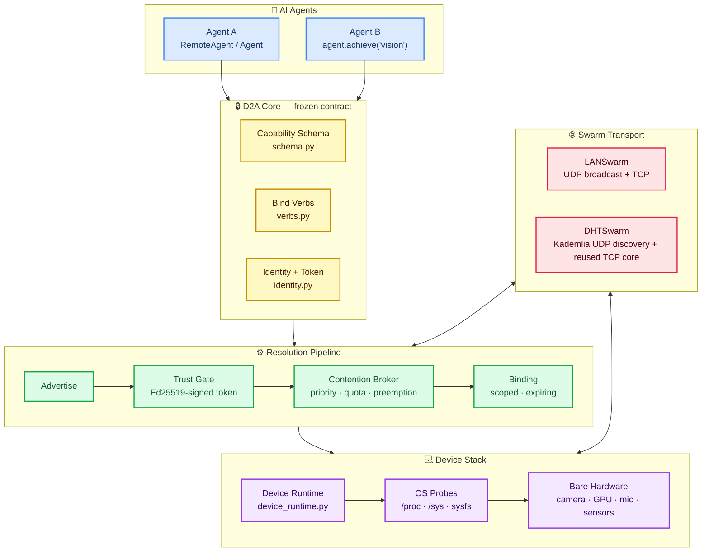
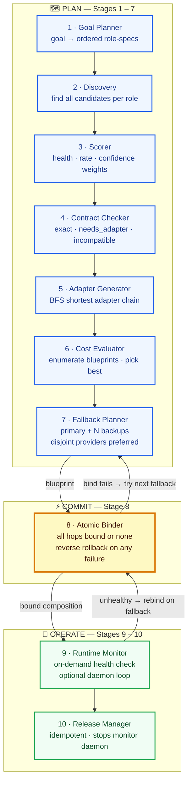
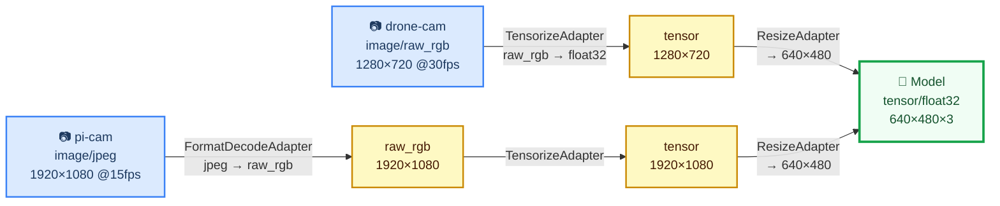
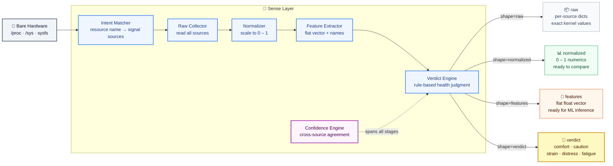

# D2A — Device-to-Agent Protocol

> A protocol that lets bodiless AI agents safely and temporarily bind to real device hardware — perceive its live state, use a capability under scope and quota, then release it — so many agents can share a limited pool of physical machines.

---

## The Idea

An agent is a mind with no body. A device is a body with no mind. D2A is how a mind borrows a body — and lets go cleanly when it's done.

Perception and action are physical: a language model that can only read text is fundamentally limited compared to one that can ask *"is this machine thermally stressed right now?"* or *"compose a vision pipeline from the camera on the drone and the GPU across the room."* Real hardware is the missing half of an AI agent.

D2A sits in a gap between two existing protocols:
- **A2A** (Agent-to-Agent): orchestration between AI agents.
- **MCP** (Model Context Protocol): agents talking to software tools.
- **D2A** fills the third corner: agent-to-physical-hardware. Bind, perceive, act, release.

The design principle is that binding is *temporary and scoped* — no agent owns a device, it borrows a capability for a TTL, under a consent policy that the device owner controls.

---

## System Architecture



Runtimes plug in on the device side; agents plug in on the top. The frozen core in the middle never changes — only the transport and the hardware underneath vary.

---

## The Universal 7-Phase Lifecycle

The same seven phases apply to every device regardless of what hardware it has. Only what it advertises in phase 1 differs.

```mermaid
flowchart LR
    P0["⚡ 0 · Exist\nprobe self"]
    P1["📡 1 · Advertise\npublish capabilities"]
    P2["🔍 2 · Discover\nagent finds providers"]
    P3["🔑 3 · Trust\nEd25519 token issued"]
    P4["🔗 4 · Bind\nbroker grants slot"]
    P5["👁️ 5 · Sense\nread via sense layer"]
    P6["🎯 6 · Act\nuse the capability"]
    P7["🔓 7 · Release\nslot returned"]

    P0 --> P1 --> P2 --> P3 --> P4 --> P5 --> P6 --> P7
    P7 -->|"back to available"| P1

    classDef exist     fill:#f0fdf4,stroke:#15803d,stroke-width:2px,color:#14532d
    classDef advertise fill:#eff6ff,stroke:#2563eb,stroke-width:2px,color:#1e3a8a
    classDef discover  fill:#f0f9ff,stroke:#0284c7,stroke-width:2px,color:#0c4a6e
    classDef trust     fill:#fef9c3,stroke:#ca8a04,stroke-width:2px,color:#451a03
    classDef bind      fill:#fdf4ff,stroke:#a21caf,stroke-width:2px,color:#4a044e
    classDef sense     fill:#fff7ed,stroke:#ea580c,stroke-width:2px,color:#431407
    classDef act       fill:#fff1f2,stroke:#e11d48,stroke-width:2px,color:#4c0519
    classDef release   fill:#f1f5f9,stroke:#475569,stroke-width:2px,color:#0f172a

    class P0 exist
    class P1 advertise
    class P2 discover
    class P3 trust
    class P4 bind
    class P5 sense
    class P6 act
    class P7 release
```



A Raspberry Pi, a laptop, a phone under Termux, a drone companion computer — all run the same runtime code. The only difference is the set of capabilities each probes and advertises.

---

## Capability Composition

The headline feature. Instead of binding to one device at a time, an agent declares a **goal**:

```python
with agent.achieve("vision") as comp:
    result = comp.run()   # consumer_confirmed=True
```

D2A assembles a working pipeline from **partial capabilities on different devices** — a camera on one node, a GPU on another — inserting adapter chains so mismatched outputs fit. A drone camera (raw RGB 1280×720) and a Pi camera (JPEG 1920×1080) both feed the same model (float32 tensor 640×480×3) via different chains. Nothing binds until every hop's contract is verified.

### The 10-Stage Engine



### Adapter Chains in Practice



Both paths produce the same verified contract at the consumer. `contracts_compatible()` runs at plan time **and** again at runtime — the consumer confirms the guarantee held end-to-end.

**Contract rules:** media-type mismatches (audio into a vision model) are rejected immediately as incompatible. Unknown format on either side always fails — never silently assumed to match.

---

## The Sense Layer

Raw hardware signals are noisy, device-specific, and meaningless to most agents. The Sense Layer translates them into four clean output **shapes** so every agent — from a one-liner to a trained ML model — gets exactly the view it needs.



**Verdict levels** (best → worst): `comfort` → `caution` → `strain` → `distress` → `fatigue`

Each verdict carries an **advice** string: `proceed`, `throttle`, `reduce_load`, `release_now`, `prefer_plugged_device`.

A simple agent needs zero ML: receive `verdict=distress`, read `advice=release_now`, release the binding. Every `SenseFrame` includes verdict + confidence regardless of which shape was requested.

> **Note:** Sense Layer Part 1 (the full forward pipeline) is complete and tested. Part 2 — SafetyFilter, ReflexPath (urgent fast-path), EventEmitter, and HealthAggregator — is **in progress**.

---

## Contention-Aware Broker

Multiple agents compete for a finite number of hardware slots. The broker handles this fairly and auditably:

| Feature | Detail |
|---|---|
| **Priority** | Integer 1 (highest) – 9 (lowest) per bind request |
| **Quotas** | Per-capability slot limit (default 1, configurable) |
| **Preemption** | Higher-priority agent takes a slot from a lower-priority holder |
| **Wait-queue** | Lower-priority requests park; auto-granted on release |
| **Auto-grant** | When a slot frees, the highest-priority queued agent is granted immediately |
| **Audit log** | Full event history: granted · queued · preempted · released · auto\_granted |
| **Cancel-queue** | Atomic Binder cancels queue entries on rollback — prevents ghost bindings |

---

## Security model (Ed25519, v1.1)

As of **v1.1** the trust gate is real asymmetric cryptography. **Identity is a keypair.**

> **What the old model actually was (honesty first).** Before v1.1, "signing" was HMAC where the device signed a token with its *own* secret and later verified it with the *same* secret. The published `public_key` was `sha256(private_key)` and was **never used in any verification path**. Net effect: **there was no cross-node authentication at all** — a device only ever "trusted" a token it had minted itself, and no agent or device ever cryptographically verified the other. v1.1 replaces this wholesale.

**Identity = keypair.** Each node (device *and* agent) has a persisted Ed25519 keypair, and its `node_id` is **derived from its public key** (`node_id = sha256(pubkey)[:16]`, `crypto.derive_node_id`). You cannot claim a `node_id` you don't hold the key for. Keys live in `~/.d2a/keys/<name>.json` (mode `0600`; override the base dir with `D2A_HOME` / `XDG_DATA_HOME`), keyed by node name so identity is stable across restarts.

**Dual crypto backend, one wire format.** `d2a/crypto.py` auto-detects a backend at import: **PyNaCl → `cryptography` → a pure-Python RFC 8032 fallback** (`d2a/_ed25519_fallback.py`). Signatures are byte-identical across all three (verified against the RFC 8032 §7.1 test vectors and cross-backend), so nodes on different backends interoperate.

> ⚠️ **The pure-Python fallback is DEMO-GRADE ONLY: not constant-time, slow, and vulnerable to timing side channels that can leak the signing key.** It exists so the core has zero third-party dependencies and still produces real signatures on a bare install. **Production deployments MUST install a real backend** (`pip install pynacl` or `cryptography`); detection is automatic. Check `d2a.crypto.ACTIVE_BACKEND` / `crypto.using_fallback()`.

**What is signed.** The five security-critical trust messages —
`bind_request`, `bind_response`, `renew_binding`, `lease_renewed`, `release_binding` — plus published **capability records**. The `BindToken` itself is device-signed over *all* its fields (`capability_name, agent_id, node_id, scope, expires_at, ts`), closing an earlier gap where `expires_at`/`scope` rode along unsigned. Canonical signing is sorted-key, compact-separator, UTF-8 JSON; `sig_key` (the signer's pubkey) is inside the signed bytes, `sig` is outside. The protocol version `v` and a timestamp `ts` are inside the signed payload too — so `agent_address` and `v` are now **tamper-evident** (both previously-flagged unauthenticated fields are closed).

**TOFU (trust on first use).** A peer's key is pinned on first contact (`~/.d2a/known_peers.json` via `crypto.PinStore`); both roles pin (agents pin devices, devices pin agents). Two independent checks guard every signed message, each with a distinct reason: **derivation** — `node_id` must derive from the presented key (`node_id_derivation_mismatch`); and **pin** — a known `node_id` presenting a different key is rejected loudly (`tofu_key_mismatch`). A bare signature check is never trusted on its own — a self-consistent forgery that claims another node's identity fails the derivation check.

**Replay window.** A signed message with `|receiver_now − ts| > 60 s` is rejected (`stale_signature`). The receiver clock is authoritative, consistent with the lease design. Records reuse the transport's TTL for freshness instead of a signed replay window (the transport rewrites a record's `ts` on ingest, so `ts` is excluded from a record's signature).

**Data-path messages stay bearer-authenticated (deliberately).** `get_reading` / `subscribe` / `stream_frame` are **not** signed per-request; the device authorizes them by looking up the `binding_id` in its own in-memory store. The signed `bind_response` is what proves the binding is real; the `binding_id` then acts as a bearer capability handle.

**What is explicitly NOT provided:**

- **No transport encryption.** Messages are signed, not encrypted — signing prevents *forgery*, not *eavesdropping*. A `binding_id` is a bearer token and is **sniffable on-path**; anyone who observes it can use it until the lease expires. **Leases are what bound the damage window** (default 300 s). Put D2A on a trusted network or add TLS/WireGuard underneath if confidentiality matters.
- **No revocation** and **no key rotation.** A pinned key is pinned until the pin store is edited; there is no CRL/OCSP and a re-keyed node presents as a new identity.
- **No PKI / no CA.** Trust is TOFU only — no certificate chains, no web of trust.
- **No forward secrecy.** There is no session key exchange; compromise of a signing key compromises all past and future signatures by it.

**Binding leases (DHCP-style).** Every binding is a *lease* with a TTL (default 300 s), carried in the bind response as `lease_ttl` / `lease_expires_at`. **The device clock is the single source of truth for expiry — agent and device clocks are never compared.** The agent auto-renews at ~½ TTL (with jitter); a single dropped renew is retried (~every TTL/10) and does *not* kill a healthy binding — only an explicit denial or the device-clock deadline actually passing does. On expiry the device runs one unified teardown (the same broker path as explicit release and preemption): it frees the broker slot, hands it to any queued agent, tears down subscriptions, and invalidates the token. This means a crashed agent that never releases no longer holds a slot forever — the lease lapses within a fraction of a TTL and the resource is reclaimed. What expiry does **not** guarantee: the `lease_expired` notice pushed to the agent is **best-effort, fire-and-forget** (it needs the agent's UNVERIFIED, agent-claimed `agent_address`, and can be lost); an agent that misses it simply finds its next request rejected. Renewal is transport-agnostic — identical over `LANSwarm` and `DHTSwarm`.

**Consent policy** (`policy.py`):

```
OPEN resources      → bindable by any trusted remote agent by default
                      (compute, gpu, sensing, battery_aware, storage, network)

Sensitive resources → DENIED to all remote agents by default
                      (camera, microphone, location, display)
                      Require explicit owner opt-in:
                      DeviceRuntime(open_resources=["camera"])
```

**Resource probes are availability-only.** `probe_camera()` detects that `/dev/video0` exists — it does not open the device, capture a frame, or record anything. The same applies to microphone, location, and display probes.

---

## Versioning & Compatibility

**The wire format is `v1.1`** as of the Ed25519 trust work — `d2a.PROTOCOL_VERSION = "1.1"` (defined in `d2a/protocol.py`). v1.1 is an **additive** minor bump over v1.0: it adds the `sig` / `sig_key` / `ts` fields to signed messages and records. Every outbound message and every published capability record carries a top-level `"v"` field, injected at the serialization chokepoints (TCP `_tcp_send` / `_handle_tcp`, LAN UDP `_broadcast` / `_handle_udp`, Kademlia `_send` / `_handle`, and both `publish()` sites). It is a plain field, **not** an envelope, so handlers that read `msg["type"]` are unaffected.

The compatibility contract:

| Peer version | Rule |
|---|---|
| **Same major** (`1.x` ↔ `1.y`) | Compatible. Process normally. **Minor versions are additive-only; unknown fields are ignored** — a `1.0` node and a `1.1` node interoperate on the data path. *(One deliberate exception below.)* |
| **Different major** (`1.x` ↔ `2.x`) | Incompatible (breaking). TCP requests get `{"type":"error","reason":"version_mismatch","peer_version":…}`; the agent raises a typed **`ProtocolVersionError`** naming both versions. Kademlia UDP messages from a different major are logged and **dropped with no reply** (no error-reply loops). |
| **Missing `"v"`** (legacy `0.x`) | Accepted for now, with a one-time deprecation warning per peer. **Planned to be rejected in the next major.** |

**Deliberate security exception to additive-only (v1.1).** The five trust operations must be Ed25519-signed. An **unsigned** `bind_request` / `renew_binding` / `release_binding` — e.g. from a v1.0 peer that predates signing — is **hard-rejected** with `{"reason":"unsigned_trust_op"}` (distinct from `version_mismatch`), even though the peers share a major. This narrowly breaks the additive-only promise **on purpose**: a half-trusted binding is worse than a failed one, so trust operations are not silently downgraded. **The data path is unaffected** — an unsigned `get_reading` / `subscribe` / `stream_frame` from a v1.0 peer still works, because those were never trust operations. So v1.0↔v1.1 interoperate for data, but v1.1 will not *establish* a binding for an unsigned peer.

**Relay caveat (message-level vs record-level `v`).** A message's `"v"` gates only the *immediate peer*. But a capability record is data that can be *relayed*: a DHT node running the same major can legitimately serve you a record **authored by a different-major node** inside a perfectly valid same-major `VALUE`/`announce` message. Records therefore carry their **own** author `"v"`, and a foreign-major record is **ingested** (not dropped) with a `debug`-level log — record-level `v` is the eventual gate for author compatibility, message-level `v` gates the hop. Rejecting foreign-major records on ingest is deferred to the next major.

---

## Device-Agnostic by Design

The same `DeviceRuntime` code runs on:
- Raspberry Pi (ARM, `/proc` present, no GPU)
- Laptop / server (x86, GPU via `/sys/class/drm`, thermal sensors)
- Android phone under Termux (ARM, battery present)
- Drone companion computer (embedded, resource-constrained)

Each device probes itself at startup using `/proc/meminfo`, `/proc/loadavg`, `/sys/class/thermal`, `/sys/class/power_supply`, `/dev/video*`, ALSA device nodes, and similar kernel interfaces — **no vendor SDK, no external library, no hardcoded hardware list**. If the kernel exposes it, the probe finds it; if not, the capability is simply absent from advertisement.

---

## What Works Today / What's In Progress

### ✅ Verified (single-process tests)

- Self-probing `DeviceRuntime`: CPU, memory, GPU, thermal, battery, disk I/O, network I/O, camera presence, microphone presence, location, storage, display
- Capability advertisement and discovery via LANSwarm (UDP broadcast + TCP)
- Ed25519 trust gate: device-signed scoped expiring `BindToken`; signed bind/renew/release + records; TOFU key pinning; pubkey-derived node IDs; replay window
- Contention broker: priority, quotas, preemption, wait-queue, auto-grant, audit log, cancel-queue
- Binding lifecycle: bind / rebind / renew / unbind
- On-demand data pull (default path, zero background work)
- Opt-in streaming at configurable Hz (background daemon, strictly opt-in)
- Sense Layer Part 1: all 4 shapes, verdict + confidence, CPU burn load test
- Full 10-stage Capability Composition: plan → atomic bind → runtime monitor + fallback → atomic release
- Consent policy: safe defaults, sensitive = denied unless owner opts in
- `with agent.achieve("vision") as comp: comp.run()` — goal API with context-manager auto-release
- Generic OS probes + resource probes across all capability types
- `Agent.achieve()` in-process mode (no TCP needed for single-machine use)

### 🔧 In Progress

- **Real two-machine / cross-network deployment** — everything is tested single-process; cross-machine binding under real network conditions is not yet validated
- **Key revocation / rotation & PKI** — trust is TOFU-only (see the security model); revocation, rotation, and any certificate/CA model are explicitly out of scope. Transport encryption (confidentiality) is also not provided — signing prevents forgery, not eavesdropping
- **Cross-machine DHT validation** — `DHTSwarm` is a full pure-stdlib Kademlia discovery layer (routing table, multi-value STORE/FIND_VALUE with TTL, bootstrap) over the reused LANSwarm TCP core; it is validated end-to-end *single-machine* (N nodes on distinct ports). Real multi-host / NAT-traversal validation is the remaining step
- **Sense Layer Part 2** — SafetyFilter (pre-return veto), ReflexPath (urgent fast-path), EventEmitter (verdict-change events), HealthAggregator (rolling health history)
- **Real adapter implementations** — adapter descriptors correctly track `IOContract` through transforms; the actual pixel/tensor computations are simulated; wiring to real compute (OpenCV, NumPy) is a separate phase
- **Multi-hop data routing** — `Composer.run()` verifies contracts and pulls from the producer; real cross-node data streaming (producer sends to consumer over the network) is a future phase

---

## Repository Layout

```
d2a/
├── schema.py              Capability + Binding data contracts (frozen)
├── crypto.py              Ed25519 (dual backend + RFC 8032 fallback), TOFU pins, node_id derivation
├── _ed25519_fallback.py   Pure-Python RFC 8032 Ed25519 (demo-grade, not constant time)
├── signing.py             Wire-message + record signing/verification (trust gate)
├── identity.py            Node ID (binding handles) + Ed25519 token signing
├── protocol.py            Wire version (PROTOCOL_VERSION="1.0") + negotiation helpers
├── verbs.py               bind / rebind / renew / unbind operations
├── broker.py              Contention broker: priority · quota · preemption · waitqueue
├── probes.py              OS probes: CPU, memory, GPU, thermal, battery, disk, net
├── resource_probes.py     Generic resource probes: camera, mic, location, storage …
├── policy.py              Owner-consent policy (safe defaults, sensitive = denied)
├── swarm.py               SwarmTransport ABC + LANSwarm (UDP broadcast + TCP)
├── swarm_dht.py           DHTSwarm: Kademlia UDP discovery + reused TCP core
├── kademlia.py            Pure-stdlib Kademlia node (routing table, STORE/FIND_VALUE)
├── data_provider.py       On-demand pull + opt-in streaming data engine
├── stream_source.py       Per-resource SignalSource readers
├── preprocessor.py        Delta / rate computation, ring buffer
├── contracts.py           IOContract · CapabilityContract · contracts_compatible()
├── adapters.py            Adapter descriptors + BFS find_adapter_chain()
├── composer.py            Composer · CompositionPlan · Composition (context manager)
├── sense_types.py         SenseRequest · SenseFrame · verdict levels · advice strings
├── sense_layer.py         SenseLayer orchestrator (Part 1: forward pipeline)
└── sense/
    ├── intent_matcher.py      Resource name → registered signal sources
    ├── raw_collector.py       Read all sources for a capability
    ├── normalizer.py          Scale numerics to [0, 1]
    ├── feature_extractor.py   Flat feature vector + aligned name list
    ├── verdict_engine.py      Rule-based health verdict (comfort → distress)
    └── confidence_engine.py   Cross-source agreement score [0, 1]

d2a/composition/
├── goal_planner.py        Goal → ordered role-specs (data-driven registry)
├── discovery.py           Find all candidates per role from capability pool
├── scorer.py              Health + rate + confidence scoring, named weights
├── contract_checker.py    exact / needs_adapter / incompatible classification
├── adapter_generator.py   Build + describe adapter chain for a hop
├── cost_evaluator.py      Blueprint · HopRecord · enumerate blueprints · pick best
├── fallback_planner.py    Primary + N backups, disjoint providers preferred
├── atomic_binder.py       All-or-nothing bind with reverse rollback
├── runtime_monitor.py     On-demand health check + optional daemon loop
└── release_manager.py     Idempotent release of all bindings

runtimes/
└── device_runtime.py      Full device node: probes + broker + swarm + sense + composition

agents/
├── remote_agent.py        Network bind / on-demand data pull / opt-in streaming
├── simple_agent.py        Friendly 5-line API + achieve() goal composition API
└── llm_agent.py           Minimal agent wrapper (used in broker tests)

examples/
└── … (see Examples section)
```

---

## Examples

All examples run single-process with no network setup required unless noted.

| Example | What it proves | Command |
|---|---|---|
| `any_device_demo.py` | Runtime probes itself and advertises only what it physically has — no hardcoded hardware list | `python3 examples/any_device_demo.py` |
| `any_resource_demo.py` | Generic resource probes detect camera / mic / location / storage presence (availability only, no capture) | `python3 examples/any_resource_demo.py` |
| `bind_one.py` | Single bind: agent discovers a runtime, binds a capability, receives a scoped token | `python3 examples/bind_one.py` |
| `broker_demo.py` | Broker: quota, preemption (priority 1 beats priority 5), wait-queue, auto-grant on release, full audit log | `python3 examples/broker_demo.py` |
| `rebind_demo.py` | Rebind to a different capability, renew a token TTL, unbind cleanly | `python3 examples/rebind_demo.py` |
| `trust_demo.py` | Ed25519 token signing and verification; cross-runtime token rejected; scoped token; expiry check | `python3 examples/trust_demo.py` |
| `ondemand_demo.py` | On-demand data pull: agent requests one fresh hardware frame per call, zero background work | `python3 examples/ondemand_demo.py` |
| `stream_optin_demo.py` | Opt-in streaming: device pushes frames at configurable Hz; agent calls stop to return to silence | `python3 examples/stream_optin_demo.py` |
| `simple_agent_demo.py` | `with agent.use("compute") as r: r.data()` — 5-line agent experience | `python3 examples/simple_agent_demo.py` |
| `sense_pipeline_demo.py` | Sense Layer: all 4 shapes, CPU burn test watching verdict shift comfort → strain → comfort | `python3 examples/sense_pipeline_demo.py` |
| `composition_plan_demo.py` | Plan phase (stages 1–7): goal→blueprint, scorer prefers healthy GPU, two cameras get different adapter chains, mismatch rejected cleanly | `python3 examples/composition_plan_demo.py` |
| `composition_run_demo.py` | Full 10-stage pipeline: happy path, atomic rollback, fallback-on-bind, runtime distress + re-bind, atomic context-manager release | `python3 examples/composition_run_demo.py` |
| `composition_simple_demo.py` | `with agent.achieve("vision") as comp: comp.run()` — the 2-line goal API with auto-release | `python3 examples/composition_simple_demo.py` |
| `swarm_local_demo.py` | LANSwarm on localhost: publish a record, discover it, send a TCP message | `python3 examples/swarm_local_demo.py` |
| `swarm_multinode_demo.py` | Two runtimes + one agent on a real LAN (**requires two terminals or two machines**) | `python3 examples/run_node.py` then `run_provider.py` then `run_seeker.py` |

---

## Tech

- **Language:** Python 3.10+
- **Dependencies:** standard library only — `socket`, `threading`, `hashlib`, `hmac`, `secrets`, `dataclasses`, `itertools`. No `pip install` required.
- **Transport:** `LANSwarm` is built-in (UDP broadcast for discovery, TCP for messages). `DHTSwarm` is a full pure-stdlib Kademlia discovery layer (`d2a/kademlia.py`) that reuses the LANSwarm TCP core for messaging — so `bind_remote()` works unchanged over the DHT. Its routing-table + XOR-metric design follows the [EdgeMind swarm project](https://github.com/student-kshitish/anp-edge-swarm), reworked here for multi-value TTL storage, event-driven lookups, parameterizable ports, and thread safety. See `examples/swarm_dht_demo.py` and `tests/test_dht.py`.
- **Platforms tested:** Linux (kernel 6.x, x86). The `/proc` and `/sys` probe paths are Linux-native; macOS / BSD probes fall back gracefully when paths are absent.
