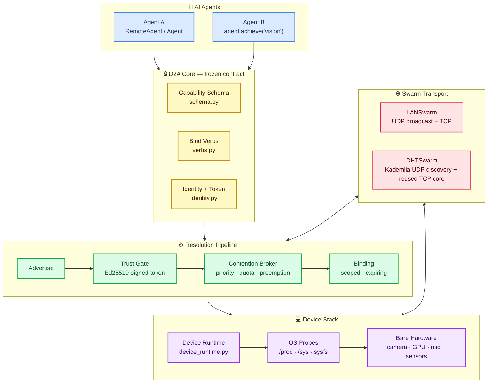
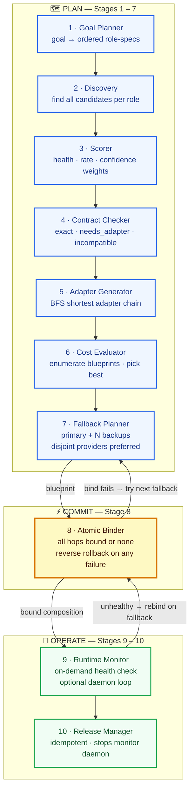
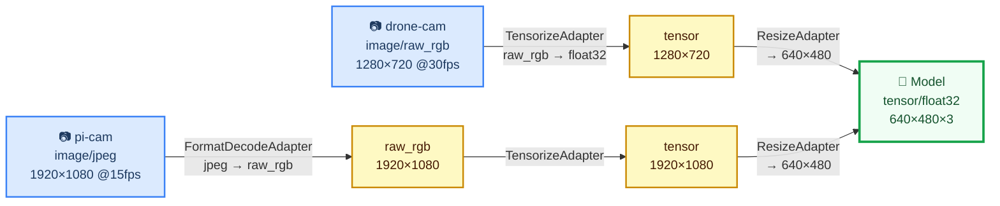
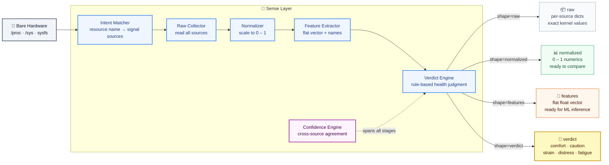

# D2A — Device-to-Agent Protocol

> A protocol that lets bodiless AI agents safely and temporarily bind to real device hardware — perceive its live state, use a capability under scope and quota, then release it — so many agents can share a limited pool of physical machines.

---

## The Idea

An agent is a mind with no body. A device is a body with no mind. D2A is how a mind borrows a body — and lets go cleanly when it's done.

Perception and action are physical: a language model that can only read text is fundamentally limited compared to one that can ask *"is this machine thermally stressed right now?"* or *"compose a vision pipeline from the camera on the drone and the GPU across the room."* Real hardware is the missing half of an AI agent.

D2A sits in a gap between two existing protocols:
- **A2A** (Agent-to-Agent): orchestration between AI agents.
- **MCP** (Model Context Protocol): agents talking to software tools.
- **D2A** fills the third corner: agent-to-physical-hardware. Bind, perceive, act, release.

The design principle is that binding is *temporary and scoped* — no agent owns a device, it borrows a capability for a TTL, under a consent policy that the device owner controls.

---

## System Architecture



Runtimes plug in on the device side; agents plug in on the top. The frozen core in the middle never changes — only the transport and the hardware underneath vary.

---

## The Universal 7-Phase Lifecycle

The same seven phases apply to every device regardless of what hardware it has. Only what it advertises in phase 1 differs.

```mermaid
flowchart LR
    P0["⚡ 0 · Exist\nprobe self"]
    P1["📡 1 · Advertise\npublish capabilities"]
    P2["🔍 2 · Discover\nagent finds providers"]
    P3["🔑 3 · Trust\nEd25519 token issued"]
    P4["🔗 4 · Bind\nbroker grants slot"]
    P5["👁️ 5 · Sense\nread via sense layer"]
    P6["🎯 6 · Act\nuse the capability"]
    P7["🔓 7 · Release\nslot returned"]

    P0 --> P1 --> P2 --> P3 --> P4 --> P5 --> P6 --> P7
    P7 -->|"back to available"| P1

    classDef exist     fill:#f0fdf4,stroke:#15803d,stroke-width:2px,color:#14532d
    classDef advertise fill:#eff6ff,stroke:#2563eb,stroke-width:2px,color:#1e3a8a
    classDef discover  fill:#f0f9ff,stroke:#0284c7,stroke-width:2px,color:#0c4a6e
    classDef trust     fill:#fef9c3,stroke:#ca8a04,stroke-width:2px,color:#451a03
    classDef bind      fill:#fdf4ff,stroke:#a21caf,stroke-width:2px,color:#4a044e
    classDef sense     fill:#fff7ed,stroke:#ea580c,stroke-width:2px,color:#431407
    classDef act       fill:#fff1f2,stroke:#e11d48,stroke-width:2px,color:#4c0519
    classDef release   fill:#f1f5f9,stroke:#475569,stroke-width:2px,color:#0f172a

    class P0 exist
    class P1 advertise
    class P2 discover
    class P3 trust
    class P4 bind
    class P5 sense
    class P6 act
    class P7 release
```



A Raspberry Pi, a laptop, a phone under Termux, a drone companion computer — all run the same runtime code. The only difference is the set of capabilities each probes and advertises.

---

## Capability Composition

The headline feature. Instead of binding to one device at a time, an agent declares a **goal**:

```python
with agent.achieve("vision") as comp:
    result = comp.run()   # consumer_confirmed=True
```

D2A assembles a working pipeline from **partial capabilities on different devices** — a camera on one node, a GPU on another — inserting adapter chains so mismatched outputs fit. A drone camera (raw RGB 1280×720) and a Pi camera (JPEG 1920×1080) both feed the same model (float32 tensor 640×480×3) via different chains. Nothing binds until every hop's contract is verified.

### The 10-Stage Engine



### Adapter Chains in Practice



Both paths produce the same verified contract at the consumer. `contracts_compatible()` runs at plan time **and** again at runtime — the consumer confirms the guarantee held end-to-end.

**Contract rules:** media-type mismatches (audio into a vision model) are rejected immediately as incompatible. Unknown format on either side always fails — never silently assumed to match.

---

## The Sense Layer

Raw hardware signals are noisy, device-specific, and meaningless to most agents. The Sense Layer translates them into four clean output **shapes** so every agent — from a one-liner to a trained ML model — gets exactly the view it needs.



**Verdict levels** (best → worst): `comfort` → `caution` → `strain` → `distress` → `fatigue`

Each verdict carries an **advice** string: `proceed`, `throttle`, `reduce_load`, `release_now`, `prefer_plugged_device`.

A simple agent needs zero ML: receive `verdict=distress`, read `advice=release_now`, release the binding. Every `SenseFrame` includes verdict + confidence regardless of which shape was requested.

> **Note:** Sense Layer Part 1 (the full forward pipeline) is complete and tested. Part 2 — SafetyFilter, ReflexPath (urgent fast-path), EventEmitter, and HealthAggregator — is **in progress**.

---

## Contention-Aware Broker

Multiple agents compete for a finite number of hardware slots. The broker handles this fairly and auditably:

| Feature | Detail |
|---|---|
| **Priority** | Integer 1 (highest) – 9 (lowest) per bind request |
| **Quotas** | Per-capability slot limit (default 1, configurable) |
| **Preemption** | Higher-priority agent takes a slot from a lower-priority holder |
| **Wait-queue** | Lower-priority requests park; auto-granted on release |
| **Auto-grant** | When a slot frees, the highest-priority queued agent is granted immediately |
| **Audit log** | Full event history: granted · queued · preempted · released · auto\_granted |
| **Cancel-queue** | Atomic Binder cancels queue entries on rollback — prevents ghost bindings |

---

## Security model (Ed25519, v1.1)

As of **v1.1** the trust gate is real asymmetric cryptography. **Identity is a keypair.**

> **What the old model actually was (honesty first).** Before v1.1, "signing" was HMAC where the device signed a token with its *own* secret and later verified it with the *same* secret. The published `public_key` was `sha256(private_key)` and was **never used in any verification path**. Net effect: **there was no cross-node authentication at all** — a device only ever "trusted" a token it had minted itself, and no agent or device ever cryptographically verified the other. v1.1 replaces this wholesale.

**Identity = keypair.** Each node (device *and* agent) has a persisted Ed25519 keypair, and its `node_id` is **derived from its public key** (`node_id = sha256(pubkey)[:16]`, `crypto.derive_node_id`). You cannot claim a `node_id` you don't hold the key for. Keys live in `~/.d2a/keys/<name>.json` (mode `0600`; override the base dir with `D2A_HOME` / `XDG_DATA_HOME`), keyed by node name so identity is stable across restarts.

**Dual crypto backend, one wire format.** `d2a/crypto.py` auto-detects a backend at import: **PyNaCl → `cryptography` → a pure-Python RFC 8032 fallback** (`d2a/_ed25519_fallback.py`). Signatures are byte-identical across all three (verified against the RFC 8032 §7.1 test vectors and cross-backend), so nodes on different backends interoperate.

> ⚠️ **The pure-Python fallback is DEMO-GRADE ONLY: not constant-time, slow, and vulnerable to timing side channels that can leak the signing key.** It exists so the core has zero third-party dependencies and still produces real signatures on a bare install. **Production deployments MUST install a real backend** (`pip install pynacl` or `cryptography`); detection is automatic. Check `d2a.crypto.ACTIVE_BACKEND` / `crypto.using_fallback()`.

**What is signed.** The five security-critical trust messages —
`bind_request`, `bind_response`, `renew_binding`, `lease_renewed`, `release_binding` — plus published **capability records**. The `BindToken` itself is device-signed over *all* its fields (`capability_name, agent_id, node_id, scope, expires_at, ts`), closing an earlier gap where `expires_at`/`scope` rode along unsigned. Canonical signing is sorted-key, compact-separator, UTF-8 JSON; `sig_key` (the signer's pubkey) is inside the signed bytes, `sig` is outside. The protocol version `v` and a timestamp `ts` are inside the signed payload too — so `agent_address` and `v` are now **tamper-evident** (both previously-flagged unauthenticated fields are closed).

**TOFU (trust on first use).** A peer's key is pinned on first contact (`~/.d2a/known_peers.json` via `crypto.PinStore`); both roles pin (agents pin devices, devices pin agents). Two independent checks guard every signed message, each with a distinct reason: **derivation** — `node_id` must derive from the presented key (`node_id_derivation_mismatch`); and **pin** — a known `node_id` presenting a different key is rejected loudly (`tofu_key_mismatch`). A bare signature check is never trusted on its own — a self-consistent forgery that claims another node's identity fails the derivation check.

**Replay window.** A signed message with `|receiver_now − ts| > 60 s` is rejected (`stale_signature`). The receiver clock is authoritative, consistent with the lease design. Records reuse the transport's TTL for freshness instead of a signed replay window (the transport rewrites a record's `ts` on ingest, so `ts` is excluded from a record's signature).

**Data-path messages stay bearer-authenticated (deliberately).** `get_reading` / `subscribe` / `stream_frame` are **not** signed per-request; the device authorizes them by looking up the `binding_id` in its own in-memory store. The signed `bind_response` is what proves the binding is real; the `binding_id` then acts as a bearer capability handle.

**What is explicitly NOT provided:**

- **No transport encryption.** Messages are signed, not encrypted — signing prevents *forgery*, not *eavesdropping*. A `binding_id` is a bearer token and is **sniffable on-path**; anyone who observes it can use it until the lease expires. **Leases are what bound the damage window** (default 300 s). Put D2A on a trusted network or add TLS/WireGuard underneath if confidentiality matters.
- **No revocation** and **no key rotation.** A pinned key is pinned until the pin store is edited; there is no CRL/OCSP and a re-keyed node presents as a new identity.
- **No PKI / no CA.** Trust is TOFU only — no certificate chains, no web of trust.
- **No forward secrecy.** There is no session key exchange; compromise of a signing key compromises all past and future signatures by it.

**Binding leases (DHCP-style).** Every binding is a *lease* with a TTL (default 300 s), carried in the bind response as `lease_ttl` / `lease_expires_at`. **The device clock is the single source of truth for expiry — agent and device clocks are never compared.** The agent auto-renews at ~½ TTL (with jitter); a single dropped renew is retried (~every TTL/10) and does *not* kill a healthy binding — only an explicit denial or the device-clock deadline actually passing does. On expiry the device runs one unified teardown (the same broker path as explicit release and preemption): it frees the broker slot, hands it to any queued agent, tears down subscriptions, and invalidates the token. This means a crashed agent that never releases no longer holds a slot forever — the lease lapses within a fraction of a TTL and the resource is reclaimed. What expiry does **not** guarantee: the `lease_expired` notice pushed to the agent is **best-effort, fire-and-forget** (it needs the agent's UNVERIFIED, agent-claimed `agent_address`, and can be lost); an agent that misses it simply finds its next request rejected. Renewal is transport-agnostic — identical over `LANSwarm` and `DHTSwarm`.

**Consent policy** (`policy.py`):

```
OPEN resources      → bindable by any trusted remote agent by default
                      (compute, gpu, sensing, battery_aware, storage, network)

Sensitive resources → DENIED to all remote agents by default
                      (camera, microphone, location, display)
                      Require explicit owner opt-in:
                      DeviceRuntime(open_resources=["camera"])
```

**Resource probes are availability-only.** `probe_camera()` detects that `/dev/video0` exists — it does not open the device, capture a frame, or record anything. The same applies to microphone, location, and display probes.

---

## Capability Manifests (v1.2)

Every capability record can carry a **manifest** — a signed, machine-readable self-description so an agent learns what a capability *is* (its reading schema, actions, consent tier, whether it streams) from discovery alone, without reading any device code. This is D2A's equivalent of an **MCP tool schema / A2A agent card**, and the prerequisite for a mechanical `d2a→MCP` bridge.

The manifest lives inside the capability record, which is **already Ed25519-signed at publish** (`signing.sign_record`), so **manifests are authenticated for free** — a tampered manifest fails `verify_record`. The manifest is injected at the single record builder (`DeviceRuntime._capability_record`, shared by the UDP/DHT publish path and the TCP `capabilities_request` path) *before* signing. Manifests are **optional** (a record without one is valid — additive contract) and validated at publish time (`d2a/manifest.py`, a stdlib leaf).

**Deliberately a small fixed vocabulary, not full JSON Schema** (no `$ref`, `oneOf`, or deep nesting) — so manifests are writable by hand, diffable, verifiable, and translatable to MCP schemas mechanically. The whole grammar:

```
manifest = {
  "description": <str>,                      # one line, human-readable        (required)
  "reading":  { <field>: <fieldspec> },      # what a data frame contains      (optional)
  "actions":  { <name>: { "description": <str>,
                          "params": { <param>: <paramspec> } } },              (optional)
  "consent_tier": "open" | "sensitive",      # MUST equal the policy SSOT      (required)
  "streaming": <bool>                         # does subscribe() apply?      (default false)
}

fieldspec / paramspec = {
  "type": "number" | "string" | "boolean" | "object" | "array",               (required)
  "items": "number" | "string" | "boolean" | "object",   # required iff type=="array";
                                                          # forbidden otherwise; NO nested arrays
  "unit":  <str>,          # optional, e.g. "%", "MB", "C"
  "description": <str>,    # optional
  "format": "hex",         # optional; ONLY on type=="string" — declares hex-encoded bytes
  "required": <bool>       # paramspec only
}
```

**Bytes** are represented as hex-encoded `"string"` fields, optionally annotated `"format": "hex"` so the encoding is machine-readable.

**consent_tier is not free text.** It must equal the resource's *intrinsic* sensitivity — the single source of truth is `RESOURCE_SENSITIVITY` (resource capabilities) / `KIND_SENSITIVITY` (peripheral kinds), unknown → `"sensitive"`. The validator rejects any manifest whose `consent_tier` contradicts it. Rationale: **the manifest describes the resource's *nature*; whether *this* device grants it is a bind-time policy decision** (see the consent policy), never encoded in the manifest — so it can't drift from, or lie about, the policy layer.

**Size cap.** A manifest larger than **4 KB** is rejected at publish. This matters because Kademlia `FIND_VALUE` returns **all** live provider records for a capability in **one** UDP datagram (`{"records": [...]}`, `MAX_PACKET = 65535`) — so the datagram size is `N_providers × record_size`, not a single record. A realistic manifest is ~0.6 KB (record ~1.2 KB); the 4 KB cap keeps a single verbose manifest from breaking discovery, but heavy provider fan-in on one capability still trends toward the 64 KB ceiling. A finer mitigation (cap records-per-`VALUE`, or TCP fallback for large result sets) is **explicitly deferred** — out of scope for v1.2.

**Worked example** — the `sensing` capability manifest (note the array-typed fields, the SSOT-derived `consent_tier`, and units):

```json
{
  "description": "Thermal zones and hardware sensor inputs of the host.",
  "reading": {
    "thermal_zones":  { "type": "number", "description": "count of thermal zones" },
    "sample_temps_c": { "type": "array", "items": "number", "unit": "C",
                        "description": "sample of current zone temperatures" },
    "sensor_inputs":  { "type": "number", "description": "count of hwmon sensor inputs" },
    "hwmons":         { "type": "array", "items": "string",
                        "description": "hardware monitor chip names" }
  },
  "consent_tier": "open",
  "streaming": true
}
```

**Agent side:** `discover()` results expose `record["manifest"]`; `RemoteAgent.describe(capability_name)` returns the parsed manifest from the discovery cache. See `examples/manifest_demo.py`.

Built-in manifests ship for `compute`, `sensing`, `camera`, and `raw_<kind>` peripheral relays. Guardian (Case 2) and Synthesis (Case 3) virtual capabilities carry their own composed manifests when they go on-wire — see below.

---

## Composition on the Wire

Guardian VirtualSmartObjects (Case 2) and Synthesis emergent devices (Case 3) are no longer in-process only — a host node **publishes them as first-class capabilities** that other agents discover, bind, and drive over the network, through the **same** broker quota, lease lifecycle, and consent policy as any real capability.

**Guardian — `DeviceRuntime.publish_virtual(vso)`.** Publishes the VSO's *smart* surface (e.g. `smart_sensor` with `verdict`/`monitor` actions) as a distinctly-named capability, signed with the host key, alongside the `raw_<kind>` relay capability (which keeps its own raw-primitive manifest). Both surfaces are independently discoverable. The manifest is composed from the kind's action map — the smart actions, not the raw primitives.

**Synthesis — `DeviceRuntime.publish_emergent(handle)`.** The **coordinator** node that holds the `EmergentDeviceHandle` publishes the emergent device (e.g. `pooled_storage_2x` with `write`/`read`). The manifest is composed **only** from the synthesis kind + `combined_contract` — **member records are never embedded**, so no per-part manifest or member `node_id` leaks into the emergent record (there's a test asserting exactly this).

**Binding & actions.** A virtual capability is registered in the host's capability set + broker quota + consent policy (its consent tier comes from `KIND_SENSITIVITY`), so bind/renew/release, lease expiry, and consent gating all apply identically — **there is no consent bypass through the virtual path** (a sensitive-kind VSO denies an unapproved remote agent, proven by test). Reads route through the virtual dispatcher; a new additive **`action`** message (binding-scope-gated, like `get_reading`) invokes a manifest-declared action via `RemoteAgent.call_action(binding, action, params)`. Bytes cross the wire hex-encoded.

> **Honest coordinator caveat.** The coordinator/host is a **single point of failure and a trust chokepoint**: agents trust *its* Ed25519 signature over the virtual/emergent record and its routing, and the **member devices are invisible behind it** — an agent cannot see or independently verify the parts a coordinator fused, nor reach them directly. The emergent *record* carries no member identity, but a runtime *action response* (e.g. a pooled `read`) may still reference the member that served it. Distributed multi-coordinator trust and per-member attestation are out of scope.

---

## Event Layer — Conditional Events (v1.3)

Before v1.3 an agent could **pull** (`get_reading`), **raw-stream** (`subscribe`), and **request/response** (`action`) — but it could not be *notified when something it cares about happens*. The event layer adds the missing interaction primitive: **"notify me when field X crosses Y."**

**Condition vocabulary — small and fixed**, exactly like the manifest vocabulary. A condition is one manifest reading field + one operator:

```json
{"field": "value", "op": "gt", "value": 50}      // op ∈ gt|lt|ge|le|eq|ne|changed
{"field": "level", "op": "changed"}               // "changed" takes no value
```

**One condition per subscription.** An agent wanting AND/OR composes it agent-side with multiple subscriptions — there is deliberately **no expression language**, which is what keeps this spec-able. Conditions are validated **at subscribe time against the capability's manifest**: an unknown field, or an op/type mismatch (`gt` on a string field, `eq` on an array), is rejected with `{"error": "invalid_condition", "detail": …}`. Ordered ops (`gt`/`lt`/`ge`/`le`) require a numeric field; `eq`/`ne` require the value to match the field's declared scalar type; arrays/objects are not conditionable.

**Edge semantics — fires on the crossing, not the level.** A `gt` condition fires on the sample where the field *crosses* the threshold (False→True), **not** on every sample it stays above it, and **re-arms** automatically when the field drops back below. `changed` fires on any value change. The **first sample only establishes a baseline and never fires** — even if the condition is already true at subscribe time (there is no prior edge to cross). Each subscription keeps its own edge state, so N conditions on one capability each track their own crossings off the single shared sample.

```python
# agent-side convenience
sub = agent.on_event(binding,
                     {"field": "value", "op": "gt", "value": 50},
                     lambda ev: print("crossed!", ev["seq"], ev["reading"]),
                     eval_hz=5)
# ... later
agent.off_event(binding, sub["event_sub_id"])
```

**Delivery — best-effort, no guarantee (documented honestly).** An `event` is a **data-path** message: `binding_id`-bearer, **not signed** (same class as `stream_frame`), fire-and-forget to the agent's address, carrying the **triggering reading snapshot** and a **per-subscription monotonic `seq`** so the agent can detect gaps (a jump surfaces as `event["_gap"]`). There is **no re-delivery** — an agent that needs certainty re-reads on event receipt.

**Principle guard — bounded background work, purchased by a live lease.** Condition evaluation is opt-in work that only runs while a lease is live. It rides the **same per-capability sampling loop** as streaming (no parallel evaluator; virtual VSO/emergent capabilities are driven through the same loop via a registered pseudo-source). Two guards, with **distinct** rejection reasons:

| Guard | Default | Rejection reason |
|---|---|---|
| Per-binding cap (what one lease may buy) | `8` | `event_cap_exceeded` |
| Per-capability device ceiling (shared-loop defense-in-depth) | `32` | `device_event_capacity` |

The device **owns the cadence**: an agent-requested `eval_hz` is clamped to `MAX_SAMPLE_HZ` (10) and the effective rate is echoed in the subscribe response. *(The same clamp now also guards `subscribe` streaming, which was previously unclamped.)* **Every event subscription dies with the binding** — lease expiry, release, and preemption all tear down events through the *same* unified cleanup path as streams (proven by a multi-sweep test: zero events after expiry).

**Sense-layer verdict events.** The Sense Layer's long-standing `event_emitter` hook is closed: a device-local health **verdict transition** (`comfort → caution → distress`) fires as a `verdict_change` event with the same changed-op edge semantics (never on the baseline).

### Async task lifecycle (Phase 2)

Some actions are slow — a `monitor` that samples a sensor N times over minutes cannot return synchronously (it would block the handler past the agent's 5 s request timeout). A dispatcher **declares an action long-running** in its manifest (`actions.<name>.long_running: true`); the device then runs it on a worker thread and returns **immediately**:

```json
{"type":"action_result", "result": {"task_id": "…", "status": "running"}}
```

Completion (or failure) arrives later as a **`kind:"task"` event on the same channel** — `{"kind":"task","task_id":…,"status":"done"|"failed","result":…}` — so no new delivery machinery is needed; the subscription is implicit with the task. Poll meanwhile with the **`task_status`** verb (`running` → `done`/`failed`/`cancelled`/`unknown`). `RemoteAgent.call_action(binding, action, params, on_complete=cb)` registers the completion callback; the call itself returns the moment the `task_id` is issued.

**Which actions are long-running (measured, not assumed).** The Guardian `monitor` (an `intervals × delay` loop, unbounded by agent params) is declared long-running. The emergent `read_all` / `verdict_all` were measured to be **single-pass** aggregate reads (one `read_value` per member, no sleep loop; `verdict_all` delegates to one `read_all`) — they stay synchronous, **no exemption invented**.

**Tasks are binding-scoped: lease death cancels them** through the *same* unified teardown path as streams and events. Here the honest limit is explicit:

- A **cooperatively cancellable** action (its function accepts a cancel token) sees the token set and returns early — **truly cancelled**.
- A **non-cancellable** action (e.g. the VSO `monitor` for-loop, which has no stop check) keeps running in the background — **orphaned**. The device drops its task record so the completion event is **suppressed** and `task_status` returns `unknown`, but the loop itself is *not* interrupted. The demo long-running action is written with a cancel token to exercise real cancellation; the VSO monitor is honestly orphaned.

### Device-local reflex path (Phase 2)

A **reflex** is a device-local `condition → action` binding that runs with **no agent involved** — the fast path for "if the health verdict crosses into `distress`, flag it locally *now*." It is wired through the Sense Layer's **`safety_check` hook** (the other closed Part-2 stub) and reuses `conditions.EdgeEvaluator`, so it fires on the edge and re-arms exactly like a wire condition — but evaluated and actioned entirely on-device (`DeviceRuntime.wire_reflex_demo()`). This is deliberately **one hook + one demo reflex**; full reflex *policy* (multiple reflexes, agent-authored local bindings) is out of scope.

> **Name-collision note.** The original Sense-Layer `reflex_path` TODO meant a *latency optimization* (skip optional pipeline stages when `mode=="urgent"`). The v1.3 reflex is a *different* feature — a local condition→action hook. They share a name only; a pointer comment marks this at the old TODO site, and the urgent skip-stages optimization stays deferred.

---

## Error model (v1.4)

Before v1.4 the wire had **five** different error shapes accreted across arcs —
`{"type":"error","reason":…}`, `{"type":"error","error":…,"detail":…}`,
`{"type":"lease_renewed","status":"denied","reason":…}`,
`{"status":"error","message":…}`, and policy denials that carried only a human
`message` with **no machine code at all**. An agent could not branch on a stable
value; it had to string-match prose. v1.4 collapses all of them onto **one shape
with one carrier key** and a single source-of-truth registry: `d2a/errors.py`.

**The two shapes.** A *fault* and a *coded denial* differ only in whether the
message is itself the answer to a request:

```jsonc
// error — a fault, no useful body
{"type": "error", "code": "binding_invalid_or_out_of_scope", "detail": "...",
 "binding_id": "…"}          // + contextual fields (task_id, peer_version) where they apply

// coded denial — a semantic "no" that keeps its own type + status,
// but carries the SAME code from the SAME registry
{"type": "lease_renewed", "status": "denied", "code": "lease_expired",
 "binding_id": "…", "detail": "..."}
```

Denials that are responses (`bind_response`, `lease_renewed`, `released`) keep
their `type` and `status:"denied"` and **gain** `code`; everything else that was
an error becomes `type:"error"` + `code`. A dying-lease **notice** push
(`lease_expired`) carries `code` too, so the agent's `LeaseLostError.code` is
uniform — `errors.LEASE_EXPIRED` on a silent TTL death, `errors.DEVICE_SHUTDOWN`
on an announced departure. Agent-side exceptions expose `.code`
(`LeaseLostError.code`, `WireError.code`); `.reason` remains a value-identical
alias.

**The registry** (`d2a/errors.py`, one leaf module, every code a named constant;
trust/identity codes are re-exported from `d2a.signing` / `d2a.crypto` so each has
exactly one name):

| Group | Codes |
|---|---|
| Transport / version | `version_mismatch` |
| Trust / identity | `unsigned_trust_op`, `stale_signature`, `bad_signature`, `node_id_derivation_mismatch`, `tofu_key_mismatch` |
| Lease / binding lifecycle | `unknown_binding`, `not_owner`, `capability_mismatch`, `lease_expired`, `device_shutdown` |
| Policy | `policy_blocked`, `approval_required` |
| Broker | `capability_not_found`, `no_active_bind`, `binding_not_found` |
| Scope / action / event guards | `binding_invalid_or_out_of_scope`, `not_an_action_capability`, `no_manifest_for_conditions`, `invalid_condition`, `event_cap_exceeded`, `device_event_capacity` |
| Agent-side | `no_response`, `binding_id_mismatch`, `no_provider` |

**Boundary — what is NOT in the registry.** Codes that appear **inside**
`action_result.result` — the Guardian/emergent *brain* results (e.g.
`consent_required`, `device_unavailable`, `path_sandbox_violation`,
`skill_not_enabled`) — are **application-level, not protocol-registry members**.
They ride nested in an otherwise-*successful* `action_result` and are not protocol
control-flow, so an agent never branches on them to keep a binding alive. Folding
those onto the same `{code, detail}` shape is **deferred** as a follow-up; the
registry and its drift guard cover the protocol error surface only.

**Free-text is not a code.** A caught exception string from a failed async task is
delivered under `error_detail` (on the `kind:"task"` event and `task_status`),
deliberately *not* `code`/`error`, so a stack-trace string can never be mistaken
for a registry member.

**Drift guard.** `tests/test_errors.py` fails if a sixth shape ever appears: it
asserts `errors.py` has no duplicate code values and that `ALL_CODES` equals its
constants, then AST-scans the wire-facing modules to assert every protocol
error/denial dict carries its code under `code` (never the abolished `reason` /
`error` carriers) and that any literal code is a registry member.

## Graceful departure (v1.4)

A device can leave the mesh two ways. **Ungraceful** — the process crashes or is
killed — is handled by the lease machinery exactly as before: renews start failing,
the agent's `LeaseLostError.code` becomes `lease_expired`, and every peer TTL-ages
the stale record out of discovery (up to one record-TTL of "ghost"). **Graceful** —
`device.stop()` / `device.stop_swarm()` / context-manager exit — now does better,
best-effort, *before* the transport closes:

1. **Unified teardown.** Every active binding is torn down through the *one*
   codepath (`broker.teardown_all` → `_remove_active_bind`, reason `"shutdown"`,
   recorded on the `Binding`), killing each binding's streams, event subs, and
   tasks via the same `_cleanup_binding_stream` used by lease expiry.
2. **Announced notice.** Each bound agent gets a `device_shutdown` push (a
   data-path message, same class as `lease_expired`) carrying
   `code: "device_shutdown"`. The agent surfaces this **distinctly** —
   `LeaseLostError.code == errors.DEVICE_SHUTDOWN`, not `lease_expired` — so a
   harness can branch: *announced shutdown → don't retry this device soon; silent
   vanish → back-off rediscovery.*
3. **Immediate unpublish.** The device retracts its records so discovery drops it
   **now**, not after a TTL:
   - **LAN** broadcasts a `withdraw`; peers delete the record from their cache on
     receipt.
   - **DHT** has no native DELETE, so we publish a **tombstone** — a record with a
     fresh `ts` (so it *supersedes* the live copy in every merge) and a `tombstone`
     flag, replicated to the K closest exactly like a store. Consumers drop the
     provider on sight; the tombstone itself is TTL-pruned, so storage doesn't grow.

The graceful path is **strictly additive**: it introduces no new required field or
verb, and an ungraceful death still behaves identically to before. *Known bound:*
all three steps are best-effort — an agent whose address the device never learned
gets no notice (same limitation as `lease_expired`), and a DHT replica that is not
among the key's current K-closest ages its copy out by TTL rather than by tombstone.

## Capability Derivation (application layer, no wire change)

Every arc before this one made a *real* capability easier to find, trust, compose,
or subscribe to. Derivation answers a different question: **what if the capability
an agent needs does not exist on any device at all?** Instead of failing, the agent
**synthesizes a functional substitute** from capabilities that *do* exist — e.g. an
ambient-temperature *trend* proxied from a host's thermal-zone maxima, or a
*free-space map* inferred from a device's motion trajectory — using a community-grade
**recipe package**.

This is a **pure application layer** in the top-level `d2a_derive/` package. It adds
**no wire verbs and changes no protocol**: it drives an ordinary `RemoteAgent` and
reuses `d2a.manifest`'s validator and `d2a.crypto`'s Ed25519 signing verbatim.
Protocol gaps it exposes are **reported, not patched** (see below).

**A recipe package** is a directory — `recipe.json` + `transform.py` +
`test_frames.json` — designed to be signed and self-contained so recipes can one day
be *contributed* (v1's registry is just a local folder, `~/.d2a/recipes/`, and the
only author is KB). `recipe.json` declares what fields it `requires`, what capability
it `provides` (a full manifest **plus** `derived`/`recipe`/`fidelity`/`cannot_detect`
metadata), any allowed `unit_adaptations`, and a `cost_rank_hint`. `transform.py` is
deterministic, stdlib-only Python exposing `init(ctx)`, `on_frame(input, frame, ctx)`,
`reading(ctx)`.

**Consent is structural and non-overridable.** The derived capability's effective
tier is `max(all input tiers, the recipe's declared output tier)`. Mapping a space is
**sensitive regardless of how open the positional inputs are**, so
`trajectory_free_space_map` (open `demo_odometry` input → **sensitive** free-space
map) is the consent-escalation demonstration — the planner's `max()` provably yields
`sensitive`.

### Trust v1 — authorship, not safety (read this)

A recipe loads **only** if **(a)** its signature verifies against its embedded
`author_pubkey` **and (b)** that pubkey is in the user's `~/.d2a/trusted_authors.json`
(the explicit *review-then-trust* install step). No signature, or an untrusted author,
is refused with a distinct code (`recipe_unsigned` / `recipe_bad_signature` /
`recipe_untrusted_author`). **Loading `transform.py` IS executing it** — `importlib`
runs the module's code, and every `on_frame` call runs recipe-author code in-process
and **unsandboxed**. The signature therefore proves **AUTHORSHIP, not SAFETY**. The
only structural safeguard is ordering: the **trust gate runs strictly before
`importlib`**, so untrusted code is never imported — but a *trusted* author's bug or
malice is out of scope for v1 and is documented, not silently mitigated. (The two
shipped reference recipes are signed by a clearly-labelled **demonstration** key whose
private seed is public in the repo — which is itself the point: a signature grants no
safety, and you must still choose to trust the author.)

### The ten components — v1 form vs. deferred

| # | Component | v1 (Phase 1 unless noted) | Deferred / out of scope |
|---|---|---|---|
| 1 | **Recipe format** | Signed, self-contained dir (`recipe.json` + `transform.py` + `test_frames.json`); canonical-JSON Ed25519 signature | Versioning of the recipe *format* itself; richer type system than the manifest vocabulary |
| 2 | **Trust** | Sig-verifies-vs-embedded-pubkey **and** pubkey ∈ `trusted_authors.json`; authorship only | PKI / revocation / rotation; **any** safety analysis of transform code; sandboxing |
| 3 | **Registry** | Local folder scan; per-recipe admission; rejects recorded, never raised | Networked recipe distribution / discovery; recipe search |
| 4 | **Validator** | Recipe schema + `provides` manifest (reuses `validate_manifest`) + `requires` contract-check (fields, types, units incl. declared adaptations, `min_hz`) | Cross-recipe type inference; conversions beyond the tiny declared-pair scale table |
| 5 | **Planner** | `need()`: direct-first → recipe match → contract → cost-rank → dry-run gate → **plan** | NL goal interpretation; multi-hop chaining (recipe feeding recipe) |
| 6 | **Dry-run** | Transform run against its own `test_frames.json`; output must validate; **run twice, must be identical** (determinism) | Property-based / fuzz fixtures; coverage requirements |
| 7 | **Provenance** | Every plan carries `{recipe, version, author_pubkey, inputs[node/cap], effective_tier}` | Signed provenance chains; audit log persistence |
| 8 | **Live executor** (Phase 2) | `DerivedCapability`: binds each input under a real auto-renewed lease, feeds the transform (subscribe for streaming providers, else a bounded pull loop), resolves the recipe's dotted fields out of the device frame's `raw` and applies the declared unit scale; `reading()` / `health()` / `close()` | Multi-hop derived-feeds-derived; back-pressure / rate shaping |
| 9 | **Self-healing** (Phase 2) | Lease-loss branches on `LeaseLostError.code`: `lease_expired` → bounded rebind + re-subscribe (backoff, capped attempts); `device_shutdown` → mark gone, slow rediscovery (no immediate retry). Required input gone → `failed`, optional → `degraded`; `on_state_change` fires; `_gap`/seq-jump → one resync re-read. No busy-spin | Predictive pre-emptive rebind; provider quality ranking on rebind |
| 10 | **Runtime monitor** (Phase 2) | Per-input staleness (no frame within `N × expected interval`) → `degraded` (reason staleness), recovery → `active`; `health()` snapshot `{state, per_input:{staleness_s, gap_count, rebind_count}, last_output_ts}` | Cross-input correlation; predictive health |

Signing helper (part of the format, not sugar): `python -m d2a_derive.sign <recipe_dir> <keyname>` produces a self-contained signed `recipe.json` in one command.

### Phase 2 — the plan comes alive

Phase 1 stopped at a *plan*. **`DerivedCapability(plan, agent).start()`** turns it into a running capability, driving an ordinary `RemoteAgent` over **whatever transport it holds — LAN or DHT** (the executor never looks; both are tested):

- **Binds every input under a real lease** (auto-renewed), subscribes to streaming providers or runs a bounded pull loop otherwise, and per frame **resolves the recipe's declared dotted fields** (`pose.x_m`, `thermal.max_temp_c`) out of the device frame's `raw` using the same flatten convention `DataProvider` writes, then **applies the declared unit scale** (a `cm` provider feeds a `m`-expecting transform correctly) before calling `transform.on_frame`.
- **`reading()`** returns `None` until the transform first emits, then always the latest output; `health()["last_output_ts"]` tracks when.
- **Self-heals** on lease loss (see component 9): the free-space map keeps growing straight through a killed lease once the input rebinds. A *required* input that becomes permanently unrecoverable takes the capability to `failed`; an *optional* one only to `degraded`.
- **`close()`** releases every input binding and tears down every stream — the device is left with **zero active binds or subscriptions** (asserted).

Run it: **`python3 examples/derive_demo.py`** — an agent needs `free_space_map`, no device provides it, the planner synthesises it from a synthetic trajectory (open inputs → **sensitive** derived), the map grows live, a mid-run lease kill is self-healed and the map resumes, then a clean close; finally `thermal_ambient_proxy` is derived from this machine's **real** `sensing` capability.

### Protocol gaps this arc exposes (reported, not patched)

1. **No per-field native cadence in manifests.** A manifest cannot say a field is a
   1 Hz vs a 10 Hz signal, so the `min_hz` contract check degrades to
   `min_hz ≤ MAX_SAMPLE_HZ` (the device cadence clamp, 10 Hz). **A per-field cadence
   key is the first v1.5 manifest-key candidate.**
2. **No positional capability ships.** `trajectory_free_space_map` binds a
   **`demo_odometry`** source (a synthetic trajectory, stood up as Phase-2 demo
   scaffolding) because no shipped capability exposes position. This is a
   **capability-availability gap, not an engine limitation** — the engine binds the
   real `sensing` capability for `thermal_ambient_proxy` today.
3. **No wire vocabulary for derived provenance.** `derived` / `fidelity` /
   `cannot_detect` are fine on a *local* object but have no manifest key, which is the
   **named cost of a future publish-derived-on-wire arc** (explicitly out of scope
   here: derived capabilities are never published in v1).

Also out of scope, each by design: multi-hop chaining, NL goals, adapter synthesis
beyond declared units, and malicious-logic detection.

## Versioning & Compatibility

**The wire format is `v1.4`** as of the error-model unification — `d2a.PROTOCOL_VERSION = "1.4"` (defined in `d2a/protocol.py`). v1.1 added the `sig` / `sig_key` / `ts` fields (Ed25519 trust); v1.2 **additively** added an optional `manifest` field to capability records; v1.3 **additively** added the `subscribe_event` / `unsubscribe_event` / `event` / `task_status` verbs, an optional per-action `long_running` manifest key, and a small set of eventable live-frame reading fields to the built-in manifests (see *Event Layer* above). **v1.4 is the one *non-additive* bump so far** — it unifies every error/denial onto a single shape with a stable `code` from the [error registry](#error-model-v14). This is a **sanctioned pre-adoption break**: it renames wire fields (`reason` / `error` → `code`), so it is not additive, and it is done now precisely because there are no external consumers yet. See the *Error model* section for the migration and the full code registry. Records/messages without any of these remain valid. Records without a manifest remain valid. Every outbound message and every published capability record carries a top-level `"v"` field, injected at the serialization chokepoints (TCP `_tcp_send` / `_handle_tcp`, LAN UDP `_broadcast` / `_handle_udp`, Kademlia `_send` / `_handle`, and both `publish()` sites). It is a plain field, **not** an envelope, so handlers that read `msg["type"]` are unaffected.

The compatibility contract:

| Peer version | Rule |
|---|---|
| **Same major** (`1.x` ↔ `1.y`) | Compatible. Process normally. **Minor versions are additive-only; unknown fields are ignored** — a `1.0` node and a `1.1` node interoperate on the data path. *(One deliberate exception below.)* |
| **Different major** (`1.x` ↔ `2.x`) | Incompatible (breaking). TCP requests get `{"type":"error","code":"version_mismatch","peer_version":…}`; the agent raises a typed **`ProtocolVersionError`** naming both versions. Kademlia UDP messages from a different major are logged and **dropped with no reply** (no error-reply loops). |
| **Missing `"v"`** (legacy `0.x`) | Accepted for now, with a one-time deprecation warning per peer. **Planned to be rejected in the next major.** |

**Deliberate security exception to additive-only (v1.1).** The five trust operations must be Ed25519-signed. An **unsigned** `bind_request` / `renew_binding` / `release_binding` — e.g. from a v1.0 peer that predates signing — is **hard-rejected** — a `bind_response` / `lease_renewed` / `released` with `"status":"denied"` carrying `"code":"unsigned_trust_op"` (distinct from `version_mismatch`), even though the peers share a major. This narrowly breaks the additive-only promise **on purpose**: a half-trusted binding is worse than a failed one, so trust operations are not silently downgraded. **The data path is unaffected** — an unsigned `get_reading` / `subscribe` / `stream_frame` from a v1.0 peer still works, because those were never trust operations. So v1.0↔v1.1 interoperate for data, but v1.1 will not *establish* a binding for an unsigned peer.

**Relay caveat (message-level vs record-level `v`).** A message's `"v"` gates only the *immediate peer*. But a capability record is data that can be *relayed*: a DHT node running the same major can legitimately serve you a record **authored by a different-major node** inside a perfectly valid same-major `VALUE`/`announce` message. Records therefore carry their **own** author `"v"`, and a foreign-major record is **ingested** (not dropped) with a `debug`-level log — record-level `v` is the eventual gate for author compatibility, message-level `v` gates the hop. Rejecting foreign-major records on ingest is deferred to the next major.

---

## Device-Agnostic by Design

The same `DeviceRuntime` code runs on:
- Raspberry Pi (ARM, `/proc` present, no GPU)
- Laptop / server (x86, GPU via `/sys/class/drm`, thermal sensors)
- Android phone under Termux (ARM, battery present)
- Drone companion computer (embedded, resource-constrained)

Each device probes itself at startup using `/proc/meminfo`, `/proc/loadavg`, `/sys/class/thermal`, `/sys/class/power_supply`, `/dev/video*`, ALSA device nodes, and similar kernel interfaces — **no vendor SDK, no external library, no hardcoded hardware list**. If the kernel exposes it, the probe finds it; if not, the capability is simply absent from advertisement.

---

## What Works Today / What's In Progress

### ✅ Verified (single-process tests)

- Self-probing `DeviceRuntime`: CPU, memory, GPU, thermal, battery, disk I/O, network I/O, camera presence, microphone presence, location, storage, display
- Capability advertisement and discovery via LANSwarm (UDP broadcast + TCP)
- Ed25519 trust gate: device-signed scoped expiring `BindToken`; signed bind/renew/release + records; TOFU key pinning; pubkey-derived node IDs; replay window
- Contention broker: priority, quotas, preemption, wait-queue, auto-grant, audit log, cancel-queue
- Binding lifecycle: bind / rebind / renew / unbind
- On-demand data pull (default path, zero background work)
- Opt-in streaming at configurable Hz (background daemon, strictly opt-in; device-clamped)
- **Conditional events (v1.3 Phase 1): manifest-validated conditions, edge-fire + re-arm, per-sub gapless sequence, per-binding + per-capability caps, device eval-hz clamp, unified lease teardown, VSO-reading conditions over both transports** — `agent.on_event(binding, condition, cb)`
- **Async task lifecycle (v1.3 Phase 2): `long_running` manifest key, `action` returns `task_id` immediately, completion as `kind:"task"` event, `task_status` polling, binding-scoped lease-death cancellation (cooperative cancel vs honest orphan)** — `agent.call_action(..., on_complete=cb)`
- **Device-local reflex (v1.3 Phase 2): condition → local action with no agent, via the Sense `safety_check` hook** — `device.wire_reflex_demo()`
- **Unified error model (v1.4): every wire error/denial carries a stable `code` from the `d2a/errors.py` registry; a source-scan drift guard fails on a sixth shape** — see [Error model](#error-model-v14)
- **Graceful departure (v1.4): `device.stop()` notifies bound agents (`device_shutdown`, distinct from a lapsed lease), tears bindings down through the one unified path (reason `shutdown`), and unpublishes records so discovery drops the device immediately on LAN + DHT — no TTL ghost; ungraceful death is unchanged (TTL aging + renew failure)**
- **Capability derivation (application layer — `d2a_derive/`): signed self-contained recipe packages, authorship-only trust gate (strictly before `importlib`), schema + `provides`-manifest + `requires` contract validation, local registry admission, `need()` planner (direct-first → match → contract → cost-rank → dry-run → plan), determinism-checked dry-run gate, structural consent escalation (open inputs → sensitive derived), full provenance; `python -m d2a_derive.sign`** — see [Capability Derivation](#capability-derivation-application-layer-no-wire-change).
- **Live derivation (Phase 2, `d2a_derive/executor.py` + `healer.py` + `monitor.py`): `DerivedCapability` binds each input under an auto-renewed lease over LAN *and* DHT, feeds the transform (subscribe or bounded pull) with dotted-field resolution + declared unit scaling, `reading()`/`health()`/`close()`; self-heals on lease loss (`lease_expired` → bounded rebind, `device_shutdown` → mark gone + slow rediscovery), required-gone → `failed` / optional-gone → `degraded` with `on_state_change`, gap resync, per-input staleness → `degraded` + recovery; clean close leaves zero device residue** — `python3 examples/derive_demo.py`.
- Sense Layer Part 1: all 4 shapes, verdict + confidence, CPU burn load test; **verdict-transition `event_emitter` + `safety_check` hooks closed (Part 2)**
- Full 10-stage Capability Composition: plan → atomic bind → runtime monitor + fallback → atomic release
- Consent policy: safe defaults, sensitive = denied unless owner opts in
- `with agent.achieve("vision") as comp: comp.run()` — goal API with context-manager auto-release
- Generic OS probes + resource probes across all capability types
- `Agent.achieve()` in-process mode (no TCP needed for single-machine use)

### 🔧 In Progress

- **Real two-machine / cross-network deployment** — everything is tested single-process; cross-machine binding under real network conditions is not yet validated
- **Key revocation / rotation & PKI** — trust is TOFU-only (see the security model); revocation, rotation, and any certificate/CA model are explicitly out of scope. Transport encryption (confidentiality) is also not provided — signing prevents forgery, not eavesdropping
- **Cross-machine DHT validation** — `DHTSwarm` is a full pure-stdlib Kademlia discovery layer (routing table, multi-value STORE/FIND_VALUE with TTL, bootstrap) over the reused LANSwarm TCP core; it is validated end-to-end *single-machine* (N nodes on distinct ports). Real multi-host / NAT-traversal validation is the remaining step
- **Orchestrator sense surface on the wire** — the SenseLayer's aggregate device-health verdict is consumed *locally* by the reflex; publishing it as a `device_health` virtual capability (so agents can set conditions on aggregate health) is a small additive follow-up. The common per-sensor case is already covered by `smart_sensor.verdict` conditions.
- **Sense Layer Part 2 remainder** — SafetyFilter *veto* semantics (the hook is wired for reflex; a real deny-policy is not built), ReflexPath (urgent skip-stages fast-path — distinct from the v1.3 local-action reflex), HealthAggregator (rolling health history). *EventEmitter and the safety_check hook are now closed — see the Event Layer above.*
- **Real adapter implementations** — adapter descriptors correctly track `IOContract` through transforms; the actual pixel/tensor computations are simulated; wiring to real compute (OpenCV, NumPy) is a separate phase
- **Multi-hop data routing** — `Composer.run()` verifies contracts and pulls from the producer; real cross-node data streaming (producer sends to consumer over the network) is a future phase

---

## Repository Layout

```
d2a/
├── schema.py              Capability + Binding data contracts (frozen)
├── crypto.py              Ed25519 (dual backend + RFC 8032 fallback), TOFU pins, node_id derivation
├── _ed25519_fallback.py   Pure-Python RFC 8032 Ed25519 (demo-grade, not constant time)
├── signing.py             Wire-message + record signing/verification (trust gate)
├── manifest.py            Capability manifest vocabulary + validator + built-ins (v1.2)
├── conditions.py          Event condition vocabulary: validate-against-manifest + edge/re-arm (v1.3)
├── identity.py            Node ID (binding handles) + Ed25519 token signing
├── protocol.py            Wire version (PROTOCOL_VERSION="1.0") + negotiation helpers
├── verbs.py               bind / rebind / renew / unbind operations
├── broker.py              Contention broker: priority · quota · preemption · waitqueue
├── probes.py              OS probes: CPU, memory, GPU, thermal, battery, disk, net
├── resource_probes.py     Generic resource probes: camera, mic, location, storage …
├── policy.py              Owner-consent policy (safe defaults, sensitive = denied)
├── swarm.py               SwarmTransport ABC + LANSwarm (UDP broadcast + TCP)
├── swarm_dht.py           DHTSwarm: Kademlia UDP discovery + reused TCP core
├── kademlia.py            Pure-stdlib Kademlia node (routing table, STORE/FIND_VALUE)
├── data_provider.py       On-demand pull + opt-in streaming data engine
├── stream_source.py       Per-resource SignalSource readers
├── preprocessor.py        Delta / rate computation, ring buffer
├── contracts.py           IOContract · CapabilityContract · contracts_compatible()
├── adapters.py            Adapter descriptors + BFS find_adapter_chain()
├── composer.py            Composer · CompositionPlan · Composition (context manager)
├── sense_types.py         SenseRequest · SenseFrame · verdict levels · advice strings
├── sense_layer.py         SenseLayer orchestrator (Part 1: forward pipeline)
└── sense/
    ├── intent_matcher.py      Resource name → registered signal sources
    ├── raw_collector.py       Read all sources for a capability
    ├── normalizer.py          Scale numerics to [0, 1]
    ├── feature_extractor.py   Flat feature vector + aligned name list
    ├── verdict_engine.py      Rule-based health verdict (comfort → distress)
    └── confidence_engine.py   Cross-source agreement score [0, 1]

d2a/composition/
├── goal_planner.py        Goal → ordered role-specs (data-driven registry)
├── discovery.py           Find all candidates per role from capability pool
├── scorer.py              Health + rate + confidence scoring, named weights
├── contract_checker.py    exact / needs_adapter / incompatible classification
├── adapter_generator.py   Build + describe adapter chain for a hop
├── cost_evaluator.py      Blueprint · HopRecord · enumerate blueprints · pick best
├── fallback_planner.py    Primary + N backups, disjoint providers preferred
├── atomic_binder.py       All-or-nothing bind with reverse rollback
├── runtime_monitor.py     On-demand health check + optional daemon loop
└── release_manager.py     Idempotent release of all bindings

runtimes/
└── device_runtime.py      Full device node: probes + broker + swarm + sense + composition

agents/
├── remote_agent.py        Network bind / on-demand data pull / opt-in streaming
├── simple_agent.py        Friendly 5-line API + achieve() goal composition API
└── llm_agent.py           Minimal agent wrapper (used in broker tests)

examples/
└── … (see Examples section)
```

---

## Examples

All examples run single-process with no network setup required unless noted.

| Example | What it proves | Command |
|---|---|---|
| `any_device_demo.py` | Runtime probes itself and advertises only what it physically has — no hardcoded hardware list | `python3 examples/any_device_demo.py` |
| `any_resource_demo.py` | Generic resource probes detect camera / mic / location / storage presence (availability only, no capture) | `python3 examples/any_resource_demo.py` |
| `bind_one.py` | Single bind: agent discovers a runtime, binds a capability, receives a scoped token | `python3 examples/bind_one.py` |
| `broker_demo.py` | Broker: quota, preemption (priority 1 beats priority 5), wait-queue, auto-grant on release, full audit log | `python3 examples/broker_demo.py` |
| `rebind_demo.py` | Rebind to a different capability, renew a token TTL, unbind cleanly | `python3 examples/rebind_demo.py` |
| `trust_demo.py` | Ed25519 token signing and verification; cross-runtime token rejected; scoped token; expiry check | `python3 examples/trust_demo.py` |
| `ondemand_demo.py` | On-demand data pull: agent requests one fresh hardware frame per call, zero background work | `python3 examples/ondemand_demo.py` |
| `stream_optin_demo.py` | Opt-in streaming: device pushes frames at configurable Hz; agent calls stop to return to silence | `python3 examples/stream_optin_demo.py` |
| `simple_agent_demo.py` | `with agent.use("compute") as r: r.data()` — 5-line agent experience | `python3 examples/simple_agent_demo.py` |
| `sense_pipeline_demo.py` | Sense Layer: all 4 shapes, CPU burn test watching verdict shift comfort → strain → comfort | `python3 examples/sense_pipeline_demo.py` |
| `composition_plan_demo.py` | Plan phase (stages 1–7): goal→blueprint, scorer prefers healthy GPU, two cameras get different adapter chains, mismatch rejected cleanly | `python3 examples/composition_plan_demo.py` |
| `composition_run_demo.py` | Full 10-stage pipeline: happy path, atomic rollback, fallback-on-bind, runtime distress + re-bind, atomic context-manager release | `python3 examples/composition_run_demo.py` |
| `composition_simple_demo.py` | `with agent.achieve("vision") as comp: comp.run()` — the 2-line goal API with auto-release | `python3 examples/composition_simple_demo.py` |
| `manifest_demo.py` | Capability manifests: discover records, print each capability's signed self-description (reading schema, actions, consent tier) | `python3 examples/manifest_demo.py` |
| `composition_wire_demo.py` | Composition on the wire: host publishes a Guardian VSO's smart surface; agent discovers its manifest, binds under a lease, drives a `verdict` action | `python3 examples/composition_wire_demo.py` |
| `swarm_local_demo.py` | LANSwarm on localhost: publish a record, discover it, send a TCP message | `python3 examples/swarm_local_demo.py` |
| `swarm_multinode_demo.py` | Two runtimes + one agent on a real LAN (**requires two terminals or two machines**) | `python3 examples/run_node.py` then `run_provider.py` then `run_seeker.py` |

---

## Tech

- **Language:** Python 3.10+
- **Dependencies:** standard library only — `socket`, `threading`, `hashlib`, `hmac`, `secrets`, `dataclasses`, `itertools`. No `pip install` required.
- **Transport:** `LANSwarm` is built-in (UDP broadcast for discovery, TCP for messages). `DHTSwarm` is a full pure-stdlib Kademlia discovery layer (`d2a/kademlia.py`) that reuses the LANSwarm TCP core for messaging — so `bind_remote()` works unchanged over the DHT. Its routing-table + XOR-metric design follows the [EdgeMind swarm project](https://github.com/student-kshitish/anp-edge-swarm), reworked here for multi-value TTL storage, event-driven lookups, parameterizable ports, and thread safety. See `examples/swarm_dht_demo.py` and `tests/test_dht.py`.
- **Platforms tested:** Linux (kernel 6.x, x86). The `/proc` and `/sys` probe paths are Linux-native; macOS / BSD probes fall back gracefully when paths are absent.
