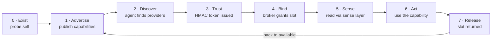
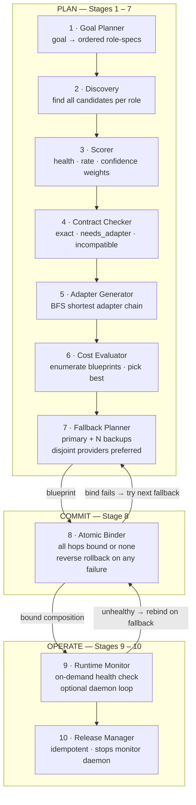
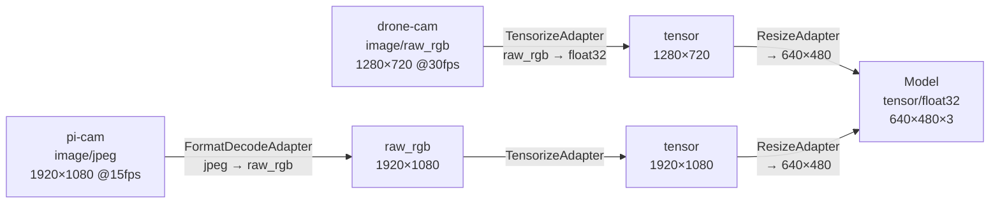
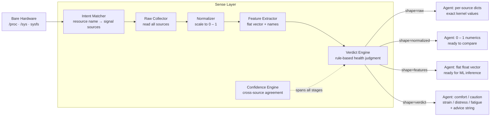

# D2A — Device-to-Agent Protocol

> A protocol that lets bodiless AI agents safely and temporarily bind to real device hardware — perceive its live state, use a capability under scope and quota, then release it — so many agents can share a limited pool of physical machines.

---

## The Idea

An agent is a mind with no body. A device is a body with no mind. D2A is how a mind borrows a body — and lets go cleanly when it's done.

Perception and action are physical: a language model that can only read text is fundamentally limited compared to one that can ask *"is this machine thermally stressed right now?"* or *"compose a vision pipeline from the camera on the drone and the GPU across the room."* Real hardware is the missing half of an AI agent.

D2A sits in a gap between two existing protocols:
- **A2A** (Agent-to-Agent): orchestration between AI agents.
- **MCP** (Model Context Protocol): agents talking to software tools.
- **D2A** fills the third corner: agent-to-physical-hardware. Bind, perceive, act, release.

The design principle is that binding is *temporary and scoped* — no agent owns a device, it borrows a capability for a TTL, under a consent policy that the device owner controls.

---

## System Architecture


Runtimes plug in on the device side; agents plug in on the top. The frozen core in the middle never changes — only the transport and the hardware underneath vary.

---

## The Universal 7-Phase Lifecycle

The same seven phases apply to every device regardless of what hardware it has. Only what it advertises in phase 1 differs.



A Raspberry Pi, a laptop, a phone under Termux, a drone companion computer — all run the same runtime code. The only difference is the set of capabilities each probes and advertises.

---

## Capability Composition

The headline feature. Instead of binding to one device at a time, an agent declares a **goal**:

```python
with agent.achieve("vision") as comp:
    result = comp.run()   # consumer_confirmed=True
```

D2A assembles a working pipeline from **partial capabilities on different devices** — a camera on one node, a GPU on another — inserting adapter chains so mismatched outputs fit. A drone camera (raw RGB 1280×720) and a Pi camera (JPEG 1920×1080) both feed the same model (float32 tensor 640×480×3) via different chains. Nothing binds until every hop's contract is verified.

### The 10-Stage Engine



### Adapter Chains in Practice



Both paths produce the same verified contract at the consumer. `contracts_compatible()` runs at plan time **and** again at runtime — the consumer confirms the guarantee held end-to-end.

**Contract rules:** media-type mismatches (audio into a vision model) are rejected immediately as incompatible. Unknown format on either side always fails — never silently assumed to match.

---

## The Sense Layer

Raw hardware signals are noisy, device-specific, and meaningless to most agents. The Sense Layer translates them into four clean output **shapes** so every agent — from a one-liner to a trained ML model — gets exactly the view it needs.



**Verdict levels** (best → worst): `comfort` → `caution` → `strain` → `distress` → `fatigue`

Each verdict carries an **advice** string: `proceed`, `throttle`, `reduce_load`, `release_now`, `prefer_plugged_device`.

A simple agent needs zero ML: receive `verdict=distress`, read `advice=release_now`, release the binding. Every `SenseFrame` includes verdict + confidence regardless of which shape was requested.

> **Note:** Sense Layer Part 1 (the full forward pipeline) is complete and tested. Part 2 — SafetyFilter, ReflexPath (urgent fast-path), EventEmitter, and HealthAggregator — is **in progress**.

---

## Contention-Aware Broker

Multiple agents compete for a finite number of hardware slots. The broker handles this fairly and auditably:

| Feature | Detail |
|---|---|
| **Priority** | Integer 1 (highest) – 9 (lowest) per bind request |
| **Quotas** | Per-capability slot limit (default 1, configurable) |
| **Preemption** | Higher-priority agent takes a slot from a lower-priority holder |
| **Wait-queue** | Lower-priority requests park; auto-granted on release |
| **Auto-grant** | When a slot frees, the highest-priority queued agent is granted immediately |
| **Audit log** | Full event history: granted · queued · preempted · released · auto\_granted |
| **Cancel-queue** | Atomic Binder cancels queue entries on rollback — prevents ghost bindings |

---

## Trust & Safety

**Identity:** Each node generates a random 16-hex node ID and an HMAC keypair at startup (`identity.py`).

**Tokens:** A `BindToken` is scoped to one capability on one node for one agent, with a TTL expiry and an HMAC signature. The device verifies the token before honouring any data request.

> ⚠️ Current signing is **HMAC-based** (`hmac.compare_digest` with a shared private key). Upgrading to **Ed25519 asymmetric verification** is **in progress**.

**Consent policy** (`policy.py`):

```
OPEN resources      → bindable by any trusted remote agent by default
                      (compute, gpu, sensing, battery_aware, storage, network)

Sensitive resources → DENIED to all remote agents by default
                      (camera, microphone, location, display)
                      Require explicit owner opt-in:
                      DeviceRuntime(open_resources=["camera"])
```

**Resource probes are availability-only.** `probe_camera()` detects that `/dev/video0` exists — it does not open the device, capture a frame, or record anything. The same applies to microphone, location, and display probes.

---

## Device-Agnostic by Design

The same `DeviceRuntime` code runs on:
- Raspberry Pi (ARM, `/proc` present, no GPU)
- Laptop / server (x86, GPU via `/sys/class/drm`, thermal sensors)
- Android phone under Termux (ARM, battery present)
- Drone companion computer (embedded, resource-constrained)

Each device probes itself at startup using `/proc/meminfo`, `/proc/loadavg`, `/sys/class/thermal`, `/sys/class/power_supply`, `/dev/video*`, ALSA device nodes, and similar kernel interfaces — **no vendor SDK, no external library, no hardcoded hardware list**. If the kernel exposes it, the probe finds it; if not, the capability is simply absent from advertisement.

---

## What Works Today / What's In Progress

### ✅ Verified (single-process tests)

- Self-probing `DeviceRuntime`: CPU, memory, GPU, thermal, battery, disk I/O, network I/O, camera presence, microphone presence, location, storage, display
- Capability advertisement and discovery via LANSwarm (UDP broadcast + TCP)
- HMAC-based trust gate: signed scoped expiring `BindToken`
- Contention broker: priority, quotas, preemption, wait-queue, auto-grant, audit log, cancel-queue
- Binding lifecycle: bind / rebind / renew / unbind
- On-demand data pull (default path, zero background work)
- Opt-in streaming at configurable Hz (background daemon, strictly opt-in)
- Sense Layer Part 1: all 4 shapes, verdict + confidence, CPU burn load test
- Full 10-stage Capability Composition: plan → atomic bind → runtime monitor + fallback → atomic release
- Consent policy: safe defaults, sensitive = denied unless owner opts in
- `with agent.achieve("vision") as comp: comp.run()` — goal API with context-manager auto-release
- Generic OS probes + resource probes across all capability types
- `Agent.achieve()` in-process mode (no TCP needed for single-machine use)

### 🔧 In Progress

- **Real two-machine / cross-network deployment** — everything is tested single-process; cross-machine binding under real network conditions is not yet validated
- **Ed25519 asymmetric signing** — current HMAC signing uses a shared private key; upgrade to proper asymmetric keypairs is planned
- **EdgeMind DHT wiring** — `DHTSwarm` adapter exists as a thin stub; the external `anp-edge-swarm` package must be installed separately and validated end-to-end
- **Sense Layer Part 2** — SafetyFilter (pre-return veto), ReflexPath (urgent fast-path), EventEmitter (verdict-change events), HealthAggregator (rolling health history)
- **Real adapter implementations** — adapter descriptors correctly track `IOContract` through transforms; the actual pixel/tensor computations are simulated; wiring to real compute (OpenCV, NumPy) is a separate phase
- **Multi-hop data routing** — `Composer.run()` verifies contracts and pulls from the producer; real cross-node data streaming (producer sends to consumer over the network) is a future phase

---

## Repository Layout

```
d2a/
├── schema.py              Capability + Binding data contracts (frozen)
├── identity.py            Node ID + HMAC keypair generation
├── verbs.py               bind / rebind / renew / unbind operations
├── broker.py              Contention broker: priority · quota · preemption · waitqueue
├── probes.py              OS probes: CPU, memory, GPU, thermal, battery, disk, net
├── resource_probes.py     Generic resource probes: camera, mic, location, storage …
├── policy.py              Owner-consent policy (safe defaults, sensitive = denied)
├── swarm.py               SwarmTransport ABC + LANSwarm (UDP broadcast + TCP)
├── swarm_dht.py           DHTSwarm adapter stub (needs anp-edge-swarm)
├── data_provider.py       On-demand pull + opt-in streaming data engine
├── stream_source.py       Per-resource SignalSource readers
├── preprocessor.py        Delta / rate computation, ring buffer
├── contracts.py           IOContract · CapabilityContract · contracts_compatible()
├── adapters.py            Adapter descriptors + BFS find_adapter_chain()
├── composer.py            Composer · CompositionPlan · Composition (context manager)
├── sense_types.py         SenseRequest · SenseFrame · verdict levels · advice strings
├── sense_layer.py         SenseLayer orchestrator (Part 1: forward pipeline)
└── sense/
    ├── intent_matcher.py      Resource name → registered signal sources
    ├── raw_collector.py       Read all sources for a capability
    ├── normalizer.py          Scale numerics to [0, 1]
    ├── feature_extractor.py   Flat feature vector + aligned name list
    ├── verdict_engine.py      Rule-based health verdict (comfort → distress)
    └── confidence_engine.py   Cross-source agreement score [0, 1]

d2a/composition/
├── goal_planner.py        Goal → ordered role-specs (data-driven registry)
├── discovery.py           Find all candidates per role from capability pool
├── scorer.py              Health + rate + confidence scoring, named weights
├── contract_checker.py    exact / needs_adapter / incompatible classification
├── adapter_generator.py   Build + describe adapter chain for a hop
├── cost_evaluator.py      Blueprint · HopRecord · enumerate blueprints · pick best
├── fallback_planner.py    Primary + N backups, disjoint providers preferred
├── atomic_binder.py       All-or-nothing bind with reverse rollback
├── runtime_monitor.py     On-demand health check + optional daemon loop
└── release_manager.py     Idempotent release of all bindings

runtimes/
└── device_runtime.py      Full device node: probes + broker + swarm + sense + composition

agents/
├── remote_agent.py        Network bind / on-demand data pull / opt-in streaming
├── simple_agent.py        Friendly 5-line API + achieve() goal composition API
└── llm_agent.py           Minimal agent wrapper (used in broker tests)

examples/
└── … (see Examples section)
```

---

## Examples

All examples run single-process with no network setup required unless noted.

| Example | What it proves | Command |
|---|---|---|
| `any_device_demo.py` | Runtime probes itself and advertises only what it physically has — no hardcoded hardware list | `python3 examples/any_device_demo.py` |
| `any_resource_demo.py` | Generic resource probes detect camera / mic / location / storage presence (availability only, no capture) | `python3 examples/any_resource_demo.py` |
| `bind_one.py` | Single bind: agent discovers a runtime, binds a capability, receives a scoped token | `python3 examples/bind_one.py` |
| `broker_demo.py` | Broker: quota, preemption (priority 1 beats priority 5), wait-queue, auto-grant on release, full audit log | `python3 examples/broker_demo.py` |
| `rebind_demo.py` | Rebind to a different capability, renew a token TTL, unbind cleanly | `python3 examples/rebind_demo.py` |
| `trust_demo.py` | HMAC token signing and verification; scoped token; expiry check | `python3 examples/trust_demo.py` |
| `ondemand_demo.py` | On-demand data pull: agent requests one fresh hardware frame per call, zero background work | `python3 examples/ondemand_demo.py` |
| `stream_optin_demo.py` | Opt-in streaming: device pushes frames at configurable Hz; agent calls stop to return to silence | `python3 examples/stream_optin_demo.py` |
| `simple_agent_demo.py` | `with agent.use("compute") as r: r.data()` — 5-line agent experience | `python3 examples/simple_agent_demo.py` |
| `sense_pipeline_demo.py` | Sense Layer: all 4 shapes, CPU burn test watching verdict shift comfort → strain → comfort | `python3 examples/sense_pipeline_demo.py` |
| `composition_plan_demo.py` | Plan phase (stages 1–7): goal→blueprint, scorer prefers healthy GPU, two cameras get different adapter chains, mismatch rejected cleanly | `python3 examples/composition_plan_demo.py` |
| `composition_run_demo.py` | Full 10-stage pipeline: happy path, atomic rollback, fallback-on-bind, runtime distress + re-bind, atomic context-manager release | `python3 examples/composition_run_demo.py` |
| `composition_simple_demo.py` | `with agent.achieve("vision") as comp: comp.run()` — the 2-line goal API with auto-release | `python3 examples/composition_simple_demo.py` |
| `swarm_local_demo.py` | LANSwarm on localhost: publish a record, discover it, send a TCP message | `python3 examples/swarm_local_demo.py` |
| `swarm_multinode_demo.py` | Two runtimes + one agent on a real LAN (**requires two terminals or two machines**) | `python3 examples/run_node.py` then `run_provider.py` then `run_seeker.py` |

---

## Tech

- **Language:** Python 3.10+
- **Dependencies:** standard library only — `socket`, `threading`, `hashlib`, `hmac`, `secrets`, `dataclasses`, `itertools`. No `pip install` required.
- **Transport:** `LANSwarm` is built-in (UDP broadcast for discovery, TCP for messages). `DHTSwarm` is a thin adapter stub; the underlying Kademlia DHT comes from the [EdgeMind swarm project](https://github.com/student-kshitish/anp-edge-swarm) and must be installed separately.
- **Platforms tested:** Linux (kernel 6.x, x86). The `/proc` and `/sys` probe paths are Linux-native; macOS / BSD probes fall back gracefully when paths are absent.
